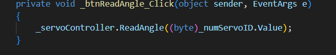
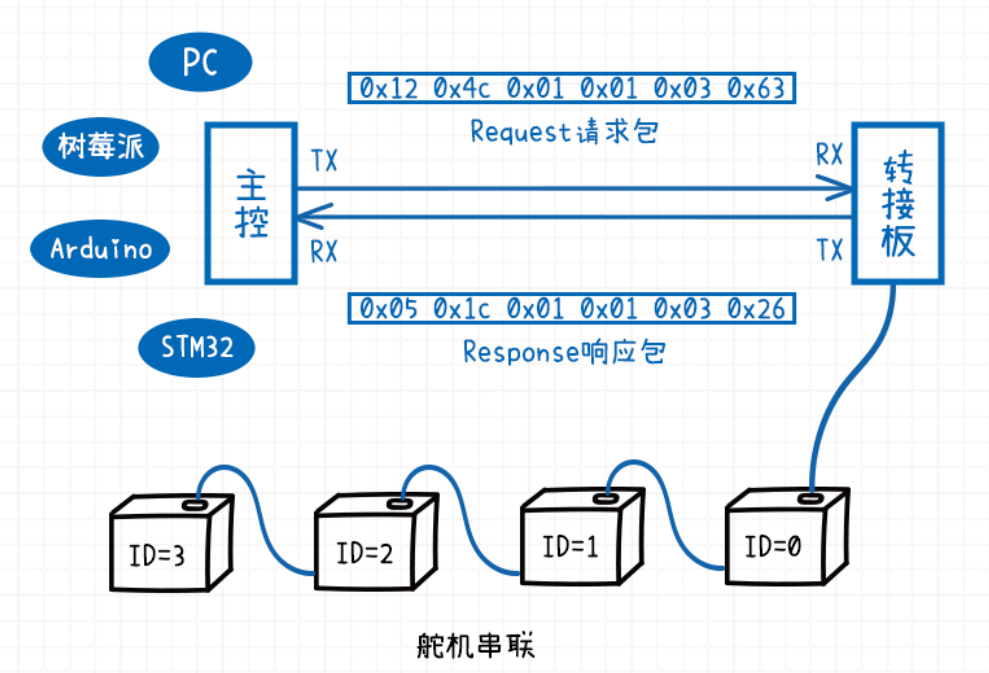
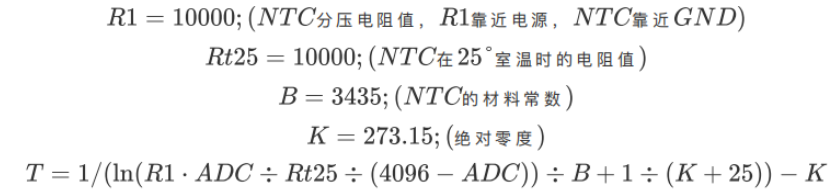

# 总线伺服舵机SDK使用手册（C#）

## 1. 概述

本SDK内容有

- 基于[总线伺服舵机通信协议](https://wiki.fashionrobo.com/uartbasic/uart-protocol/)的C#方法，适用于所有总线伺服舵机型号。
- C#开发编程示例UARTServoDemo

- 新增的方法與事件大多在 ServoController.Tx.cs 以及 ServoController.Rx.cs 兩個檔案內，請参照協議文件比對測試。同步命令範例在 MainForm.cs内SyncCommandTest()函式

### 1.1.上位机软件

上位机软件可以调试总线伺服舵机，测试总线伺服舵机的功能。

- 上位机软件：[FashionStar UART总线伺服舵机上位机软件](https://fashionrobo.com/downloadcenter/)

- 使用说明：[总线伺服舵机上位机软件使用说明](https://wiki.fashionrobo.com/uartbasic/uart-servo-software/)

### 1.2.SDK

本文例程、API下载。

- C# SDK下载链接：[SDK for C#](https://fashionrobo.com/downloadcenter/)

### 1.3.开发软件

总线伺服舵机转接板使用的USB转TTL串口芯片是`CH340`，需要在Windows上安装驱动。[检查驱动是否安装成功](https://jingyan.baidu.com/article/00a07f3872a90982d028dcb9.html)

- 串口调试驱动：[CH340驱动下载链接](https://fashionrobo.com/wp-content/uploads/download/CH341SER.zip)


### 1.4. 命名空间

使用本SDK需要打开以下命名空间

```c#
using BrightJade;
using BrightJade.Serial;
using FashionStar.Servo.Uart;
using FashionStar.Servo.Uart.Protocol;
```


### 1.5. 定义与宣告

```c#
// Serial Port 管理器。
private SerialPortManager _serialPortManager;
// 舵机控制器。
private ServoController _servoController;

_serialPortManager = new SerialPortManager();
_servoController = new ServoController(_serialPortManager);
```

### 1.6.图例

HP8-U45-M总线伺服舵机


总线伺服舵机转接板UC-01


## 2.接线说明

1. 安装USB转TTL模块的驱动程序。
2. 将TTL/USB调试转换板UC-01与控制器、总线伺服舵机以及电源连接。


## 3.环境搭建与例程使用

1.下载[Visual Studio 2022](https://visualstudio.microsoft.com/zh-hans/)，你会得到一个后缀为.exe的文件，双击进行安装。


2.点击继续


3.下载需要等待，程序比较大，要确保硬盘空间足够。


3.下载完成后，勾选下载.NET桌面开发拓展。


4.打开下载的 `SDKfashionstar-uart-servo-csharp-sdk\uart-servo-csharp-sdk\UARTServo` 目录下的 `UARTServo.sln`


5.打开后，会进入到Visual Studio 界面，其中解决方案资源管理器如下

.png)

6.生成解决方案后，即可启动demo程序


7.选择正确的端口号连接到伺服总线舵机，就可以使用了。

## 4.代码撰写

 

### 4.1.Serial Port 管理器

**SerialSettings 物件**

SerialPortManager包装并管理 SerialPort对象的收发行为，并有一型态为SerialSettings的成员CurrentSerialSettings，储存相关信息。


**初始化**

SerialPortManager创建同时，会寻找目前装置所有可用的Serial Port，并将清单存于CurrentSerialSettings.PortNameCollection中。

其中第一个元素给予CurrentSerialSettings.PortName。同时根据选择的Baud，在CurrentSerialSettings.BaudRateCollection中更新可用Baud的清单。可以实作需求，自行调用。

其余参数正常状况下多维持初始值，若有需要请自行参考调用。

### 4.2.Protocol

Protocol文件夹下包含里对舵机协议的封装类。这部分内容与[总线伺服舵机通信协议](https://wiki.fashionrobo.com/uartbasic/uart-protocol/)对应，是`ServoController` 的请求包和响应包格式 。


### 4.3.ServoController

- `ServoController.cs`：定义了控制器初始化方法，启停监听串口数据方法，处理串口数据接收的事件。
- `ServoController.Rx.cs`：定义了对舵机响应包的处理方法，处理方法根据接收的响应包类型，触发不同的事件。如图所示，当检测到Ping指令的舵机响应包ID时，触发`PingResponsed`事件。


- `ServoController.Tx.cs`：定义了发送舵机请求包的方法。方法使用如下图所示，其中当前角度查询指令需要填入参数舵机ID。



**方法与事件**

舵机控制器的方法可视为Tx请求封包；事件可视为Rx响应封包。

请参考文件：[总线伺服舵机通信协议](https://wiki.fashionrobo.com/uartbasic/uart-protocol/)，呼叫与封包命名同名的方法作为请求，接收命名后缀Responsed的事件，作为舵机信息响应。


总线伺服舵机在默认情况下控制命令是不带响应包的，如果需要获取控制响应包以触发某些事件的需求，可以通过判断回读角度，来作为触发事件的根据。

另外，也可以在上位机打开 *控制送出后是否响应开关* 。

```
控制送出后是否响应开关
0 - 舵机控制指令执行可以被中断，新的指令覆盖旧的指令，无反馈数据 
1 - 舵机控制指令不可以被中断，指令执行结束之后发送反馈数据
```

例如：上图ReadAngle封包，呼叫`ServoController`对象的`ReadAngle()`方法，即可向舵机询问角度。

```c#
_servoController.ReadAngle((byte)_numServoID.Value);
```

接收ReadAngleResponsed事件，以处理回传的角度数值。

```c#
_servoController.ReadAngleResponsed += OnReadAngleResponsed;
```


### 4.4.UARTServoDemo

`UARTServoDemo`是SDK内置的例程，下面以当前角度查询功能为例，其他功能编写方法相同。


- **初始化范例**

```c#
// Serial Port 管理器。
private SerialPortManager _serialPortManager;
// 舵机控制器。
private ServoController _servoController;

_serialPortManager = new SerialPortManager();
_servoController = new ServoController(_serialPortManager);

// 接收事件。
_servoController.ReadAngleResponsed += OnReadAngleResponsed;
_servoController.ReadMultiTurnAngleResponsed += OnReadMultiTurnAngleResponsed;
_serialPortManager.ErrorOccured += OnErrorOccured;
```


- **串口开始连接按钮的Click事件**

```c#
// 开始监听。
private void _btnConnect_Click(object sender, EventArgs e)
{
    ConnectSwitch(true);
    _servoController.StartListening();
}
```

- **串口停止连接按钮的Click事件**

```c#
// 停止监听
private void _btnDisconnect_Click(object sender, EventArgs e)
{
    ConnectSwitch(false);
    _servoController.StopListening();
}
```


- **读取角度按钮的Click事件**

```c#
// 读取单圈角度，结果将回传至回呼 OnReadAngleResponsed。
private void _btnReadAngle_Click(object sender, EventArgs e)
{
    _servoController.ReadAngle((byte)_numServoID.Value);
}
```

- **判断响应包类别**

```c#
public void AppendData(byte[] data)//AppendData 是 Serial Port管理器 接收到数据事件的处理方法
{
	...
	case PacketConst.ReadAngle://判断响应包指令ID
    {
        ReadAngleResponse packet = PacketConverterEx.GetObject<ReadAngleResponse>(_dataBuffer);
        OnReadAngleResponsed(new DataEventArgs<ReadAngleResponse>(packet));//触发读取角度事件的方法
    }
    break;
    ...
}
```

- **UI处理：在窗口更新读取到的角度**

```c#
//OnReadAngleResponsed 已订阅事件 ReadAngleResponsed
private void OnReadAngleResponsed(object sender, DataEventArgs<ReadAngleResponse> e)
{
    if (InvokeRequired)//多线程
    {
        BeginInvoke((MethodInvoker)delegate { OnReadAngleResponsed(sender, e); });//舵机控制器的事件，与UI的线程不同，必须额外处理
    }
    else
    {
        double angle = e.Data.Angle / 10.0;
        _txtAngle.Text = angle.ToString();//更新UI
    }
}
```

## 5.通讯检测

检查舵机是否在线，就需要用到通讯检测指令。

- 如果ID号的舵机存在且在线，舵机在接收到通讯检测指令时，会发送一个响应包。

- 如果ID号的舵机不存在或者掉线，就不会有舵机发送响应数据包。



**函数原型**

```C#
public void Ping(byte id)
```

- `id` 舵机的ID

**响应包事件**

```c#
public event EventHandler<DataEventArgs<PingResponse>> PingResponsed;
```

**响应包内容**

- `ID` 舵机的ID


## 6.单圈角度控制

</td></tr></table><table><tr><td bgcolor=#DDDDDD>

**注意事项：**

- 舵机只会响应最新的角度控制指令。当需要连续执行多个角度控制命令时，可以在程序中使用延时或者读取角度来判断上一个命令是否完成。
- 建议连续发送指令给同一个舵机时，指令间隔在10ms以上。
- 若power = 0或者大于功率保持值，按照功率保持值执行。功率保持值可在上位机进行设置。
- 舵机的最大旋转速度因舵机型号、负载情况而异。

</td></tr></table>

### 6.1.简易角度控制


**函数原型**

```C#
public void MoveOnAngleMode(byte id, short angle, ushort interval, ushort power = 0)
```

- `id` 舵机的ID

- `angle` 舵机的目标角度，最小单位 0.1°，取值范围 [-1800, 1800] 。例如：目标角度为10°时，填入100。

- `interval` 舵机的运行时间，单位ms，最小值 > 100

- `power` 舵机执行功率，单位mV，默认为0

  

**响应包事件**（需要在上位机开启 *控制送出后是否响应开关*）

```c#
public event EventHandler<DataEventArgs<MoveOnAngleModeResponse>> MoveOnAngleModeResponsed;
```

**响应包内容**

- `ID` 舵机的ID
- `Result` 执行结果，0：失败，1：成功


### 6.2.带加减速的角度控制(指定周期)


**函数原型**

```C#
public void MoveOnAngleModeExByInterval(byte id, short angle, ushort interval, ushort accInterval, ushort decInterval, ushort power = 0)
```

- `id` 舵机的ID

- `angle` 舵机的目标角度，最小单位 0.1°，取值范围 [-1800, 1800] 。例如：目标角度为10°时，填入100。

- `interval` 舵机的运行时间，单位ms，最小值 > 100

- `accInterval` 舵机启动到匀速的时间，单位ms，最小值 > 20

- `decInterval` 舵机接近目标角度时的减速时间，单位ms，最小值 > 20

- `power` 舵机执行功率，单位mV，默认为0

  

**响应包事件**（需要在上位机开启 *控制送出后是否响应开关*）

```c#
public event EventHandler<DataEventArgs<MoveOnAngleModeExByIntervalResponse>> MoveOnAngleModeExByTimeResponsed;
```

**响应包内容**

- `ID` 舵机的ID
- `Result` 执行结果，0：失败，1：成功


### 6.3.带加减速的角度控制(指定转速)


**函数原型**

```C#
public void MoveOnAngleModeExByVelocity(byte id, short angle, ushort targetVelocity, ushort accInterval, ushort decInterval, ushort power = 0)
```

- `id` 舵机的ID

- `angle` 舵机的目标角度，最小单位 0.1°，取值范围 [-1800, 1800] 。例如：目标角度为10°时，填入100。

- `targetVelocity` 舵机目标转速，单位0.1°/s，取值范围 [10 ,7500] 。例如：目标转速为200°/s时，填入2000。

- `accInterval` 舵机启动到匀速的时间，单位ms，最小值 > 20

- `decInterval` 舵机接近目标角度时的减速时间，单位ms，最小值 > 20

- `power` 舵机执行功率，单位mV，默认为0

  

**响应包事件**（需要在上位机开启 *控制送出后是否响应开关*）

```c#
public event EventHandler<DataEventArgs<MoveOnAngleModeExByVelocityResponse>> MoveOnAngleModeExByVelocityResponsed;
```

**响应包内容**

- `ID` 舵机的ID
- `Result` 执行结果，0：失败，1：成功


### 6.4.当前角度查询

**函数原型**

```C#
public void ReadAngle(byte id)
```

- `id` 舵机的ID

**响应包事件**

```c#
public event EventHandler<DataEventArgs<ReadAngleResponse>> ReadAngleResponsed;
```

**响应包内容**

- `ID` 舵机的ID
- `Angle` 当前的舵机单圈角度，单位 0.1°，例如：值为100时，换算成角度即10°。

## 7.多圈角度控制

</td></tr></table><table><tr><td bgcolor=#DDDDDD>

**注意事项：**

- 舵机只会响应最新的角度控制指令。当需要连续执行多个角度控制命令时，可以在程序中使用延时或者读取角度来判断上一个命令是否完成。
- 建议连续发送指令给同一个舵机时，指令间隔在10ms以上。
- 若power = 0或者大于功率保持值，按照功率保持值执行。功率保持值可在上位机进行设置。
- 舵机的最大旋转速度因舵机型号、负载情况而异。

</td></tr></table>


### 7.1.简易多圈角度控制


**函数原型**

```C#
public void MoveOnMultiTurnAngleMode(byte id, int angle, uint interval, ushort power = 0)
```

- `id` 舵机的ID

- `angle` 舵机的目标角度，最小单位 0.1°，取值范围 [-3,686,400 ,  3,686,400] 。例如：目标角度为500°时，填入5000。

- `interval` 舵机的运行时间，单位ms，最小值 > 100

- `power` 舵机执行功率，单位mV，默认为0

  

**响应包事件**（需要在上位机开启 *控制送出后是否响应开关*）

```c#
public event EventHandler<DataEventArgs<MoveOnMultiTurnAngleModeResponse>> MoveOnMultiTurnAngleModeResponsed;
```

**响应包内容**

- `ID` 舵机的ID
- `Result` 执行结果，0：失败，1：成功

### 7.2.带加减速的多圈角度控制(指定周期)


**函数原型**

```C#
public void MoveOnMultiTurnAngleModeExByInterval(byte id, int angle, uint interval, ushort accInterval, ushort decInterval, ushort power = 0)
```

- `id` 舵机的ID

- `angle` 舵机的目标角度，最小单位 0.1°，取值范围 [-3,686,400 ,  3,686,400] 。例如：目标角度为500°时，填入5000。

- `interval` 舵机的运行时间，单位ms，最小值 > 100

- `accInterval` 舵机启动到匀速的时间，单位ms，最小值 > 20

- `decInterval` 舵机接近目标角度时的减速时间，单位ms，最小值 > 20

- `power` 舵机执行功率，单位mV，默认为0

  

**响应包事件**（需要在上位机开启 *控制送出后是否响应开关*）

```c#
public event EventHandler<DataEventArgs<MoveOnMultiTurnAngleModeExByIntervalResponse>> MoveOnMultiTurnAngleModeExByTimeResponsed;
```

**响应包内容**

- `ID` 舵机的ID
- `Result` 执行结果，0：失败，1：成功


### 7.3.带加减速的多圈角度控制(指定转速)


**函数原型**

```C#
public void MoveOnMultiTurnAngleModeExByVelocity(byte id, int angle, ushort targetVelocity, ushort accInterval, ushort decInterval, ushort power = 0)
```

- `id` 舵机的ID

- `angle` 舵机的目标角度，最小单位 0.1°，取值范围 [-1800, 1800] 。例如：目标角度为10°时，填入100。

- `targetVelocity` 舵机目标转速，单位0.1°/s，取值范围 [10 ,7500] 。例如：目标转速为200°/s时，填入2000。

- `accInterval` 舵机启动到匀速的时间，单位ms，最小值 > 20

- `decInterval` 舵机接近目标角度时的减速时间，单位ms，最小值 > 20

- `power` 舵机执行功率，单位mV，默认为0

  

**响应包事件**（需要在上位机开启 *控制送出后是否响应开关*）

```c#
public event EventHandler<DataEventArgs<MoveOnMultiTurnAngleModeExByVelocityResponse>> MoveOnMultiTurnAngleModeExByVelocityResponsed;
```

**响应包内容**

- `ID` 舵机的ID
- `Result` 执行结果，0：失败，1：成功


### 7.4.当前多圈角度查询

**函数原型**

```C#
public void ReadMultiTurnAngle(byte id)
```

- `id` 舵机的ID

**响应包事件**

```c#
public event EventHandler<DataEventArgs<ReadMultiTurnAngleResponse>> ReadMultiTurnAngleResponsed;
```

**响应包内容**

- `ID` 舵机的ID
- `Angle` 当前的舵机多圈角度，单位 0.1°，例如：值为9000时，换算成角度即900°。
- `Turns` 当前舵机的多圈圈数，单位 圈 ，符号代表方向。


### 7.5.清除多圈圈数

**函数原型**

```c#
public void ResetMultiTurnAngle(byte id)
```

* `id` 舵机的ID


**响应包事件**（需要在上位机开启 *控制送出后是否响应开关*）

```c#
public event EventHandler<DataEventArgs<ResetMultiTurnAngleResponse>> ResetMultiTurnAngleResponsed;
```

**响应包内容**

- `ID` 舵机的ID
- `Result` 执行结果，0：失败，1：成功


## 8.舵机阻尼模式

**函数原型**

```c#
public void MoveOnDampingMode(byte id, ushort power = 0)
```

* `id` 舵机的ID
* `power` 舵机执行功率，单位mV，默认为0


**响应包事件**（需要在上位机开启 *控制送出后是否响应开关*）

```c#
public event EventHandler<DataEventArgs<MoveOnDampingModeResponse>> MoveOnDampingModeResponsed;
```

**响应包内容**

- `ID` 舵机的ID
- `Result` 执行结果，0：失败，1：成功


## 9.舵机轮式模式

**函数原型**

```c#
public void MoveOnWheelMode(byte id, byte method, ushort speed, ushort value)
```

* `id` 舵机的ID

- `method` 该字节不同位的值代表控制旋转方向和行为方式。没有特殊注明的位，值均为0。


- `speed` 舵机角速度，单位: °/s
- `value`  根据`method`设置不同，含义不同

| 行为方式     | value含义                                            |
| ------------ | ---------------------------------------------------- |
| 停止（卸力） | 无意义                                               |
| 旋转（不停） | 无意义                                               |
| 定圈         | 旋转的圈数(旋转`value`圈后，舵机停止)                |
| 定时         | 定时旋转的时间，单位为ms(旋转`value` ms后，舵机停止) |


**响应包事件**（需要在上位机开启 *控制送出后是否响应开关*）

```c#
public event EventHandler<DataEventArgs<MoveOnWheelModeResponse>> MoveOnWheelModeResponsed;
```

**响应包内容**

- `ID` 舵机的ID
- `Result` 执行结果，0：失败，1：成功


## 10.舵机状态读取

### 10.1.读取参数

**函数原型**

```c#
public void ReadData(byte id, byte dataID)
```

* `id` 舵机的ID
* `dataID` 参数ID，见 [附表1-只读参数表](#1-) ，[附表2-自定义参数表](#2-)。


**响应包事件**

```c#
public event EventHandler<DataEventArgs<ReadDataResponse>> ReadDataResponsed;
```

**响应包内容**

- `ID` 舵机的ID
- `DataID` 参数ID，见 [附表1-只读参数表](#1-) ，[附表2-自定义参数表](#2-)。
- `Data` 舵机参数的取值


### 10.2.写入自定义参数

</td></tr></table><table><tr><td bgcolor=#DDDDDD>

推荐使用上位机写入自定义参数。

</td></tr></table>


**函数原型**

```c#
public void WriteData(byte id, byte dataID, byte[] data)
```

* `id` 舵机的ID
* `dataID` 参数ID，见[附表2-自定义参数表](#2-)。
* `data` 写入参数的值，内容须与表中定义一致。


**响应包事件**（需要在上位机开启 *控制送出后是否响应开关*）

```c#
public event EventHandler<DataEventArgs<WriteDataResponse>> WriteDataResponsed;
```

**响应包内容**

- `ID` 舵机的ID
- `DataID` 参数ID，见[附表2-自定义参数表](#2-)。
- `Result` 执行结果，0：失败，1：成功

### 10.3.重置舵机自定义参数

**函数原型**

```c#
public void ResetUserData(byte id)
```

* `id` 舵机的ID

**响应包事件**（需要在上位机开启 *控制送出后是否响应开关*）

```c#
public event EventHandler<DataEventArgs<ResetUserDataResponse>> ResetUserDataResponsed;
```

**响应包内容**

- `ID` 舵机的ID
- `Result` 执行结果，0：失败，1：成功

## 11.舵机失锁

</td></tr></table><table><tr><td bgcolor=#DDDDDD>

**注意事项：**

- 失锁状态下，舵机仍会响应指令。

</td></tr></table>

**函数原型**

```c#
public void Stop(byte id)
```

* `id` 舵机的ID

**响应包事件**（需要在上位机开启 *控制送出后是否响应开关*）

```c#
public event EventHandler<DataEventArgs<MoveOnWheelModeResponse>> MoveOnWheelModeResponsed;
```

**响应包内容**

- `ID` 舵机的ID
- `Result` 执行结果，0：失败，1：成功


## 12.原点设置

</td></tr></table><table><tr><td bgcolor=#DDDDDD>

**注意事项**：

- 仅适用于无刷磁编码舵机
- 需要在失锁状态下使用本API

</td></tr></table>

**函数原型**

```c#
public void SetOriginPoint(byte id)
```

* `id` 舵机的ID

**响应包事件**（需要在上位机开启 *控制送出后是否响应开关*）

```c#
public event EventHandler<DataEventArgs<SetOriginPointResponse>> SetOriginPointResponsed
```

**响应包内容**

- `ID` 舵机的ID
- `Result` 执行结果，0：失败，1：成功


## 附表1 - 只读参数表

| address | 参数<br/>名称<br/>(en) | 参数<br/>名称<br/>(cn) | 字节<br/>类型 | 字节<br/>长度 | 说明                                                         | 单位 |
| :-----: | ---------------------- | ---------------------- | ------------- | ------------- | ------------------------------------------------------------ | ---- |
|    1    | voltage                | 舵机电压               | uint16_t      | 2             |                                                              | mV   |
|    2    | current                | 舵机电流               | uint16_t      | 2             |                                                              | mA   |
|    3    | power                  | 舵机功率               | uint16_t      | 2             |                                                              | mW   |
|    4    | temprature             | 舵机温度               | uint16_t      | 2             |                                                              | ADC  |
|    5    | servo_status           | 舵机工作状态           | uint8_t       | 1             | BIT[0] - 执行指令置1，执行完成后清零。<br>BIT[1] - 执行指令错误置1，在下次正确执行后清零。<br>BIT[2] - 堵转错误置1，解除堵转后清零。<br>BIT[3] - 电压过高置1，电压恢复正常后清零。<br>BIT[4] - 电压过低置1，电压恢复正常后清零。<br>BIT[5] - 电流错误置1，电流恢复正常后清零。<br>BIT[6] - 功率错误置1，功率恢复正常后清零。<br>BIT[7] - 温度错误置1，温度恢复正常后清零。 |      |
|    6    | servo_type             | 舵机型号               | uint16_t      | 2             |                                                              |      |
|    7    | firmware_version       | 舵机固件版本           | uint16_t      | 2             |                                                              |      |
|    8    | serial_number          | 舵机序列号             | uint32_t      | 4             | 舵机序列号(serial_number)并不是舵机ID，它是舵机的唯一识别符。 |      |

------


## 附表2 - 自定义参数表

| address | 参数<br/>名称<br/>(en) | 参数<br/>名称<br/>(cn) | 字节<br>类型 | 字节<br/>长度 | 说明                                                         | 单位  |
| :-----: | ---------------------- | ---------------------- | ------------ | ------------- | ------------------------------------------------------------ | ----- |
|   32    |                        | <预留>                 | uint8_t      |               |                                                              |       |
|   33    | response_switch        | 响应开关               | uint8_t      | 1             | 0 - 舵机控制指令执行可以被中断，新的指令覆盖旧的指令，无反馈数据 <br>1 - 舵机控制指令不可以被中断，指令执行结束之后发送反馈数据 |       |
|   34    | servo_id               | 舵机ID                 | uint8_t      | 1             | 舵机的ID号初始默认设置为0。修改此值可以修改舵机的ID号        |       |
|   35    |                        | <预留>                 | uint8_t      |               |                                                              |       |
|   36    | baudrate               | 波特率选项             | uint8_t      | 1             | 1 - 9600<br>2 - 19200<br>3 - 38400<br>4 - 57600<br>5 - 115200<br>6 - 250000<br>7 - 500000<br>8 - 1000000 |       |
|   37    | stall_protect_mode     | 舵机堵转保护模式       | uint8_t      | 1             | 0 - 将舵机功率降低到功率上限<br>1 - 释放舵机锁力（舵机卸力） |       |
|   38    | stall_power_limit      | 舵机堵转功率上限       | uint16_t     | 2             |                                                              | mW    |
|   39    | over_volt_low          | 舵机电压下限           | uint16_t     | 2             |                                                              | mV    |
|   40    | over_volt_high         | 舵机电压上限           | uint16_t     | 2             |                                                              | mV    |
|   41    | over_temprature        | 温度上限               | uint16_t     | 2             | [附表3 - 温度ADC值转换表](#3-adc)                            | ADC   |
|   42    | over_power             | 功率上限               | uint16_t     | 2             |                                                              | mW    |
|   43    | over_current           | 电流上限               | uint16_t     | 2             |                                                              | mA    |
|   44    | accel_switch           | 加速度处理开关         | uint8_t      | 1             | 舵机目前必须设置启用加速度处理，即只能设置0x01这个选项。     |       |
|   45    |                        | <预留>                 | uint8_t      | 1             |                                                              |       |
|   46    | po_lock_switch         | 舵机上电锁力开关       | uint8_t      | 1             | 0 - 上电舵机释放锁力<br>1 - 上电舵机保持锁力                 |       |
|   47    | wb_lock_switch         | 轮式刹车锁力开关       | uint8_t      | 1             | 0 - 停止时释放舵机锁力<br>1 - 停止时保持舵机锁力             |       |
|   48    | angle_limit_switch     | 角度限制开关           | uint8_t      | 1             | 0 - 关闭角度限制<br>1 - 开启角度限制                         |       |
|   49    | soft_start_switch      | 上电首次缓慢执行       | uint8_t      | 1             | 0 - 关闭上电首次缓慢执行<br>1 - 开启上电首次缓慢执行         |       |
|   50    | soft_start_time        | 上电首次执行时间       | uint16_t     | 2             |                                                              | ms    |
|   51    | angle_limit_high       | 舵机角度上限           | int16_t      | 2             |                                                              | 0.1度 |
|   52    | angle_limit_low        | 舵机角度下限           | int16_t      | 2             |                                                              | 0.1度 |
|   53    | angle_mid_offset       | 舵机中位角度偏移       | int16_t      | 2             |                                                              | 0.1度 |


## 附表3 - 温度ADC值转换表

温度为ADC值，需要进行转换。



以下为50-79℃ 温度/ADC参照表。


| 温度(℃) | ADC  | 温度(℃) | ADC  | 温度(℃) | ADC  |
| :-----: | :--: | :-----: | :--: | :-----: | :--: |
|   50    | 1191 |   60    | 941  |   70    | 741  |
|   51    | 1164 |   61    | 918  |   71    | 723  |
|   52    | 1137 |   62    | 897  |   72    | 706  |
|   53    | 1110 |   63    | 876  |   73    | 689  |
|   54    | 1085 |   64    | 855  |   74    | 673  |
|   55    | 1059 |   65    | 835  |   75    | 657  |
|   56    | 1034 |   66    | 815  |   76    | 642  |
|   57    | 1010 |   67    | 796  |   77    | 627  |
|   58    | 986  |   68    | 777  |   78    | 612  |
|   59    | 963  |   69    | 759  |   79    | 598  |

