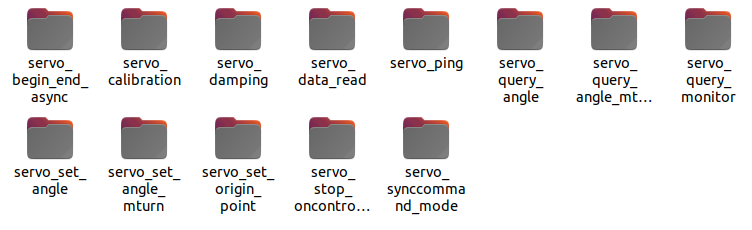
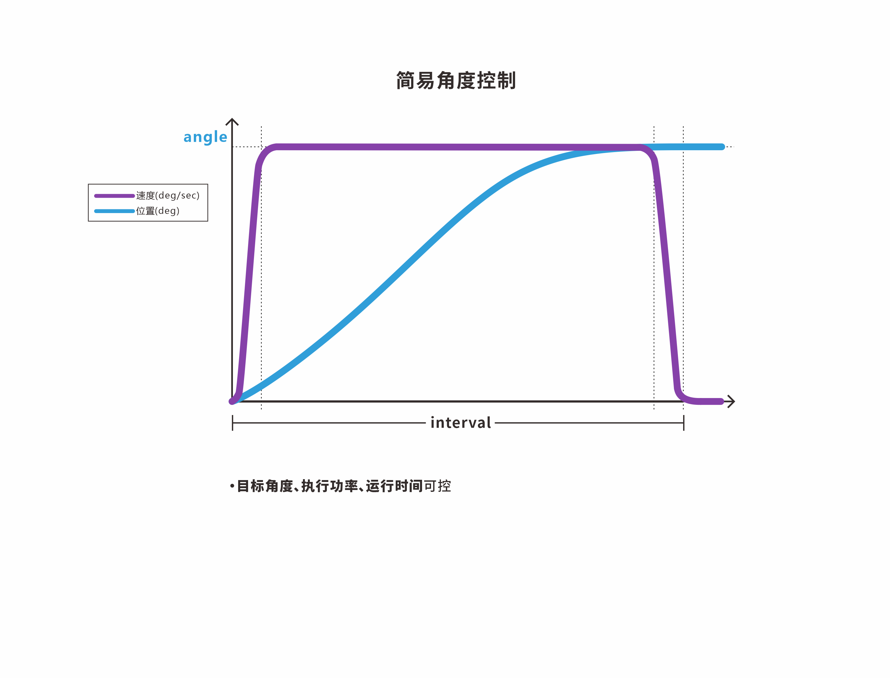

# 总线伺服舵机SDK使用手册(C++)

## 1.概述 

本SDK内容有

- 搭建Windows—总线伺服舵机使用环境说明
- 搭建Ubuntu—总线伺服舵机使用环境说明
- 基于[总线伺服舵机通信协议](https://wiki.fashionrobo.com/uartbasic/uart-protocol/)的C++的API函数，适用于所有总线伺服舵机型号。
- 精简版CSerialPort依赖库


### 1.1.上位机软件

上位机软件可以调试总线伺服舵机，测试总线伺服舵机的功能。

- 上位机软件：[FashionStar UART总线伺服舵机上位机软件](https://fashionrobo.com/downloadcenter/)

- 使用说明：[总线伺服舵机上位机软件使用说明](https://wiki.fashionrobo.com/uartbasic/uart-servo-software/)

### 1.2.SDK

本文例程、API下载。

- C++_SDK下载链接：[SDK for C++](https://fashionrobo.com/downloadcenter/)


### 1.3.图例

HP8-U45-M总线伺服舵机


总线伺服舵机转接板UC-01


## 2.接线说明

1. 安装USB转TTL模块的驱动程序。
2. 将TTL/USB调试转换板UC-01与控制器、总线伺服舵机以及电源连接。


## 3.Ubuntu下总线伺服舵机使用环境搭建

### 3.1.安装CMake

执行命令

```shell
sudo apt install cmake
```

### 3.2.安装CSerialPort

FashionStar总线伺服舵机，通信部分使用的是[CSerialPort](https://github.com/itas109/CSerialPort)库。使用前需要编译安装。详情可以点击链接查看Github代码仓库。

本SDK下载压缩包里预备了精简版本的CSerialPort库。


1. 在终端进入到 `fashionstar-uart-servo-cpp/dependency/CSerialPort` 目录。
2. 依次执行命令

```shell
mkdir build
cd build
cmake ..
make
sudo make install
```

**安装日志**

从日志文件里面可以看出，库文件最终被安装在了`/usr/local`目录下

```shell
kyle@turing:~/Project/fashionstar-uart-servo-cpp/dependency/CSerialPort/build$
sudo make install
[100%] Built target libcserialport
Install the project...
-- Install configuration: "Release"
-- Up-to-date: /usr/local/include/CSerialPort
-- Up-to-date: /usr/local/include/CSerialPort/SerialPortInfoUnixBase.h
-- Up-to-date: /usr/local/include/CSerialPort/SerialPort_global.h
-- Up-to-date: /usr/local/include/CSerialPort/SerialPortUnixBase.h
-- Up-to-date: /usr/local/include/CSerialPort/SerialPortBase.h
-- Up-to-date: /usr/local/include/CSerialPort/SerialPort.h
-- Up-to-date: /usr/local/include/CSerialPort/osplatformutil.h
-- Up-to-date: /usr/local/include/CSerialPort/SerialPortInfo.h
-- Up-to-date: /usr/local/include/CSerialPort/SerialPortInfoBase.h
-- Up-to-date: /usr/local/include/CSerialPort/sigslot.h
-- Up-to-date: /usr/local/include/CSerialPort/SerialPortInfoWinBase.h
-- Up-to-date: /usr/local/include/CSerialPort/SerialPortWinBase.h
-- Up-to-date: /usr/local/lib/libcserialport.so
-- Installing: /usr/local/lib/cmake/CSerialPort/cserialport-config.cmake
```

### 3.3.安装FashionStar总线伺服舵机库

1. 在终端进入到 `fashionstar-uart-servo-cpp` 目录。
2. 依次执行命令

```shell
mkdir build
cd build
cmake ..
make
sudo make install
sudo ldconfig
```

**安装日志**

```shell
kyle@turing:~/Project/fashionstar-uart-servo-cpp/build$ sudo make install
[sudo] password for kyle:
[100%] Built target fsuartservo
Install the project...
-- Install configuration: ""
-- Installing: /usr/local/lib/libfsuartservo.so
-- Set runtime path of "/usr/local/lib/libfsuartservo.so" to ""
-- Installing:
/usr/local/include/FashionStar/UServo/FashionStar_UartServoProtocol.h
-- Installing: /usr/local/include/FashionStar/UServo/FashionStar_UartServo.h
```


## 4.Windows下总线伺服舵机使用环境搭建

在Windows下配置C++的开发环境过程有些繁琐， 同时也有很多需要配置的地方， 以及技术常识。

### 4.1.安装mingw-w64, make, cmake

此步骤网上已经有很多配置教学，故不在本文赘述。

### 4.2.安装CSerialPort

FashionStar总线伺服舵机，通信部分使用的是[CSerialPort](https://github.com/itas109/CSerialPort)库。使用前需要编译安装。详情可以点击链接查看Github代码仓库。

本SDK下载压缩包里预备了精简版本的CSerialPort库。


1. 在终端进入到 `fashionstar-uart-servo-cpp/dependency/CSerialPort` 目录。

2. 依次执行命令

   ```shell
   mkdir build
   cd build
   # 需要把`CMAKE_INSTALL_PREFIX` 里面的内容替换为你自己的C++库的安装路径.
   cmake .. -D CMAKE_INSTALL_PREFIX="D:/KyleSoftware/CPP_LIBRARIES/"
   make
   sudo make install
   sudo ldconfig
   ```

**安装日志**


### 4.3.安装FashionStar总线伺服舵机库

1.修改CMAKE配置文件`CMakeLists.txt`

```cmake
cmake_minimum_required(VERSION 3.00)
# 设置工程名称, 设定版本
project(UART_DEMO VERSION 1.0)
# 动态链接库的安装路径
if(CMAKE_HOST_WIN32)
# Windows
# 注意事项：这里需要改成自己的Windows下的动态链接库的安装路径
# <<<<<<<<<<<<<<<<<<<<<<<<<<< 改这里
SET(CMAKE_INSTALL_PREFIX "D:/KyleSoftware/CPP_LIBRARIES/")
elseif(CMAKE_HOST_UNIX)
# Linux
# 注意事项: Linux下，CMake默认会将库安装到/usr/local, 需要注意的是，安装的时候需要sudo
权限
# sudo make install
SET(CMAKE_INSTALL_PREFIX "/usr/local/")
endif()
# 添加依赖的.h文件路径(即hello.h所在的文件夹)
include_directories(${CMAKE_INSTALL_PREFIX}/include include)
# 添加link文件夹
link_directories(${CMAKE_INSTALL_PREFIX}/bin)
# 构建源码文件
add_subdirectory(src)
```

2.终端打开 `fashionstar-uart-servo-cpp`目录

3.依次执行命令

```shell
mkdir build
cd build
cmake ..
make
sudo make install
```

**安装日志**


## 5.如何运行示例代码

在 `fashionstar-uart-servo-cpp-sdk/example` 文件夹下，存放了若干独立的示例工程，每个例程都是独立的。



以运行舵机通信检测例程 servo_ping 为例

1.修改`servo_ping.cpp`源码里面的对应UC01的端口号名称、舵机ID号。

```c++
// 总线伺服舵机配置
// 设置串口总线Servo转接板的端口号
#ifdef _WIN32
#define SERVO_PORT_NAME "COM8" 	        // Windows下端口号名称 COM{}
#else
#define SERVO_PORT_NAME "/dev/ttyUSB0" 	// Linux下端口号名称 /dev/ttyUSB{}
#endif
#define SERVO_ID 0 				        // 舵机ID号
```

3.在终端进入到 `fashionstar-uart-servo-cpp-sdk/example/servo_ping` 目录。

4.依次执行命令

```shell
mkdir build
cd build
cmake ..
make

sudo ldconfig #更新

./servo_ping 
# windows环境下为 .\servo_ping.exe
```

5.可以看到运行日志，对应着0号舵机是否接入。

```shell
Servo ID = 0 , is offline
Servo ID = 0 , is online
Servo ID = 0 , is online
```

## 6.舵机对象的创建与初始化

导入依赖

```c++
// 标准库
#include <iostream>

// 导入串口通信库的头文件
#include "CSerialPort/SerialPort.h"
// 导入总线伺服舵机库的头文件
#include "FashionStar/UServo/FashionStar_UartServoProtocol.h"
#include "FashionStar/UServo/FashionStar_UartServo.h"
```

`FashionStar_UartServoProtocol` ：用来处理舵机的底层通信协议的逻辑（数据帧的收发，数据校验等）。

`FashionStar_UartServo `：舵机的SDK，是在协议上层的更高一级的封装。


使用命名空间

```c++
using namespace std;
using namespace fsuservo;
```


配置总线伺服舵机转接板对应的端口号

```c++
// 总线伺服舵机配置
// 设置串口总线Servo转接板的端口号
#ifdef _WIN32
#define SERVO_PORT_NAME "COM8" 	        // Windows下端口号名称 COM{}
#else
#define SERVO_PORT_NAME "/dev/ttyUSB0" 	// Linux下端口号名称 /dev/ttyUSB{}
#endif
#define SERVO_ID 0 				        // 舵机ID号
```


创建一个总线伺服舵机通信协议对象`FSUS_Protocol`，默认波特率为`115200`。

```c++
// 创建协议对象
FSUS_Protocol protocol(SERVO_PORT_NAME, FSUS_DEFAULT_BAUDRATE);
```


创建一个`FSUS_Servo`舵机对象，创建的时候需要传入舵机的ID，以及通信协议对象的指针`&protocol`。

舵机的ID取值范围为``0-254`

```c++
#define SERVO_ID 0 //舵机ID号
// 创建一个舵机对象
FSUS_Servo servo0(SERVO_ID, &protocol);
```

## 7.舵机通信检测

检查舵机是否在线，就需要用到通讯检测指令。

- 如果ID号的舵机存在且在线，舵机在接收到通讯检测指令时，会发送一个响应包。

- 如果ID号的舵机不存在或者掉线，就不会有舵机发送响应数据包。


### 7.1. `ping`

用于舵机的通信检测，判断舵机是否在线。

**函数原型**

```c++
bool FSUS_Servo::ping()
```

**使用示例**

```c++
bool is_online = servo0.ping();
```

### 7.2.例程-通讯检测

**功能简介**

持续向0号舵机发送通信检测指令，并且根据0号舵机的响应情况在日志输出串口打印提示信息。

**例程源码**

`servo_ping.cpp`

```c++
/*
 * 舵机通讯检测
 * --------------------------
 * 作者: 深圳市华馨京科技有限公司
 * 网站：https://fashionrobo.com/
 * 更新时间: 2024/08/5
 **/

#include <iostream>

#include "CSerialPort/SerialPort.h"
#include "FashionStar/UServo/FashionStar_UartServoProtocol.h"
#include "FashionStar/UServo/FashionStar_UartServo.h"

// 总线伺服舵机配置
// 设置总线伺服Servo转接板的端口号
#ifdef _WIN32
#define SERVO_PORT_NAME "COM8" 	        // Windows下端口号名称 COM{}
#else
#define SERVO_PORT_NAME "/dev/ttyUSB0" 	// Linux下端口号名称 /dev/ttyUSB{}
#endif
#define SERVO_ID 0 				        // 舵机ID号

using namespace std;
using namespace fsuservo;

// 创建协议对象
FSUS_Protocol protocol(SERVO_PORT_NAME, FSUS_DEFAULT_BAUDRATE);
// 创建一个舵机对象
FSUS_Servo servo0(SERVO_ID, &protocol);

int main(){
	cout << "Example Uart Servo Ping" << endl;
	
	while(true){
		// 通信检测
		bool is_online = servo0.ping();
		// 打印日志
		cout << "Servo ID = " << SERVO_ID << " , is ";
 		if (is_online){
			cout << "online" << endl;
		}else{
			cout << "offline" << endl;
		}
		// 延时1s
		protocol.delay_ms(1000);
	}
	
}
```

## 8.单圈角度控制

</td></tr></table><table><tr><td bgcolor=#DDDDDD>

**注意事项：**

- 舵机只会响应最新的角度控制指令。当需要连续执行多个角度控制指令时，可以在程序中使用延时或者读取角度来判断上一个指令是否完成。
- 建议连续发送指令给同一个舵机时，指令间隔在10ms以上。
- 若power = 0或者大于功率保持值，按照功率保持值执行。功率保持值可在上位机进行设置。
- 舵机的最大旋转速度因舵机型号、负载情况而异。

</td></tr></table>


### 8.1. `setRawAngle`

简易角度控制



**函数原型**

```c++
/* 控制舵机的角度，interval和power为设定值 */
void FSUS_Servo::setRawAngle(FSUS_SERVO_ANGLE_T rawAngle, FSUS_INTERVAL_T interval, FSUS_POWER_T power)
```

```c++
/* 控制舵机的角度，interval为设定值，power为默认值 */
void FSUS_Servo::setRawAngle(FSUS_SERVO_ANGLE_T rawAngle, FSUS_INTERVAL_T interval)
```

```c++
/* 控制舵机的角度,interval和power为默认值 */
void FSUS_Servo::setRawAngle(FSUS_SERVO_ANGLE_T rawAngle)
```

* `rawAngle`：舵机的目标角度，单位 °
* `interval`：舵机的运行时间，单位ms
* `power`：舵机执行功率，单位mW


**使用示例**

```C++
//对应3种重载函数
servo0.setRawAngle(90.0,2000,0);  // 控制舵机的角度，interval和power为设定值
servo0.setRawAngle(90.0,2000);  // 控制舵机的角度，interval为设定值，power为默认值
servo0.setRawAngle(90.0);  // 控制舵机的角度,interval和power为默认值
```


### 8.2. `setRawAngleByInterval`

带加减速的角度控制(指定周期)


**函数原型**

```c++
// 带加减速的角度控制(指定周期)
void FSUS_Servo::setRawAngleByInterval(FSUS_SERVO_ANGLE_T rawAngle, FSUS_INTERVAL_T interval, FSUS_INTERVAL_T t_acc, FSUS_INTERVAL_T t_dec, FSUS_POWER_T power)
```

* `rawAngle`：舵机的目标角度，单位 °
* `interval`：舵机的运行时间，单位ms
* `t_acc`：舵机启动到匀速的时间，单位ms，最小值 > 20
* `t_dec`：舵机接近目标角度时的减速时间，单位ms，最小值 > 20
* `power`：舵机执行功率，单位mV，默认为0


**使用示例**

```c++
FSUS_INTERVAL_T interval;  // 运行周期 单位ms 
FSUS_INTERVAL_T t_acc;     // 加速时间 单位ms
FSUS_INTERVAL_T t_dec;     // 减速时间 单位ms

interval = 1000;
t_acc = 100;
t_dec = 100;
servo0.setRawAngleByInterval(90, interval, t_acc, t_dec, 0);
```


### 8.3. `setRawAngleByVelocity`

带加减速的角度控制(指定转速)

**函数原型**

```c++
// 带加减速的角度控制(指定转速)
void FSUS_Servo::setRawAngleByVelocity(FSUS_SERVO_ANGLE_T rawAngle, FSUS_SERVO_SPEED_T velocity, FSUS_INTERVAL_T t_acc, FSUS_INTERVAL_T t_dec, FSUS_POWER_T power)
```

* `rawAngle` : 舵机的目标角度，单位 °
* `velocity`：舵机目标转速，单位°/s
* `t_acc`：舵机启动到匀速的时间，单位ms，最小值 > 20
* `t_dec`：舵机接近目标角度时的减速时间，单位ms，最小值 > 20
* `power`：舵机执行功率，单位mV，默认为0


**使用示例**

```c++
FSUS_SERVO_SPEED_T velocity;// 目标转速 单位°/s
FSUS_INTERVAL_T t_acc;     // 加速时间 单位ms
FSUS_INTERVAL_T t_dec;     // 减速时间 单位ms

velocity = 200.0;
t_acc = 100;
t_dec = 100;
servo0.setRawAngleByVelocity(-90, velocity, t_acc, t_dec, 0);
```


### 8.4. `queryRawAngle`

查询舵机当前的单圈角度，向舵机发送角度查询指令，并将角度值赋值给舵机对象的`curAngle`属性。


**函数原型**

```c++
FSUS_SERVO_ANGLE_T FSUS_Servo::queryRawAngle()
```


**使用示例**

- 示例1


```c++
float curAngle = uservo.queryRawAngle();
```

- 示例2


```c++
// 舵机角度查询 (更新角度)
uservo.queryRawAngle(); 
// 通过curRawAngle访问当前的真实角度
//uservo.curRawAngle
```


### 8.5. `isStop`

判断舵机是否在旋转，是否是静止。该函数在执行的时候，会先查询舵机当前的角度，返回对比跟目标角度`targetAngle` 之间的差值是否小于控制死区。

**函数原型**

```c++
bool FSUS_Servo::isStop()
```

* 返回值：`true`：舵机已经到达目标角度，已停止旋转；`false`：舵机还没有到达目标角度，正在旋转。

**使用示例**

```c++
uservo.isStop();
```


### 8.6.例程-舵机单圈角度回读

**功能简介**

读取0号舵机的单圈角度，并且打印出来。

**例程源码**

`servo_query_angle.cpp`

```c++
/*
 * 舵机单圈角度回读
 * --------------------------
 * 作者: 深圳市华馨京科技有限公司
 * 网站：https://fashionrobo.com/
 * 更新时间: 2024/08/05
 **/
#include <iostream>

#include "CSerialPort/SerialPort.h"
#include "FashionStar/UServo/FashionStar_UartServoProtocol.h"
#include "FashionStar/UServo/FashionStar_UartServo.h"

// 总线伺服舵机配置
// 设置总线伺服Servo转接板的端口号
#ifdef _WIN32
#define SERVO_PORT_NAME "COM8" 	        // Windows下端口号名称 COM{}
#else
#define SERVO_PORT_NAME "/dev/ttyUSB0" 	// Linux下端口号名称 /dev/ttyUSB{}
#endif
#define SERVO_ID 0 				        // 舵机ID号
#define DAMPING_POWER 800 		// 阻尼模式的功率

using namespace std;
using namespace fsuservo;

// 创建协议对象
FSUS_Protocol protocol(SERVO_PORT_NAME, FSUS_DEFAULT_BAUDRATE);
// 创建一个舵机对象
FSUS_Servo servo0(SERVO_ID, &protocol);

int main(){
	// 打印例程信息
	cout << "Query Servo Angle" << endl;
	// 设置舵机为阻尼模式
	// servo0.setDamping(DAMPING_POWER);

	while(true){
		// 查询(更新)舵机角度
		servo0.queryRawAngle();
		// 输出查询信息
		cout << "Servo Angle: " <<  servo0.curRawAngle << endl;
		// 延时1s
		protocol.delay_ms(1000);
	}
	
}
```


### 8.7.例程-单圈角度控制功能演示

**功能简介**

测试控制舵机的角度，演示了三种控制舵机角度的API，在每次执行完角度控制指令后，会调用当前角度查询API得到实时角度。

- 简易角度控制 + 当前角度查询
- 带加减速的角度控制(指定周期) 
- 带加减速的角度控制(指定转速) + 当前角度查询

**例程源码**

`servo_set_angle.cpp`

```c++
/*
 * 单圈角度控制功能演示
 * --------------------------
 * 作者: 深圳市华馨京科技有限公司
 * 网站：https://fashionrobo.com/
 * 更新时间: 2024/08/05
 */
#include <iostream>

#include "CSerialPort/SerialPort.h"
#include "FashionStar/UServo/FashionStar_UartServoProtocol.h"
#include "FashionStar/UServo/FashionStar_UartServo.h"

// 总线伺服舵机配置
// 设置总线伺服Servo转接板的端口号
#ifdef _WIN32
#define SERVO_PORT_NAME "COM8" 	        // Windows下端口号名称 COM{}
#else
#define SERVO_PORT_NAME "/dev/ttyUSB0" 	// Linux下端口号名称 /dev/ttyUSB{}
#endif
#define SERVO_ID 0 				        // 舵机ID号
#define DAMPING_POWER 800 		// 阻尼模式的功率

using namespace std;
using namespace fsuservo;

// 创建协议对象
FSUS_Protocol protocol(SERVO_PORT_NAME, FSUS_DEFAULT_BAUDRATE);
// 创建一个舵机对象
FSUS_Servo servo0(SERVO_ID, &protocol);

// 轨迹规划参数定义
uint16_t interval;  // 运行周期 单位ms
uint16_t t_acc;     // 加速时间 单位ms
uint16_t t_dec;     // 减速时间 单位ms
float velocity;         // 目标转速 单位°/s

/* 等待并报告当前的角度*/
void waitAndReport(FSUS_Servo* servo){
	cout << "Real Angle = " << servo->curRawAngle << ", Target Angle = " << servo->targetRawAngle << endl;
    protocol.delay_ms(2000); // 暂停2s
}

int main(){
	// 打印例程信息
	cout << "Set Servo Angle" << endl;

	cout << "Set Angle = 90 deg" << endl;
    servo0.setRawAngle(90.0);  // 设置舵机的角度
    waitAndReport(&servo0);

	cout << "Set Angle = -90 deg" << endl;
    servo0.setRawAngle(-90);
    waitAndReport(&servo0);

	cout << "Set Angle = 90 deg - Set Interval = 500ms" << endl;
    interval = 500;
    t_acc = 100;
    t_dec = 100;
    servo0.setRawAngleByInterval(90, interval, t_acc, t_dec, 0);
    waitAndReport(&servo0);

	cout << "Set Angle = -90 deg - Set Velocity = 200 dps" << endl;
    velocity = 200.0;
    t_acc = 100;
    t_dec = 100;
    servo0.setRawAngleByVelocity(-90, velocity, t_acc, t_dec, 0);
    waitAndReport(&servo0);
}
```

## 9.多圈角度控制

### 9.1. `setRawAngleMTurn`

简易多圈角度控制


**函数原型**

```c++
// 控制舵机的角度，interval和power为设定值
void FSUS_Servo::setRawAngleMTurn(FSUS_SERVO_ANGLE_T rawAngle, FSUS_INTERVAL_T_MTURN interval, FSUS_POWER_T power)
```

```c++
// 控制舵机的角度，interval为设定值，power为默认值
void FSUS_Servo::setRawAngleMTurn(FSUS_SERVO_ANGLE_T rawAngle, FSUS_INTERVAL_T_MTURN interval)
```

```c++
// 控制舵机的角度,interval和power为默认值
void FSUS_Servo::setRawAngleMTurn(FSUS_SERVO_ANGLE_T rawAngle)
```

* `rawAngle`：舵机的目标角度，单位 °
* `interval`：舵机的运行时间，单位ms
* `power`：舵机执行功率，单位mW


**使用示例**

```c++
servo0.setRawAngleMTurn(500.0,2000,0);  // 控制舵机的角度，interval和power为设定值
servo0.setRawAngleMTurn(500.0,2000);  // 控制舵机的角度，interval为设定值，power为默认值
servo0.setRawAngleMTurn(500.0);  // 控制舵机的角度,interval和power为默认值
```


### 9.2. `setRawAngleMTurnByInterval`

带加减速的多圈角度控制(指定周期)


**函数原型**

```c++
// 设定舵机的原始角度(多圈+指定周期)
void FSUS_Servo::setRawAngleMTurnByInterval(FSUS_SERVO_ANGLE_T rawAngle, FSUS_INTERVAL_T_MTURN interval, FSUS_INTERVAL_T t_acc, FSUS_INTERVAL_T t_dec, FSUS_POWER_T power)
```

* `rawAngle`：舵机的目标角度，单位 °
* `interval`：舵机的运行时间，单位ms
* `t_acc`：舵机启动到匀速的时间，单位ms，最小值 > 20
* `t_dec`：舵机接近目标角度时的减速时间，单位ms，最小值 > 20
* `power`：舵机执行功率，单位mV，默认为0


**使用示例**

```c++
FSUS_INTERVAL_T_MTURN interval;  // 运行周期 单位ms 
FSUS_INTERVAL_T t_acc;     // 加速时间 单位ms
FSUS_INTERVAL_T t_dec;     // 减速时间 单位ms

interval = 1000;
t_acc = 100;
t_dec = 100;
servo0.setRawAngleMTurnByInterval(90, interval, t_acc, t_dec, 0);
```


### 9.3. `setRawAngleMTurnByVelocity`

带加减速的多圈角度控制(指定转速)


**函数原型**

```c++
// 设定舵机的原始角度(多圈+指定转速)
void FSUS_Servo::setRawAngleMTurnByVelocity(FSUS_SERVO_ANGLE_T rawAngle, FSUS_SERVO_SPEED_T velocity, FSUS_INTERVAL_T t_acc, FSUS_INTERVAL_T t_dec, FSUS_POWER_T power)
```

* `rawAngle` : 舵机的目标角度，单位 °
* `velocity`：舵机目标转速，单位°/s
* `t_acc`：舵机启动到匀速的时间，单位ms，最小值 > 20
* `t_dec`：舵机接近目标角度时的减速时间，单位ms，最小值 > 20
* `power`：舵机执行功率，单位mV，默认为0


**使用示例**

```c++
FSUS_SERVO_SPEED_T velocity;// 目标转速 单位°/s
FSUS_INTERVAL_T t_acc;     // 加速时间 单位ms
FSUS_INTERVAL_T t_dec;     // 减速时间 单位ms

velocity = 200.0;
t_acc = 100;
t_dec = 100;
servo0.setRawAngleMTurnByVelocity(-90, velocity, t_acc, t_dec, 0);
```

### 9.4. `queryRawAngleMTurn`

查询舵机当前的多圈角度，向舵机发送角度查询指令，并将角度值赋值给舵机对象的`curAngle`属性。


**函数原型**

```c++
FSUS_SERVO_ANGLE_T FSUS_Servo::queryRawAngle()
```

**使用示例**

- 示例1

```c++
float curAngle = uservo.queryRawAngleMTurn()
```

- 示例2

```c++
// 舵机角度查询 (更新角度)
uservo.queryRawAngleMTurn(); 
// 通过curRawAngle访问当前的真实角度
uservo.curRawAngle
```

### 9.5.例程-舵机多圈角度回读

**功能简介**

读取0号舵机的多圈角度，并且打印出来。

**例程源码**

`servo_query_angle_mturn.cpp`

```c++
/*
 * 舵机多圈角度回读
 * --------------------------
 * 作者: 深圳市华馨京科技有限公司
 * 网站：https://fashionrobo.com/
 * 更新时间: 2021/06/12
 **/
#include <iostream>

#include "CSerialPort/SerialPort.h"
#include "FashionStar/UServo/FashionStar_UartServoProtocol.h"
#include "FashionStar/UServo/FashionStar_UartServo.h"

// 总线伺服舵机配置
// 设置总线伺服Servo转接板的端口号
#ifdef _WIN32
#define SERVO_PORT_NAME "COM8" 	        // Windows下端口号名称 COM{}
#else
#define SERVO_PORT_NAME "/dev/ttyUSB0" 	// Linux下端口号名称 /dev/ttyUSB{}
#endif
#define SERVO_ID 0 				        // 舵机ID号
#define DAMPING_POWER 800 		// 阻尼模式的功率

using namespace std;
using namespace fsuservo;

// 创建协议对象
FSUS_Protocol protocol(SERVO_PORT_NAME, FSUS_DEFAULT_BAUDRATE);
// 创建一个舵机对象
FSUS_Servo servo0(SERVO_ID, &protocol);

int main(){
	// 打印例程信息
	cout << "Query Servo Angle MTurn" << endl;
	// 设置舵机为阻尼模式
	// servo0.setDamping(DAMPING_POWER);

	while(true){
		// 查询(更新)舵机角度 (多圈模式)
		servo0.queryRawAngleMTurn();
		// 输出查询信息
		cout << "Servo Angle: " <<  servo0.curRawAngle << endl;
		// 延时1s
		protocol.delay_ms(1000);
	}
	
}
```


### 9.6.例程-多圈角度控制功能演示

**功能简介**

测试控制舵机的角度，演示了三种控制舵机角度的API，在每次执行完角度控制指令后，会调用当前角度查询API得到实时角度。

- 简易多圈角度控制 + 当前多圈角度查询
- 带加减速的多圈角度控制(指定周期) + 当前多圈角度查询
- 带加减速的多圈角度控制(指定转速) + 当前多圈角度查询

**例程源码**

`servo_set_angle_mturn.cpp`

```c++
/*
 * 多圈角度控制功能演示
 * --------------------------
 * 作者: 深圳市华馨京科技有限公司
 * 网站：https://fashionrobo.com/
 * 更新时间: 2024/08/05
 */

#include <iostream>

#include "CSerialPort/SerialPort.h"
#include "FashionStar/UServo/FashionStar_UartServoProtocol.h"
#include "FashionStar/UServo/FashionStar_UartServo.h"

// 总线伺服舵机配置
// 设置总线伺服Servo转接板的端口号
#ifdef _WIN32
#define SERVO_PORT_NAME "COM8" 	        // Windows下端口号名称 COM{}
#else
#define SERVO_PORT_NAME "/dev/ttyUSB0" 	// Linux下端口号名称 /dev/ttyUSB{}
#endif
#define SERVO_ID 0 				        // 舵机ID号
#define DAMPING_POWER 800 		// 阻尼模式的功率

using namespace std;
using namespace fsuservo;

// 创建协议对象
FSUS_Protocol protocol(SERVO_PORT_NAME, FSUS_DEFAULT_BAUDRATE);
// 创建一个舵机对象
FSUS_Servo servo0(SERVO_ID, &protocol);

// 轨迹规划参数定义
uint16_t interval;  // 运行周期 单位ms
uint16_t t_acc;     // 加速时间 单位ms
uint16_t t_dec;     // 减速时间 单位ms
float velocity;         // 目标转速 单位°/s

/* 等待并报告当前的角度*/
void waitAndReport(FSUS_Servo* servo){
	cout << "Real Angle = " << servo->curRawAngle << ", Target Angle = " << servo->targetRawAngle << endl;
    protocol.delay_ms(2000); // 暂停2s
}

int main(){
	// 打印例程信息
	cout << "Set Servo Angle" << endl;

	cout << "Set Angle = 900 deg" << endl;
    servo0.setRawAngleMTurn(900.0);  // 设置舵机的角度
    waitAndReport(&servo0);

	cout << "Set Angle = -900.0 deg" << endl;
    servo0.setRawAngleMTurn(-900.0);
    waitAndReport(&servo0);

	cout << "Set Angle = 900 deg - Set Interval = 10s" << endl;
    interval = 10000;
    t_acc = 100;
    t_dec = 100;
    servo0.setRawAngleMTurnByInterval(900, interval, t_acc, t_dec, 0);
    waitAndReport(&servo0);

	cout << "Set Angle = -900 deg - Set Velocity = 200 dps" << endl;
    velocity = 200.0;
    t_acc = 100;
    t_dec = 100;
    servo0.setRawAngleMTurnByVelocity(-900, velocity, t_acc, t_dec, 0);
    waitAndReport(&servo0);

}

```


## 10. 舵机阻尼模式

### 10.1.  `setDamping`

设置舵机为阻尼模式，并且自定义功率。

**函数原型**

```c++
void FSUS_Servo::setDamping()//默认状态 功率500mW
```

```c++
void FSUS_Servo::setDamping(FSUS_POWER_T power)//自定义功率
```

* `power` 舵机的功率，单位为mW. 功率值越大，旋转舵机的时候阻尼力也就越大。


**使用示例**

```c++
#define DAMPING_POWER 800 // 阻尼模式下的功率(单位mW) 500,800,1000

uservo.setDamping(DAMPING_POWER);
```


### 10.2.例程-设置舵机为阻尼模式

**功能简介**

单次使用 `setDamping` 函数，舵机进入阻尼模式。可以修改阻尼模式下的功率功率，体验不同的阻尼变化。


**例程源码**

`servo_damping.cpp`

```c++
/*
 * 设置舵机为阻尼模式
 * 调整参数`DAMPING_POWER`感受不同的阻尼力
 * --------------------------
 * 作者: 深圳市华馨京科技有限公司
 * 网站：https://fashionrobo.com/
 * 更新时间: 2024/08/05
 **/
#include <iostream>

#include "CSerialPort/SerialPort.h"
#include "FashionStar/UServo/FashionStar_UartServoProtocol.h"
#include "FashionStar/UServo/FashionStar_UartServo.h"

// 总线伺服舵机配置
// 设置总线伺服Servo转接板的端口号
#ifdef _WIN32
#define SERVO_PORT_NAME "COM8" 	        // Windows下端口号名称 COM{}
#else
#define SERVO_PORT_NAME "/dev/ttyUSB0" 	// Linux下端口号名称 /dev/ttyUSB{}
#endif
#define SERVO_ID 0 				        // 舵机ID号
#define DAMPING_POWER 800 		// 阻尼模式的功率

using namespace std;
using namespace fsuservo;

// 创建协议对象
FSUS_Protocol protocol(SERVO_PORT_NAME, FSUS_DEFAULT_BAUDRATE);
// 创建一个舵机对象
FSUS_Servo servo0(SERVO_ID, &protocol);

int main(){
	// 打印例程信息
	cout << "Set Servo Mode To Damping" << endl;
	// 设置舵机为阻尼模式
	servo0.setDamping(DAMPING_POWER);
	cout << "Set Damping Power = " << DAMPING_POWER << endl;	
}
```

## 11.舵机同步指令

### 11.1. `setSyncRawAngle`

同步设置单圈角度

**函数原型**

```c++
void FSUS_Servo::setSyncRawAngle(FSUS_SERVO_COUNT_T servo_count,FSUS_Sync_T Syncsend[])
```

* `servo_count`：同步控制舵机的数量
* `Syncsend[]`：舵机的控制参数结构体数组

**使用示例**

```c++
uint8_t set_count=1;//舵机发送数量
servo0.Syncsend[0].id=0;
servo0.Syncsend[0].angle=90;
servo0.Syncsend[0].interval_single=1000;
servo0.Syncsend[0].power=500;
servo0.setSyncRawAngle(set_count,servo0.Syncsend);//设置舵机同步的原始角度
```


### 11.2. `setSyncRawAngleByInterval` 

同步设置单圈角度（指定周期）

**函数原型**

```c++
void FSUS_Servo::setSyncRawAngleByInterval(FSUS_SERVO_COUNT_T servo_count,FSUS_Sync_T Syncsend[])
```

* `servo_count`：同步控制舵机的数量
* `Syncsend[]`：舵机的控制参数结构体数组

**使用示例**

```c++
uint8_t set_count=1;//舵机发送数量
servo0.Syncsend[0].id=0;
servo0.Syncsend[0].angle=90;
servo0.Syncsend[0].interval_single=1000;
servo0.Syncsend[0].t_acc=20;
servo0.Syncsend[0].t_dec=20;
servo0.Syncsend[0].power=500;
servo0.setSyncRawAngleByInterval(set_count,servo0.Syncsend);//设置舵机同步的原始角度(指定周期)
```


### 11.3. `setSyncRawAngleByVelocity`

同步设置单圈角度（指定转速）

**函数原型**

```c++
void FSUS_Servo::setSyncRawAngleByVelocity(FSUS_SERVO_COUNT_T servo_count,FSUS_Sync_T Syncsend[])
```

* `servo_count`：同步控制舵机的数量
* `Syncsend[]`：舵机的控制参数结构体数组

**使用示例**

```c++
uint8_t set_count=1;//舵机发送数量
servo0.Syncsend[0].id=0;
servo0.Syncsend[0].angle=90;
servo0.Syncsend[0].velocity=100.0;
servo0.Syncsend[0].t_acc=20;
servo0.Syncsend[0].t_dec=20;
servo0.Syncsend[0].power=500;
servo0.setSyncRawAngleByVelocity(count,servo0.Syncsend);// 设定舵机同步的原始角度(指定转速)
```


### 11.4. `setSyncRawAngleMTurn`

同步设置多圈角度

**函数原型**

```c++
void FSUS_Servo::setSyncRawAngleMTurn(FSUS_SERVO_COUNT_T servo_count,FSUS_Sync_T Syncsend[])
```

* `servo_count`：同步控制舵机的数量
* `Syncsend[]`：舵机的控制参数结构体数组

**使用示例**

```c++
uint8_t set_count=1;//舵机发送数量
servo0.Syncsend[0].id=0;
servo0.Syncsend[0].angle=90;
servo0.Syncsend[0].interval_multi=1000;
servo0.Syncsend[0].power=500;
servo0.setSyncRawAngleMTurn(count,servo0.Syncsend);// 设定舵机同步的原始角度(多圈)
```


### 11.5.  `setSyncRawAngleMTurnByInterval`

同步设置多圈角度（指定周期）

**函数原型**

```c++
void FSUS_Servo::setSyncRawAngleMTurnByInterval(FSUS_SERVO_COUNT_T servo_count,FSUS_Sync_T Syncsend[])
```

* `servo_count`：同步控制舵机的数量
* `Syncsend[]`：舵机的控制参数结构体数组

**使用示例**

```c
uint8_t set_count=1;//舵机发送数量
servo0.Syncsend[0].id=0;
servo0.Syncsend[0].angle=90;
servo0.Syncsend[0].interval_multi=1000;
servo0.Syncsend[0].t_acc=20;
servo0.Syncsend[0].t_dec=20;
servo0.Syncsend[0].power=500;
servo0.setSyncRawAngleMTurnByInterval(count,servo0.Syncsend);// 设定舵机同步的原始角度(多圈+指定周期)
```

### 11.6.  `setSyncRawAngleMTurnByVelocity`

同步设置多圈角度（指定转速）

**函数原型**

```c++
void FSUS_Servo::setSyncRawAngleMTurnByVelocity(FSUS_SERVO_COUNT_T servo_count,FSUS_Sync_T Syncsend[])
```

* `servo_count`：同步控制舵机的数量
* `Syncsend[]`：舵机的控制参数结构体数组

**使用示例**

```c
uint8_t set_count=1;//舵机发送数量
servo0.Syncsend[0].id=0;
servo0.Syncsend[0].angle=90;
servo0.Syncsend[0].velocity=100.0;
servo0.Syncsend[0].t_acc=20;
servo0.Syncsend[0].t_dec=20;
servo0.Syncsend[0].power=500;
servo0.setSyncRawAngleMTurnByVelocity(count,servo0.Syncsend);// 设定舵机同步的原始角度(多圈+指定周期)
```


### 11.7.例程-同步指令功能演示

**例程源码**

`servo_synccommand_mode.cpp`

```c++
/*
 * 同步指令演示
 * --------------------------
 * 作者: 深圳市华馨京科技有限公司
 * 网站：https://fashionrobo.com/
 * 更新时间: 2024/08/05
 */

#include <iostream>

#include "CSerialPort/SerialPort.h"
#include "FashionStar/UServo/FashionStar_UartServoProtocol.h"
#include "FashionStar/UServo/FashionStar_UartServo.h"

// 总线伺服舵机配置
// 设置总线伺服Servo转接板的端口号
#ifdef _WIN32
#define SERVO_PORT_NAME "COM8" 	        // Windows下端口号名称 COM{}
#else
#define SERVO_PORT_NAME "/dev/ttyUSB0" 	// Linux下端口号名称 /dev/ttyUSB{}
#endif
#define SERVO_ID 0 				        // 舵机ID号

using namespace std;
using namespace fsuservo;

// 创建协议对象
FSUS_Protocol protocol(SERVO_PORT_NAME, FSUS_DEFAULT_BAUDRATE);
// 创建一个舵机对象
FSUS_Servo servo0(SERVO_ID, &protocol);

uint8_t set_count=6;//舵机发送数量
uint8_t data_count=1;//舵机读取数量

int main(){
	// 打印例程信息
	cout << "SYNC SEND" << endl;

    servo0.Syncsend[0].id=0;
    servo0.Syncsend[0].angle=90;servo0.Syncsend[0].velocity=100.0;
    servo0.Syncsend[0].interval_single=1000;servo0.Syncsend[0].interval_multi=1000;
    servo0.Syncsend[0].t_acc=20;servo0.Syncsend[0].t_dec=20;servo0.Syncsend[0].power=500;
    servo0.Syncsend[1].id=1;
    servo0.Syncsend[1].angle=90;servo0.Syncsend[1].velocity=100.0;
    servo0.Syncsend[1].interval_single=1000;servo0.Syncsend[1].interval_multi=1000;
    servo0.Syncsend[1].t_acc=20;servo0.Syncsend[1].t_dec=20;servo0.Syncsend[1].power=500;
    servo0.Syncsend[2].id=2;
    servo0.Syncsend[2].angle=90;servo0.Syncsend[2].velocity=100.0;
    servo0.Syncsend[2].interval_single=1000;servo0.Syncsend[2].interval_multi=1000;
    servo0.Syncsend[2].t_acc=20;servo0.Syncsend[2].t_dec=20;servo0.Syncsend[2].power=500;
    servo0.Syncsend[3].id=3;
    servo0.Syncsend[3].angle=90;servo0.Syncsend[3].velocity=100.0;
    servo0.Syncsend[3].interval_single=1000;servo0.Syncsend[3].interval_multi=1000;
    servo0.Syncsend[3].t_acc=20;servo0.Syncsend[3].t_dec=20;servo0.Syncsend[3].power=500;
    servo0.Syncsend[4].id=4;
    servo0.Syncsend[4].angle=90;servo0.Syncsend[4].velocity=100.0;
    servo0.Syncsend[4].interval_single=1000;servo0.Syncsend[4].interval_multi=1000;
    servo0.Syncsend[4].t_acc=20;servo0.Syncsend[4].t_dec=20;servo0.Syncsend[4].power=500;

    servo0.setSyncRawAngle(set_count,servo0.Syncsend);//设置舵机同步的原始角度
    // servo0.setSyncRawAngleByInterval(count,servo0.Syncsend);//设置舵机同步的原始角度(指定周期)
    // servo0.setSyncRawAngleByVelocity(count,servo0.Syncsend);// 设定舵机同步的原始角度(指定转速)
    // servo0.setSyncRawAngleMTurn(count,servo0.Syncsend);// 设定舵机同步的原始角度(多圈)
    // servo0.setSyncRawAngleMTurnByInterval(count,servo0.Syncsend);// 设定舵机同步的原始角度(多圈+指定周期)
    // servo0.setSyncRawAngleMTurnByVelocity(count,servo0.Syncsend);// 设定舵机同步的原始角度(多圈+指定转速)
    protocol.delay_ms(2000);

    servo0.querySyncMonitor(data_count);//设定舵机同步的数据监控

    for (uint8_t i = 0; i < data_count; i++)
        {
            cout << "Test Servo ******************************************************" << endl;
            cout << "Servo ID[" << static_cast<int>(i) << "]: " << static_cast<int>(servo0.Syncmonitor[i].id) << endl;
            cout << "Voltage[" << static_cast<int>(i) << "]: " << servo0.Syncmonitor[i].voltage << " mV" << endl;
            cout << "Current[" << static_cast<int>(i) << "]: " << servo0.Syncmonitor[i].current << " mA" << endl;
            cout << "Power[" << static_cast<int>(i) << "]: " << servo0.Syncmonitor[i].power << " mW" << endl;
            cout << "Temperature[" << static_cast<int>(i) << "]: " << servo0.Syncmonitor[i].temperature << " °C" << endl;
            cout << "Status[" << static_cast<int>(i) << "]: " << static_cast<int>(servo0.Syncmonitor[i].status) << endl;
            cout << "Angle[" << static_cast<int>(i) << "]: " << servo0.Syncmonitor[i].angle << " °" << endl;
            cout << "Circle Count[" << static_cast<int>(i) << "]: " << static_cast<int>(servo0.Syncmonitor[i].circle_count) << endl;
        }


    protocol.delay_ms(2000);

}
```


## 12.舵机状态读取

### 12.1. `queryVoltage`

读取舵机当前的电压，单位为mV。

**函数原型**

```c++
uint16_t FSUS_Servo::queryVoltage()
```

**使用示例**

```c++
uint16_t voltage = servo0.queryVoltage();
cout << "voltage: " << voltage << endl;
```


### 12.2. `queryCurrent`

读取舵机当前的电流，单位为mA。

**函数原型**

```c++
uint16_t FSUS_Servo::queryCurrent()
```

**使用示例**

```c++
uint16_t current = servo0.queryCurrent();
cout << "current: " << current << endl;
```


### 12.3. `queryPower`

读取舵机当前的功率，单位为mW。

**函数原型**

```c++
uint16_t FSUS_Servo::queryPower()
```

**使用示例**

```c++
uint16_t power = servo0.queryPower();
cout << "power: " << power << endl;
```


### 12.4. `queryTemperature`

读取舵机当前的温度，为ADC值（见附表）。

**函数原型**

```c++
uint16_t FSUS_Servo::queryTemperature()
```

**使用示例**

```c++
uint16_t temperature = servo0.queryTemperature();
cout << "temperature: " << temperature << endl;
```


### 12.5. `queryStatus`

读取舵机当前的工作状态，每个位有不同的含义。

    // BIT[0] - 执行指令置1，执行完成后清零。
    // BIT[1] - 执行指令错误置1，在下次正确执行后清零。
    // BIT[2] - 堵转错误置1，解除堵转后清零。
    // BIT[3] - 电压过高置1，电压恢复正常后清零。
    // BIT[4] - 电压过低置1，电压恢复正常后清零。
    // BIT[5] - 电流错误置1，电流恢复正常后清零。
    // BIT[6] - 功率错误置1，功率恢复正常后清零。
    // BIT[7] - 温度错误置1，温度恢复正常后清零。

**函数原型**

```c++
uint8_t FSUS_Servo::queryStatus()
```

**使用示例**

```c++
uint8_t status = servo0.queryStatus(); 
cout << "voltage high:"<<((status >> 3) & 0x01)<<endl;
```


### 12.6.例程-读取舵机的状态

**功能简介**

读取舵机当前的状态。

- 电压
- 电流
- 功率
- 温度（ADC值）
- 工作状态

**例程源码**

`servo_data_read.cpp`

```c++
/*
 * 读取舵机的状态
 * --------------------------
 * 作者: 深圳市华馨京科技有限公司
 * 网站：https://fashionrobo.com/
 * 更新时间: 2024/08/05
 **/
#include <iostream>
#include <string>

#include "CSerialPort/SerialPort.h"
#include "FashionStar/UServo/FashionStar_UartServoProtocol.h"
#include "FashionStar/UServo/FashionStar_UartServo.h"

// 总线伺服舵机配置
// 设置总线伺服Servo转接板的端口号
#ifdef _WIN32
#define SERVO_PORT_NAME "COM8" 	        // Windows下端口号名称 COM{}
#else
#define SERVO_PORT_NAME "/dev/ttyUSB0" 	// Linux下端口号名称 /dev/ttyUSB{}
#endif
#define SERVO_ID 0 				        // 舵机ID号

using namespace std;
using namespace fsuservo;

// 创建协议对象
FSUS_Protocol protocol(SERVO_PORT_NAME, FSUS_DEFAULT_BAUDRATE);
// 创建一个舵机对象
FSUS_Servo servo0(SERVO_ID, &protocol);


int main(){
	// 打印例程信息
	cout << "Servo Data Read" << endl;
	// 设置舵机角度(限制功率)
	// servo0.setAngle(0.0,  1000, 800); 

	while(true){
		// 信息查询
		uint16_t voltage = servo0.queryVoltage();
		uint16_t current = servo0.queryCurrent();
		uint16_t power = servo0.queryPower();
		uint16_t temperature = servo0.queryTemperature();
		uint8_t status = servo0.queryStatus(); 

		// 打印状态信息
		cout << "voltage(mV): " << voltage << endl;
		cout << "current(mA): " << current << endl;
		cout << "power(mW): " << power << endl;
		cout << "temperature(ADC): " << temperature << endl;
        // 舵机工作状态标志位
        // BIT[0] - 执行指令置1，执行完成后清零。
        // BIT[1] - 执行指令错误置1，在下次正确执行后清零。
        // BIT[2] - 堵转错误置1，解除堵转后清零。
        // BIT[3] - 电压过高置1，电压恢复正常后清零。
        // BIT[4] - 电压过低置1，电压恢复正常后清零。
        // BIT[5] - 电流错误置1，电流恢复正常后清零。
        // BIT[6] - 功率错误置1，功率恢复正常后清零。
        // BIT[7] - 温度错误置1，温度恢复正常后清零。
		cout << "voltage high:"<<((status >> 3) & 0x01)<<endl;
		cout << "voltage low:"<<((status >> 4) & 0x01)<<endl;
		// 延时1s
    	protocol.delay_ms(1000);
	}	
}
```

## 13.原点设置

</td></tr></table><table><tr><td bgcolor=#DDDDDD>

**注意事项**：

- 仅适用于无刷磁编码舵机
- 需要在失锁状态下使用本API

</td></tr></table>


### 13.1. `SetOriginPoint`

**函数原型**

```c++
void FSUS_Servo::SetOriginPoint()
```


**使用示例**

```c++
servo0.SetOriginPoint();
```


### 13.2.例程-舵机原点设置

**功能简介**

查询当前的单圈角度，然后将当前舵机位置设置为舵机原点。

**例程源码**

`servo_set_origin_point.cpp`

```c++
/*
 * 舵机原点设置
 * --------------------------
 * 作者: 深圳市华馨京科技有限公司
 * 网站：https://fashionrobo.com/
 * 更新时间: 2024/08/05
 **/

#include <iostream>

#include "CSerialPort/SerialPort.h"
#include "FashionStar/UServo/FashionStar_UartServoProtocol.h"
#include "FashionStar/UServo/FashionStar_UartServo.h"

// 总线伺服舵机配置
// 设置总线伺服Servo转接板的端口号
#ifdef _WIN32
#define SERVO_PORT_NAME "COM8" 	        // Windows下端口号名称 COM{}
#else
#define SERVO_PORT_NAME "/dev/ttyUSB0" 	// Linux下端口号名称 /dev/ttyUSB{}
#endif
#define SERVO_ID 0 				        // 舵机ID号

using namespace std;
using namespace fsuservo;

// 创建协议对象
FSUS_Protocol protocol(SERVO_PORT_NAME, FSUS_DEFAULT_BAUDRATE);
// 创建一个舵机对象
FSUS_Servo servo0(SERVO_ID, &protocol);

int main(){
	cout << "Example Set Origin Point" << endl;
		servo0.setTorque(0);
		servo0.queryRawAngle();
		// 输出查询信息
		cout << "Before Set Origin Point: Servo Angle: " <<  servo0.curRawAngle << endl;
		servo0.SetOriginPoint();
		protocol.delay_ms(1000);
		servo0.queryRawAngle();
		cout << "After Set Origin Point: Servo Angle: " <<  servo0.curRawAngle << endl;
}
```


## 14.异步指令

### 14.1. `SetBeginAsync`

**函数原型**

```c++
void FSUS_Servo::SetBeginAsync()
```

**使用示例**

```c++
servo0.SetBeginAsync(); //异步写入
```

### 14.2. `SetEndAsync`

**函数原型**

```c++
void FSUS_Servo::SetEndAsync(uint8_t mode)
```

**使用示例**

```c++
uint8_t endasync_mode = 0;//0执行存储指令，1取消执行存储的指令
servo0.SetEndAsync(endasync_mode);//异步执行
```


### 14.3.例程-异步指令

**功能简介**

舵机存储一次指令，可选择执行存储的指令或者取消存储的指令

**例程源码**

`servo_begin_end_async.cpp`

```c++
/*
 * 舵机存储一次指令异步执行的应用
 * --------------------------
 * 作者: 深圳市华馨京科技有限公司
 * 网站：https://fashionrobo.com/
 * 更新时间: 2025/01/05
 */

#include <iostream>

#include "CSerialPort/SerialPort.h"
#include "FashionStar/UServo/FashionStar_UartServoProtocol.h"
#include "FashionStar/UServo/FashionStar_UartServo.h"

// 总线伺服舵机配置
// 设置总线伺服Servo转接板的端口号
#ifdef _WIN32
#define SERVO_PORT_NAME "COM8" 	        // Windows下端口号名称 COM{}
#else
#define SERVO_PORT_NAME "/dev/ttyUSB0" 	// Linux下端口号名称 /dev/ttyUSB{}
#endif
#define SERVO_ID 0 				        // 舵机ID号
#define DAMPING_POWER 800 		// 阻尼模式的功率

using namespace std;
using namespace fsuservo;

// 创建协议对象
FSUS_Protocol protocol(SERVO_PORT_NAME, FSUS_DEFAULT_BAUDRATE);
// 创建一个舵机对象
FSUS_Servo servo0(SERVO_ID, &protocol);

// 轨迹规划参数定义
uint16_t interval;  // 运行周期 单位ms
uint16_t t_acc;     // 加速时间 单位ms
uint16_t t_dec;     // 减速时间 单位ms
float velocity;         // 目标转速 单位°/s

uint8_t endasync_mode = 0;//0执行存储指令，1取消执行存储的指令

/* 等待并报告当前的角度*/
void waitAndReport(FSUS_Servo* servo){
	cout << "Real Angle = " << servo->curRawAngle << ", Target Angle = " << servo->targetRawAngle << endl;
    protocol.delay_ms(2000); // 暂停2s
}

int main(){
	// 打印例程信息
	cout << "Star Async" << endl;
    servo0.SetBeginAsync();

    cout << "---------First send---------" << endl;
	cout << "Set Angle = 90 deg" << endl;
    servo0.setRawAngle(90.0);  // 设置舵机的角度
    waitAndReport(&servo0);

    protocol.delay_ms(2000); // 暂停2s

    cout << "---------Second send---------" << endl;
    servo0.SetEndAsync(endasync_mode);//0执行存储指令，1取消执行存储的指令

}

```


## 15.舵机数据监控

### 15.1. `querymonitor`

**函数原型**

```c++
uint16_t FSUS_Servo::querymonitor()
```

**使用示例**

```c++
servo0.querymonitor();
```


### 15.2.例程-读取舵机的所有数据

**功能简介**

获取舵机数据信息

**例程源码**

`servo_query_monitor.cpp`

```c++
/*
 * 读取舵机所有数据信息
 * --------------------------
 * 作者: 深圳市华馨京科技有限公司
 * 网站：https://fashionrobo.com/
 * 更新时间: 2025/01/05
 */

#include <iostream>

#include "CSerialPort/SerialPort.h"
#include "FashionStar/UServo/FashionStar_UartServoProtocol.h"
#include "FashionStar/UServo/FashionStar_UartServo.h"

// 总线伺服舵机配置
// 设置总线伺服Servo转接板的端口号
#ifdef _WIN32
#define SERVO_PORT_NAME "COM8" 	        // Windows下端口号名称 COM{}
#else
#define SERVO_PORT_NAME "/dev/ttyUSB0" 	// Linux下端口号名称 /dev/ttyUSB{}
#endif
#define SERVO_ID 0 				        // 舵机ID号

using namespace std;
using namespace fsuservo;

// 创建协议对象
FSUS_Protocol protocol(SERVO_PORT_NAME, FSUS_DEFAULT_BAUDRATE);
// 创建一个舵机对象
FSUS_Servo servo0(SERVO_ID, &protocol);


int main(){

    while (1)
    {
    servo0.querymonitor(); // 读取舵机数据
	// 打印例程信息
	cout << "*********************Test Servo monitor**************" << endl;
    cout << "Servo ID: " << static_cast<int>(servo0.servomonitor.id) << endl;
    cout << "Voltage: " << servo0.servomonitor.voltage << " mV" << endl;
    cout << "Current: " << servo0.servomonitor.current << " mA" << endl;
    cout << "Power: " << servo0.servomonitor.power << " mW" << endl;
    cout << "Temperature: " << servo0.servomonitor.temperature << " °C" << endl;
    cout << "Status: " << static_cast<int>(servo0.servomonitor.status) << endl;
    cout << "Angle: " << servo0.servomonitor.angle << " °" << endl;
    cout << "Circle Count: " << static_cast<int>(servo0.servomonitor.circle_count) << endl;

    protocol.delay_ms(2000);
    }

}
```


## 16.控制模式停止指令

### 16.1.`SetStopOnControlMode`

**函数原型**

```c++
void FSUS_Servo::SetStopOnControlMode(uint8_t mode, FSUS_POWER_T power)
```

**使用示例**

```c++
uint8_t stoponcontrol_mode = 0;//控制模式停止指令的模式选择参数  0:卸力(失锁)  1:保持锁力  2:阻尼状态
servo0.SetStopOnControlMode(stoponcontrol_mode,500);
```


### 16.2.例程-设置停止模式

**功能简介**

在运动过程中可以发送该指令让舵机进入不同的状态

**例程源码**

`servo_stop_oncontrolmode.cpp`

```c++
/*
 * 控制模式停止指令，选择进入对应状态
 * --------------------------
 * 作者: 深圳市华馨京科技有限公司
 * 网站：https://fashionrobo.com/
 * 更新时间: 2025/01/05
 */

#include <iostream>

#include "CSerialPort/SerialPort.h"
#include "FashionStar/UServo/FashionStar_UartServoProtocol.h"
#include "FashionStar/UServo/FashionStar_UartServo.h"

// 总线伺服舵机配置
// 设置总线伺服Servo转接板的端口号
#ifdef _WIN32
#define SERVO_PORT_NAME "COM8" 	        // Windows下端口号名称 COM{}
#else
#define SERVO_PORT_NAME "/dev/ttyUSB0" 	// Linux下端口号名称 /dev/ttyUSB{}
#endif
#define SERVO_ID 0 				        // 舵机ID号

using namespace std;
using namespace fsuservo;

// 创建协议对象
FSUS_Protocol protocol(SERVO_PORT_NAME, FSUS_DEFAULT_BAUDRATE);
// 创建一个舵机对象
FSUS_Servo servo0(SERVO_ID, &protocol);

// 轨迹规划参数定义
uint16_t interval;  // 运行周期 单位ms
uint16_t t_acc;     // 加速时间 单位ms
uint16_t t_dec;     // 减速时间 单位ms
float velocity;         // 目标转速 单位°/s

uint8_t stoponcontrol_mode = 0;//控制模式停止指令的模式选择参数  0:卸力(失锁)  1:保持锁力  2:阻尼状态

/* 等待并报告当前的角度*/
void waitAndReport(FSUS_Servo* servo){
	cout << "Real Angle = " << servo->curRawAngle << ", Target Angle = " << servo->targetRawAngle << endl;
    protocol.delay_ms(2000); // 暂停2s
}

int main(){
	// 打印例程信息
	cout << "servo_Stop_OnControlMode 2" << endl;

    cout << "Set Angle = 90 deg" << endl;
    servo0.setRawAngle(90.0);  // 设置舵机的角度
    waitAndReport(&servo0);

	cout << "Set Angle = -90 deg" << endl;
    servo0.setRawAngle(-90);
    waitAndReport(&servo0);

	cout << "Set Angle = 90 deg - Set Interval = 500ms" << endl;
    interval = 500;
    t_acc = 100;
    t_dec = 100;
    servo0.setRawAngleByInterval(90, interval, t_acc, t_dec, 0);
    waitAndReport(&servo0);

	cout << "Set Angle = -90 deg - Set Velocity = 200 dps" << endl;
    velocity = 200.0;
    t_acc = 100;
    t_dec = 100;
    servo0.setRawAngleByVelocity(-90, velocity, t_acc, t_dec, 0);
    waitAndReport(&servo0);

    //控制模式停止指令，选择进入阻尼状态
    servo0.SetStopOnControlMode(stoponcontrol_mode,500);
}

```


## 附表1 - 温度ADC值转换表

温度为ADC值，需要进行转换。


以下为50-79℃ 温度/ADC参照表。


| 温度(℃) | ADC  | 温度(℃) | ADC  | 温度(℃) | ADC  |
| :-----: | :--: | :-----: | :--: | :-----: | :--: |
|   50    | 1191 |   60    | 941  |   70    | 741  |
|   51    | 1164 |   61    | 918  |   71    | 723  |
|   52    | 1137 |   62    | 897  |   72    | 706  |
|   53    | 1110 |   63    | 876  |   73    | 689  |
|   54    | 1085 |   64    | 855  |   74    | 673  |
|   55    | 1059 |   65    | 835  |   75    | 657  |
|   56    | 1034 |   66    | 815  |   76    | 642  |
|   57    | 1010 |   67    | 796  |   77    | 627  |
|   58    | 986  |   68    | 777  |   78    | 612  |
|   59    | 963  |   69    | 759  |   79    | 598  |

