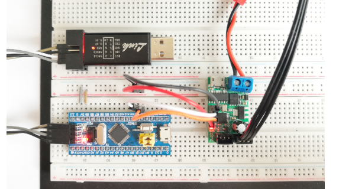
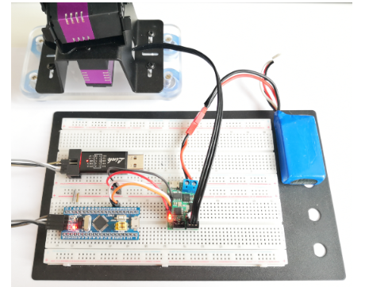
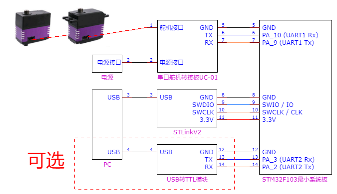
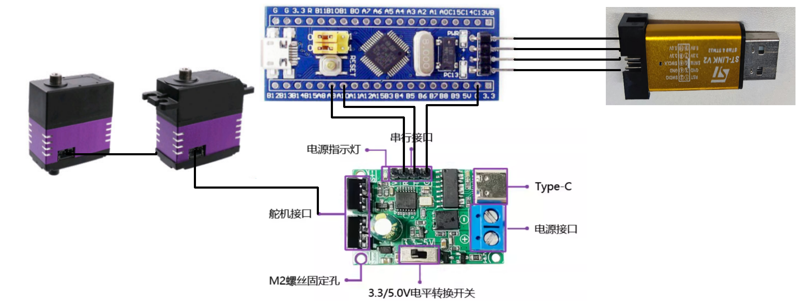
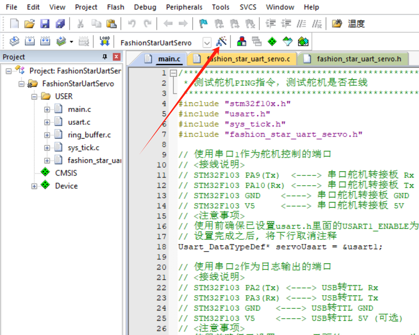
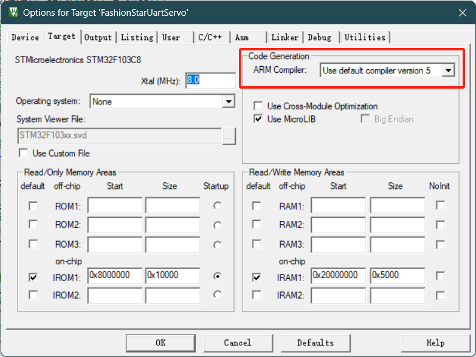
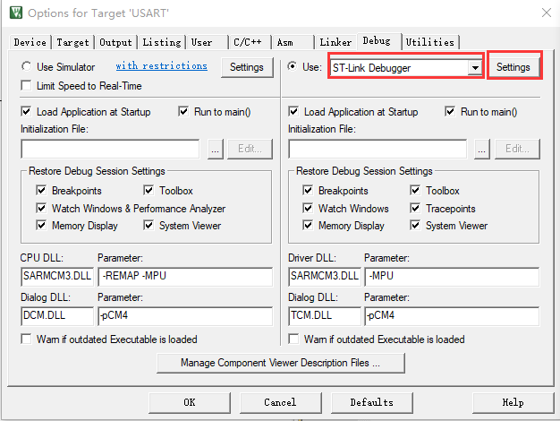
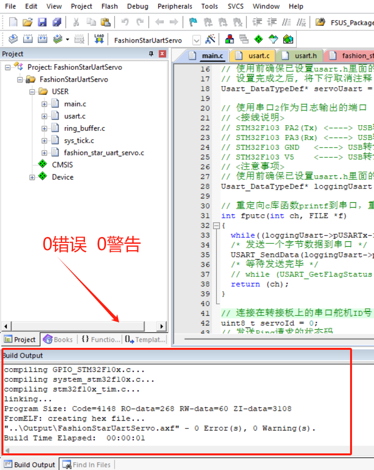
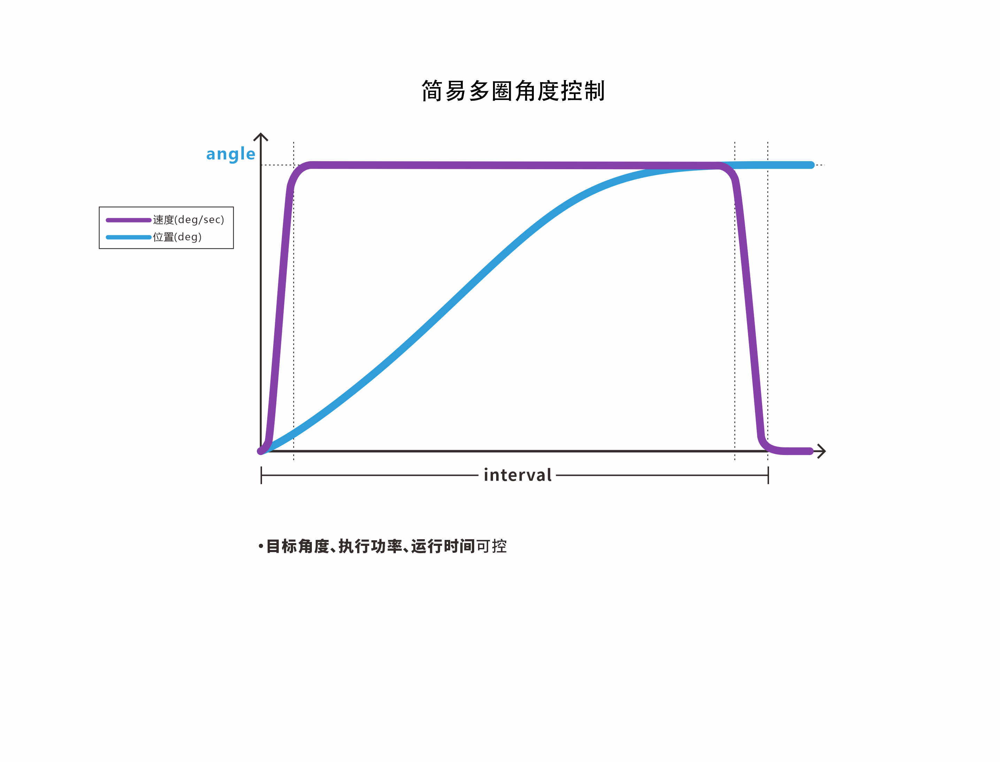

# 总线伺服舵机SDK使用手册（STM32F103）

## 1.概述

本SDK提供了基于[总线伺服舵机通信协议](https://wiki.fashionrobo.com/uartbasic/uart-protocol/)的STM32F103的API函数，适用于所有总线伺服舵机型号。


### 1.1.上位机软件

上位机软件可以调试总线伺服舵机，测试总线伺服舵机的功能。

- 上位机软件：[FashionStar UART总线伺服舵机上位机软件](https://fashionrobo.com/downloadcenter/)

- 使用说明：[总线伺服舵机上位机软件使用说明](https://wiki.fashionrobo.com/uartbasic/uart-servo-software/)

### 1.2.SDK

本文例程、API下载。

- STM32F103_SDK下载链接：[SDK for STM32F103](https://fashionrobo.com/downloadcenter/)


### 1.3.开发软件

总线伺服舵机转接板使用的USB转TTL串口芯片是`CH340`，需要在Windows上安装驱动。[检查驱动是否安装成功](https://jingyan.baidu.com/article/00a07f3872a90982d028dcb9.html)

+ keil5：[keil5下载链接](https://fashionrobo.com/wp-content/uploads/download/keil5.zip)
+ STLink驱动：[STLink驱动下载链接](https://fashionrobo.com/wp-content/uploads/download/STLinkV2.zip)
+ 串口调试助手：[XCOM V2.2下载链接](https://www.amobbs.com/forum.php?mod=attachment&aid=NDQxNzc5fDE5NzMzYjQ1fDE1NzY2NTQ4NTN8MHw1NzAzODMz)
+ 串口调试驱动：[CH340驱动下载链接](https://fashionrobo.com/wp-content/uploads/download/CH341SER.zip)


### 1.4.图例

HP8-U45-M总线伺服舵机


STM32多合一主控板


总线伺服舵机转接板UC-01


STM32F103C8T6


## 2.接线说明

### 2.1.硬件准备

|              名称              |                         说明                          |                             备注                             |
| :----------------------------: | :---------------------------------------------------: | :----------------------------------------------------------: |
|          总线伺服舵机          |            所有型号的通信协议都是统一的。             |                                                              |
|    总线伺服舵机转接板UC-01     | 提供舵机工作所需的<br> **电源接口** 和 **通信接口**。 |                             必备                             |
|      STM32F103C8T6开发板       |                     用于MCU编程。                     |                     同芯片的开发板适用。                     |
|              电脑              |             用于软件开发、打印调试信息。              |                                                              |
|           ST-Link/v2           |             STM32在线仿真器下载器/调试器              |                其他STM32下载器/调试器也适用。                |
|  USB转TTL串口模块<br>（可选）  |        用于电脑与STM32串口通信，打印调试信息。        |             并非必选，主用于开发过程中打印信息。             |
| STM32多合一主控板<br/>（可选） | 集成了总线伺服舵机转接板UC-01和STM32F103C8T6的功能。  | 可直接代替总线伺服舵机转接板UC-01和STM32F103C8T6开发板进行开发。 |

- 零基础推荐的开发方式为使用STM32多合一主控板进行开发；该主控板集成了 **总线伺服舵机转接板UC-01** 和 **STM32F103C8T6** 的功能，并且引出了开发中常用的接口，可有效缩短开发时间。
- 使用 **总线伺服舵机转接板UC-01** 和 **STM32F103C8T开发板** 组合开发，更适用于多种不同的开发环境。


### 2.2.STM32与STLinkV2的接线

通过STLinkV2给STM32下载固件。

*STM32与STLinkV2的接线图*

| STM32       | STLinkV2 |
| ----------- | -------- |
| SWIO / IO   | SWDIO    |
| SWCLK / CLK | SWCLK    |
| GND         | GND      |
| 3V3         | 3.3v     |


### 2.3.硬件接线

STM32F103一共有三个串口资源，分别为UART1、UART2、UART3。在舵机SDK内，约定三个串口的用途分别为如下所示：

* `UART1` 接总线伺服舵机转接板，控制总线伺服舵机
* `UART2` 接USB转TTL模块，用于日志输出（可选）
* `UART3` 未接


**与总线伺服舵机的接线**

串口1和总线伺服舵机转接板的TTL接口相连，用于控制总线伺服舵机。

<!--若使用PTC-32开发板，直接使用即可，不需跳线-->

*STM32与总线伺服舵机转接板接线图*

| STM32F103 GPIO    | 总线伺服舵机转接板 |
| ----------------- | ------------------ |
| PA_9   (UART1 Tx) | Rx                 |
| PA_10 (UART1 Rx)  | Tx                 |
| 5v                | 5v                 |
| GND               | GND                |






**STM32与USB转TTL模块（可选）**

STM32的串口2与USB转TTL模块模块相连，给PC发送日志信息。

*STM32与USB转TTL接线图*

| STM32F103 GPIO  | USB转TTL模块 |
| --------------- | ------------ |
| PA_2 (UART2 Tx) | Rx           |
| PA_3 (UART2 Rx) | Tx           |
| GND             | GND          |

USB转TTL模块的USB口与电脑的USB口相连。


### 2.4.图例





## 3.开发环境配置


### 3.1.KEIL5配置

配置软件部分步骤

下载并安装KEIL5和STM32F1芯片包。

下载SDK并解压缩包： **fashionstar-uart-servo-stm32f103-master**

使用KEIL5打开STM32例程的工程文件（以通信检测为例），文件路径如下：

```
fashionstar-uart-servo-stm32f103-master\UART总线伺服舵机STM32F103 SDK使用手册\2.1.舵机通讯检测\源代码\FashionStarUartServo\Project\FashionStarUartServo.uvprojx
```


选择编译器 Use default compiler version 5。



 



选择实际使用的Debugger。本例程使用ST-Link。



### 3.2.编译下载代码


输出编译结果。



将ST-Link与电脑的USB相连接。

固件下载到STM32。


按下STM32开发板上的 reset 按键。STM32执行新写入的固件。


### 3.3.拓展-文件结构讲解

**工程结构**

以例程 **舵机通讯检测** 为例，讲解STM32的工程结构。

打开文件夹 *舵机通讯检测/源代码/FashionStarUartServo*

目录结构如下: 

* `Project` 

  Keil5的工程文件，点击 `FashionStarUartServo.uvprojx`   即可通过Keil5打开此工程。

* `User`

  主程序以及用户自定义库

  * `main.c` 用户主程序
  * 用户自定义的库文件，例如*舵机驱动库*等

* `Libraries` 

  * `CMSIS`：存放ARM公司为cm3内核专一定制的内核文件接口
  * `FWLIB`：存放STM32的外设库

* `Listings` ：该目录是MDK生成信息输出目录，存放代码分布（.map和.lst）

* `Output` 该目录是MDK生成信息输出目录，存放目标文件(.o)、调试文件(.axf)、下载文件(.hex)、依赖文件（.d）等。


**用户自定义库文件**

User文件夹 工程结构介绍

* `sys_tick` 

  管理系统时间。通过配置系统定时器中断，实现了延时以及倒计时的逻辑。

* `ring_buffer` 

  用C语言实现了环形缓冲队列。用于存放管理串口通信的字节流。同时还具备向缓冲队列读取/写入特定数据类型的数值的功能。

* `usart`

  串口通信的库。通过配置宏，可以方便的打开关闭STM32F103C8开发板上三个USART资源。

* `fashion_star_uart_servo` 

  封装了Fashion Star 总线伺服舵机的通信协议，是舵机STM32F103版本的SDK。

* `main.c`

  主程序。程序入口。

`User` 文件目录树

```
├── fashion_star_uart_servo 舵机驱动库
│   ├── fashion_star_uart_servo.c
│   └── fashion_star_uart_servo.h
├── main.c 主程序
├── ring_buffer 环形缓冲队列驱动库
│   ├── README.md
│   ├── ring_buffer.c
│   └── ring_buffer.h
├── stm32f10x_conf.h
├── sys_tick　系统时钟
│   ├── sys_tick.c
│   └── sys_tick.h
└── usart 串口通信
    ├── README.md
    ├── usart.c
    └── usart.h
```

## 4.通讯检测

检查舵机是否在线，就需要用到通讯检测指令。

- 如果ID号的舵机存在且在线，舵机在接收到通讯检测指令时，会发送一个响应包。

- 如果ID号的舵机不存在或者掉线，就不会有舵机发送响应数据包。


### 4.1.通讯检测

**函数原型**

```C
FSUS_STATUS FSUS_Ping(Usart_DataTypeDef *usart, uint8_t servo_id);
```

- `usart` 舵机控制对应的串口数据对象`Usart_DataTypeDef`
- `servo_id` 舵机的ID


**使用示例**

舵机通讯检测函数`FSUS_Ping`，依次传入串口数据结构体指针`servoUsart`，还有舵机的ID号`servoId`。

```c
statusCode = FSUS_Ping(servoUsart, servoId);
```

`statusCode`是返回的状态码`FSUS_STATUS`，如果是请求成功则返回`0`，如果是其他的数值则意味着舵机通讯检测失败。可以在`fashion_star_uart_servo.h` 文件里面查阅不同的statusCode对应的错误。

```C
// FSUS状态码
#define FSUS_STATUS uint8_t
#define FSUS_STATUS_SUCCESS 0 // 设置/读取成功
#define FSUS_STATUS_FAIL 1 // 设置/读取失败
#define FSUS_STATUS_TIMEOUT 2 // 等待超时 
#define FSUS_STATUS_WRONG_RESPONSE_HEADER 3 // 响应头不对
#define FSUS_STATUS_UNKOWN_CMD_ID 4 // 未知的控制指令
#define FSUS_STATUS_SIZE_TOO_BIG 5 // 参数的size大于FSUS_PACK_RESPONSE_MAX_SIZE里面的限制
#define FSUS_STATUS_CHECKSUM_ERROR 6 // 校验和错误
#define FSUS_STATUS_ID_NOT_MATCH 7 // 请求的舵机ID跟反馈回来的舵机ID不匹配
```

### 4.2.例程-检测舵机是否在线

**功能简介**

持续向0号舵机发送通信检测指令，并且根据0号舵机的响应情况在日志输出串口打印提示信息。

**源代码**

```c
/********************************************************
 * 测试通信检测指令，测试舵机是否在线
 ********************************************************/
#include "stm32f10x.h"
#include "usart.h"
#include "sys_tick.h"
#include "fashion_star_uart_servo.h"

// 使用串口1作为舵机控制的端口
// <接线说明>
// STM32F103 PA9(Tx)  <----> 总线伺服舵机转接板 Rx
// STM32F103 PA10(Rx) <----> 总线伺服舵机转接板 Tx
// STM32F103 GND 	  <----> 总线伺服舵机转接板 GND
// STM32F103 V5 	  <----> 总线伺服舵机转接板 5V
// <注意事项>
// 使用前确保已设置usart.h里面的USART1_ENABLE为1
// 设置完成之后, 将下行取消注释
Usart_DataTypeDef* servoUsart = &usart1; 

// 使用串口2作为日志输出的端口
// <接线说明>
// STM32F103 PA2(Tx) <----> USB转TTL Rx
// STM32F103 PA3(Rx) <----> USB转TTL Tx
// STM32F103 GND 	 <----> USB转TTL GND
// STM32F103 V5 	 <----> USB转TTL 5V (可选)
// <注意事项>
// 使用前确保已设置usart.h里面的USART2_ENABLE为1
Usart_DataTypeDef* loggingUsart = &usart2;

// 重定向c库函数printf到串口，重定向后可使用printf函数
int fputc(int ch, FILE *f)
{
	while((loggingUsart->pUSARTx->SR&0X40)==0){}
	/* 发送一个字节数据到串口 */
	USART_SendData(loggingUsart->pUSARTx, (uint8_t) ch);
	/* 等待发送完毕 */
	// while (USART_GetFlagStatus(USART1, USART_FLAG_TC) != SET);		
	return (ch);
}

// 连接在转接板上的总线伺服舵机ID号
uint8_t servoId = 0; 
// 发送Ping请求的状态码
FSUS_STATUS statusCode; 

int main (void)
{
	// 嘀嗒定时器初始化
	SysTick_Init();
	// 串口初始化
	Usart_Init();
	
	while (1)
    {	
		printf("\r\n");
		// Ping一下舵机
		printf("[INFO]ping servo %d \r\n", servoId);
		statusCode = FSUS_Ping(servoUsart, servoId);
		printf("[INFO]status code %d \r\n", statusCode);
		
		// 根据状态码做不同的处理
		if (statusCode == FSUS_STATUS_SUCCESS){
			printf("[INFO]ping success, servo %d echo \r\n", servoId);
		}else{
			printf("[ERROR]ping fail, servo %d not online \r\n", servoId);
		}
		// 等待1000ms
		SysTick_DelayMs(1000);
    }
}
```


## 5.单圈角度控制

</td></tr></table><table><tr><td bgcolor=#DDDDDD>

**注意事项：**

- 舵机只会响应最新的角度控制指令。当需要连续执行多个角度控制命令时，可以在程序中使用延时或者读取角度来判断上一个命令是否完成。
- 建议连续发送指令给同一个舵机时，指令间隔在10ms以上。
- 若power = 0或者大于功率保持值，按照功率保持值执行。功率保持值可在上位机进行设置。
- 舵机的最大旋转速度因舵机型号、负载情况而异。

</td></tr></table>

### 5.1.简易角度控制


**函数原型**

```c
FSUS_STATUS FSUS_SetServoAngle(Usart_DataTypeDef *usart, uint8_t servo_id, float angle, uint16_t interval, uint16_t power, uint8_t wait);
```

* `usart` 舵机控制对应的串口数据对象`Usart_DataTypeDef`
* `servo_id` 舵机的ID
* `angle` 舵机的目标角度，最小单位 0.1°，取值范围 [-180.0, 180.0] 
* `interval` 舵机的运行时间，单位ms，最小值 > 100
* `power` 舵机执行功率，单位mV，默认为0
* `wait` API是否为阻塞式；`0`：不阻塞，`1`：等待舵机旋转到特定的位置

**使用示例**

```c
// 舵机控制相关的参数

uint8_t servoId = 0;  // 舵机的ID号
float angle = 0;// 舵机的目标角度  舵机角度在-180度到180度之间, 最小单位0.1°
uint16_t interval = 2000; // 运行时间ms  可以尝试修改设置更小的运行时间，例如500ms
uint16_t power = 0; // 舵机执行功率 单位mV 默认为0   
uint8_t wait = 0; //  API是否为阻塞式，0:不等待 1:等待舵机旋转到特定的位置; 

FSUS_SetServoAngle(servoUsart, servoId, angle, interval, power, wait);
```


### 5.2.带加减速的角度控制(指定周期)


**函数原型**

```c
FSUS_STATUS FSUS_SetServoAngleByInterval(Usart_DataTypeDef *usart, uint8_t servo_id, \
                float angle, uint16_t interval, uint16_t t_acc, \
                uint16_t t_dec, uint16_t  power, uint8_t wait);
```


* `usart` 舵机控制对应的串口数据对象`Usart_DataTypeDef`

* `servo_id` 舵机的ID

* `angle` 舵机的目标角度，最小单位 0.1°，取值范围 [-180.0, 180.0] 

* `interval` 舵机的运行时间，单位ms，取值须 > `t_acc` + `t_dec`，最小值 > 100

* `t_acc` 舵机启动到匀速的时间，单位ms，最小值 > 20

* `t_dec` 舵机接近目标角度时的减速时间，单位ms，最小值 > 20

* `power` 舵机执行功率，单位mV，默认为0

* `wait` API是否为阻塞式；`0`：不阻塞，`1`：等待舵机旋转到特定的位置

  

**使用示例**

```c
//// 舵机控制相关的参数
// 舵机的ID号
uint8_t servoId = 0;  
// 舵机的目标角度
// 舵机角度在-180度到180度之间, 最小单位0.1°
float angle = 0; 
// 运行时间ms  
// 可以尝试修改设置更小的运行时间，例如500ms
uint16_t interval = 2000; 
// 加速时间
uint16_t t_acc = 100;
// 减速时间
uint16_t t_dec = 150;
// 舵机执行功率 单位mV 默认为0   
uint16_t power = 0;
 //  API是否为阻塞式，0:不等待 1:等待舵机旋转到特定的位置; 
uint8_t wait = 0; 

FSUS_SetServoAngleByInterval(servo_usart, servo_id, angle, interval, t_acc, t_dec, power, wait);
```


### 5.3.带加减速的角度控制(指定转速)


**函数原型**

```c
FSUS_STATUS FSUS_SetServoAngleByVelocity(Usart_DataTypeDef *usart, uint8_t servo_id, \
                float angle, float velocity, uint16_t t_acc, \
                uint16_t t_dec, uint16_t  power, uint8_t wait);
```

* `usart` 舵机控制对应的串口数据对象`Usart_DataTypeDef`
* `servo_id` 舵机的ID
* `angle` 舵机的目标角度，最小单位 0.1°，取值范围 [-180.0, 180.0] 
* `velocity` 舵机目标转速，单位°/s，取值范围 [1 ,750] 
* `t_acc` 舵机启动到匀速的时间，单位ms，最小值 > 20
* `t_dec` 舵机接近目标角度时的减速时间，单位ms，最小值 > 20
* `power` 舵机执行功率，单位mV，默认为0
* `wait` API是否为阻塞式；`0`：不阻塞，`1`：等待舵机旋转到特定的位置


**使用示例**

```c
//// 舵机控制相关的参数
// 舵机的ID号
uint8_t servoId = 0;  
// 舵机的目标角度
// 舵机角度在-180度到180度之间, 最小单位0.1°
float angle = 0; 
// 目标转速
float velocity;
// 加速时间
uint16_t t_acc = 100;
// 减速时间
uint16_t t_dec = 150;
// 舵机执行功率 单位mV 默认为0   
uint16_t power = 0;
 //  API是否为阻塞式，0:不等待 1:等待舵机旋转到特定的位置; 
uint8_t wait = 0; 

FSUS_SetServoAngleByVelocity(servo_usart, servo_id, angle, velocity, t_acc, t_dec, power, wait);
```


### 5.4.当前角度查询

**函数原型**

```c
// 查询单个舵机的角度信息 angle 单位度
FSUS_STATUS FSUS_QueryServoAngle(Usart_DataTypeDef *usart, uint8_t servo_id, float *angle);
```

* `usart` 舵机控制对应的串口数据对象`Usart_DataTypeDef`
* `servo_id` 舵机的ID
* `angle` 舵机当前的角度存放指针


**使用示例**

```c
uint8_t servoId = 0;    // 舵机的ID号
float curAngle = 0;     // 舵机当前所在的角度
FSUS_QueryServoAngle(servoUsart, servoId, &curAngle); // 读取一下舵机的角度
//curAngle = 当前单圈角度
```

### 5.5.例程-控制单个舵机


**功能简介**

测试控制舵机的角度，演示了三种控制舵机角度的API，在每次执行完角度控制命令后，会调用当前角度查询API得到实时角度。

- 简易角度控制 + 当前角度查询
- 带加减速的角度控制(指定周期) + 当前角度查询
- 带加减速的角度控制(指定转速) + 当前角度查询


**源代码**

```c
/********************************************************
 * 测试控制舵机的角度, 让舵机在两个角度之间做周期性旋转
 ********************************************************/
#include "stm32f10x.h"
#include "usart.h"
#include "sys_tick.h"
#include "fashion_star_uart_servo.h"

// 使用串口1作为舵机控制的端口
// <接线说明>
// STM32F103 PA9(Tx)    <----> 总线伺服舵机转接板 Rx
// STM32F103 PA10(Rx) 	<----> 总线伺服舵机转接板 Tx
// STM32F103 GND        <----> 总线伺服舵机转接板 GND
// STM32F103 V5         <----> 总线伺服舵机转接板 5V
// <注意事项>
// 使用前确保已设置usart.h里面的USART1_ENABLE为1
Usart_DataTypeDef* servo_usart = &usart1; 

// 使用串口2作为日志输出的端口
// <接线说明>
// STM32F103 PA2(Tx) <----> USB转TTL Rx
// STM32F103 PA3(Rx) <----> USB转TTL Tx
// STM32F103 GND     <----> USB转TTL GND
// STM32F103 V5      <----> USB转TTL 5V (可选)
Usart_DataTypeDef* logging_usart = &usart2;


// 重定向c库函数printf到串口，重定向后可使用printf函数
int fputc(int ch, FILE *f)
{
    while((logging_usart->pUSARTx->SR&0X40)==0){}
    /* 发送一个字节数据到串口 */
    USART_SendData(logging_usart->pUSARTx, (uint8_t) ch);
    /* 等待发送完毕 */
    // while (USART_GetFlagStatus(USART1, USART_FLAG_TC) != SET);       
    return (ch);
}


//// 舵机控制相关的参数
// 舵机的ID号
uint8_t servo_id = 0;  
// 舵机的目标角度
// 舵机角度在-180度到180度之间, 最小单位0.1°
float angle = 0; 
// 运行时间ms  
// 可以尝试修改设置更小的运行时间，例如500ms
uint16_t interval;
// 目标转速
float velocity;
// 加速时间
uint16_t t_acc;
// 减速时间
uint16_t t_dec;
// 舵机执行功率 单位mV 默认为0   
uint16_t power = 0;
// 设置舵机角度的时候, 是否为阻塞式 
// 0:不等待 1:等待舵机旋转到特定的位置; 
uint8_t wait = 1; 
// 读取的角度
float angle_read;

int main (void)
{
    // 嘀嗒定时器初始化
    SysTick_Init();
    // 串口初始化
    Usart_Init();
    
    while (1){
        printf("GOTO: 135.0f\r\n");
        // 简易角度控制 + 当前角度查询
        angle = 135.0;
        interval = 2000;
        FSUS_SetServoAngle(servo_usart, servo_id, angle, interval, power, wait);
        FSUS_QueryServoAngle(servo_usart, servo_id, &angle_read);
        printf("Cur Angle: %.1f\r\n", angle_read);
        
        // 等待2s
        SysTick_DelayMs(2000);
        
        // 带加减速的角度控制(指定周期) + 当前角度查询
        printf("GOTO+Interval: 0.0f\r\n");
        angle = 0.0f;
        interval = 1000;
        t_acc = 100;
        t_dec = 150;
        FSUS_SetServoAngleByInterval(servo_usart, servo_id, angle, interval, t_acc, t_dec, power, wait);
        FSUS_QueryServoAngle(servo_usart, servo_id, &angle_read);
        printf("Cur Angle: %.1f\r\n", angle_read);
        
        // 等待2s
        SysTick_DelayMs(2000);
        
        // 带加减速的角度控制(指定转速) + 当前角度查询
        printf("GOTO+Velocity: -135.0f\r\n");
        angle = -135.0f;
        velocity = 200.0f;
        t_acc = 100;
        t_dec = 150;
        FSUS_SetServoAngleByVelocity(servo_usart, servo_id, angle, velocity, t_acc, t_dec, power, wait);
        FSUS_QueryServoAngle(servo_usart, servo_id, &angle_read);
        printf("Cur Angle: %.1f\r\n", angle_read);
  }
}

```


**输出日志**

```
GOTO: 135.0f
Cur Angle: 134.7
GOTO+Interval: 0.0f
Cur Angle: 0.3
GOTO+Velocity: -135.0f
Cur Angle: -134.6
```


### 5.6.例程-控制多个舵机


**功能简介**

演示如何使用简易角度控制指令来控制多个舵机。


**源代码**

```c
#include "stm32f10x.h"
#include "usart.h"
#include "sys_tick.h"
#include "fashion_star_uart_servo.h"

// 使用串口1作为舵机控制的端口
// <接线说明>
// STM32F103 PA9(Tx)    <----> 总线伺服舵机转接板 Rx
// STM32F103 PA10(Rx) 	<----> 总线伺服舵机转接板 Tx
// STM32F103 GND        <----> 总线伺服舵机转接板 GND
// STM32F103 V5         <----> 总线伺服舵机转接板 5V
// <注意事项>
// 使用前确保已设置usart.h里面的USART1_ENABLE为1
// 设置完成之后, 将下行取消注释
Usart_DataTypeDef* servoUsart = &usart1; 

//// 舵机控制相关的参数
// 运行时间ms  
// 可以尝试修改设置更小的运行时间，例如500ms
uint16_t interval = 2000; 
// 舵机执行功率 单位mV 默认为0   
uint16_t power = 0;
// 设置舵机角度的时候, 是否为阻塞式 
// 0:不等待 1:等待舵机旋转到特定的位置; 
uint8_t wait = 0; 

int main (void)
{
    // 嘀嗒定时器初始化
    SysTick_Init();
    // 串口初始化
    Usart_Init();
    
    while (1)
    {   
        // 简易角度控制指令，控制0和1号舵机
        FSUS_SetServoAngle(servoUsart, 0, 135.0, interval, power, wait);
        FSUS_SetServoAngle(servoUsart, 1, 45.0, interval, power, wait);
        // 等待动作完成
        SysTick_DelayMs(interval);
        
        // 等待2s
        SysTick_DelayMs(2000);
        
        // 简易角度控制指令，控制0和1号舵机
        FSUS_SetServoAngle(servoUsart, 0, -135.0, interval, power, wait);
        FSUS_SetServoAngle(servoUsart, 1, -45.0, interval, power, wait);
        // 等待动作完成
        SysTick_DelayMs(interval);
        
        // 等待2s
        SysTick_DelayMs(2000);
    }
}
```


### 5.7.例程-平均转速与角度回读 


**功能简介**

控制舵机角度-平均转速与角度回读

- 查询当前角度，根据平均转速和目标角度估计执行周期。
- 通过周期性查询舵机角度，判断舵机是否到达目标角度。
- 测试舵机的死区(Dead Block)/稳态误差。


**源代码**

```c
#include "stm32f10x.h"
#include "usart.h"
#include "sys_tick.h"
#include "fashion_star_uart_servo.h"

// 使用串口1作为舵机控制的端口
// <接线说明>
// STM32F103 PA9(Tx)    <----> 总线伺服舵机转接板 Rx
// STM32F103 PA10(Rx)   <----> 总线伺服舵机转接板 Tx
// STM32F103 GND        <----> 总线伺服舵机转接板 GND
// STM32F103 V5         <----> 总线伺服舵机转接板 5V
// <注意事项>
// 使用前确保已设置usart.h里面的USART1_ENABLE为1
// 设置完成之后, 将下行取消注释
Usart_DataTypeDef* servoUsart = &usart1; 

// 使用串口2作为日志输出的端口
// <接线说明>
// STM32F103 PA2(Tx) <----> USB转TTL Rx
// STM32F103 PA3(Rx) <----> USB转TTL Tx
// STM32F103 GND     <----> USB转TTL GND
// STM32F103 V5      <----> USB转TTL 5V (可选)
// <注意事项>
// 使用前确保已设置usart.h里面的USART2_ENABLE为1
Usart_DataTypeDef* loggingUsart = &usart2;

// 重定向c库函数printf到串口，重定向后可使用printf函数
int fputc(int ch, FILE *f)
{
    while((loggingUsart->pUSARTx->SR&0X40)==0){}
    /* 发送一个字节数据到串口 */
    USART_SendData(loggingUsart->pUSARTx, (uint8_t) ch);
    /* 等待发送完毕 */
    // while (USART_GetFlagStatus(USART1, USART_FLAG_TC) != SET);       
    return (ch);
}

// 舵机控制相关的参数
uint8_t servoId = 0;    // 舵机的ID
float curAngle = 0;     // 舵机当前所在的角度
float nextAngle = 0;    // 舵机的目标角度
uint16_t speed = 200;   // 舵机的转速 单位 °/s
uint16_t interval = 0;  // 舵机旋转的周期
uint16_t power = 0;     // 舵机执行功率 单位mV 默认为0
uint8_t wait = 0;       // 0:不等待 1:等待舵机旋转到特定的位置;
// 舵机角度死区, 如果舵机当前角度跟
// 目标角度相差小于死区则代表舵机到达目标角度, 舵机不再旋转
// <注意事项>
//      死区跟舵机的型号有关系, 取决于舵机固件的设置, 不同型号的舵机会有差别
float servoDeadBlock = 1.0; 

// 查询舵机的角度
uint16_t calcIntervalMs(uint8_t servoId, float nextAngle, float speed){
    // 读取一下舵机的角度
    FSUS_QueryServoAngle(servoUsart, servoId, &curAngle);
    // 计算角度误差
    float dAngle =  (nextAngle > curAngle) ? (nextAngle - curAngle) : (curAngle - nextAngle);
    // 计算所需的时间
    return (uint16_t)((dAngle / speed) * 1000.0);
}

// 等待舵机进入空闲状态IDLE, 即舵机到达目标角度
void waitUntilServoIDLE(uint8_t servoId, float nextAngle){
    
    while(1){
        // 读取一下舵机的角度
        FSUS_QueryServoAngle(servoUsart, servoId, &curAngle);
        
        // 判断舵机是否达到目标角度
        float dAngle =  (nextAngle > curAngle) ? (nextAngle - curAngle) : (curAngle - nextAngle);
        
        // 打印一下当前的舵机角度
        printf("curAngle: %f dAngle: %f\r\n", curAngle, dAngle);
        
        // 判断是否小于死区
        if (dAngle <= servoDeadBlock){
            break;
        }
        // 等待一小段时间
        SysTick_DelayMs(5);
    }
}


int main (void)
{
    // 嘀嗒定时器初始化
    SysTick_Init();
    // 串口初始化
    Usart_Init();
    
    while (1)
    {   
        // 设置舵机的目标角度
        nextAngle = 120.0;
        // 根据转速还有角度误差计算周期
        interval = calcIntervalMs(servoId, nextAngle, speed);
        printf("Set Servo %f-> %f", curAngle, nextAngle);
        // 控制舵机角度
        FSUS_SetServoAngle(servoUsart, servoId, nextAngle, interval, power, wait);
        // SysTick_DelayMs(interval);
        SysTick_DelayMs(5);
        waitUntilServoIDLE(servoId, nextAngle);
        
        // 等待1s 看舵机死区范围
        SysTick_DelayMs(1000);
        // 读取一下舵机的角度
        FSUS_QueryServoAngle(servoUsart, servoId, &curAngle);
        printf("Final Angle: %f", curAngle);
        SysTick_DelayMs(1000);
        
        // 设置舵机的目标角度
        nextAngle = -120;
        // 根据转速还有角度误差计算周期
        interval = calcIntervalMs(servoId, nextAngle, speed);
        // 控制舵机角度
        FSUS_SetServoAngle(servoUsart, servoId, nextAngle, interval, power, wait);
        // 需要延时一会儿，确保舵机接收并开始执行舵机控制指令
        // 如果马上发送舵机角度查询信息,新发送的这条指令可能会覆盖舵机角度控制信息
        SysTick_DelayMs(5);
        waitUntilServoIDLE(servoId, nextAngle);
        
        // 等待1s 看舵机死区范围
        SysTick_DelayMs(1000);
        // 读取一下舵机的角度
        FSUS_QueryServoAngle(servoUsart, servoId, &curAngle);
        printf("Final Angle: %f", curAngle);
        SysTick_DelayMs(1000);
    }
}
```

## 6.多圈角度控制

</td></tr></table><table><tr><td bgcolor=#DDDDDD>

**注意事项：**

- 舵机只会响应最新的角度控制指令。当需要连续执行多个角度控制命令时，可以在程序中使用延时或者读取角度来判断上一个命令是否完成。
- 建议连续发送指令给同一个舵机时，指令间隔在10ms以上。
- 若power = 0或者大于功率保持值，按照功率保持值执行。功率保持值可在上位机进行设置。
- 舵机的最大旋转速度因舵机型号、负载情况而异。

</td></tr></table>


### 6.1.简易多圈角度控制


**函数原型**

```c
FSUS_STATUS FSUS_SetServoAngleMTurn(Usart_DataTypeDef *usart, uint8_t servo_id, float angle, \
			uint32_t interval, uint16_t power, uint8_t wait);
```

* `usart` 舵机控制对应的串口数据对象`Usart_DataTypeDef`
* `servo_id` 舵机的ID
* `angle` 舵机的目标角度，最小单位 0.1°，取值范围 [-368,640.0° ,  368,640.0°]
* `interval` 舵机的运行时间，单位ms，最小值 > 100
* `power` 舵机执行功率，单位mV，默认为0
* `wait` API是否为阻塞式；`0`：不阻塞，`1`：等待舵机旋转到特定的位置


**使用示例**

```C
//// 舵机控制相关的参数
// 舵机的ID号
uint8_t servo_id = 0;  
// 舵机的目标角度
float angle= 720.0f; 
uint32_t interval = 2000; 	// 运行时间ms  
// 舵机执行功率，单位mV，默认为0	
uint16_t power = 0;
 //  API是否为阻塞式，0:不等待 1:等待舵机旋转到特定的位置; 
uint8_t wait = 0; 

FSUS_SetServoAngleMTurn(servo_usart, servo_id, angle, interval, power, wait);
```


### 6.2.带加减速的多圈角度控制(指定周期)


**函数原型**

```c
FSUS_STATUS FSUS_SetServoAngleMTurnByInterval(Usart_DataTypeDef *usart, uint8_t servo_id, float angle, \
			uint32_t interval,  uint16_t t_acc,  uint16_t t_dec, uint16_t power, uint8_t wait);
```

* `usart` 舵机控制对应的串口数据对象`Usart_DataTypeDef`
* `servo_id` 舵机的ID
* `angle` 舵机的目标角度，最小单位 0.1°，取值范围 [-368,640.0° ,  368,640.0°]
* `interval` 舵机的运行时间，单位ms，取值须 > `t_acc` + `t_dec`，最小值 > 100
* `t_acc` 舵机启动到匀速的时间，单位ms，最小值 > 20
* `t_dec` 舵机接近目标角度时的减速时间，单位ms，最小值 > 20
* `power` 舵机执行功率，单位mV，默认为0
* `wait` API是否为阻塞式；`0`：不阻塞，`1`：等待舵机旋转到特定的位置

**使用示例**

```c
//// 舵机控制相关的参数
// 舵机的ID号
uint8_t servo_id = 0;  
// 舵机的目标角度
float angle= 720.0f; 
uint32_t interval = 2000; 	// 运行时间ms  
// 舵机执行功率，单位mV，默认为0	
uint16_t power = 0;
 //  API是否为阻塞式，0:不等待 1:等待舵机旋转到特定的位置; 
uint8_t wait = 1; 
// 加速时间(单位ms)
uint16_t t_acc = 100;
// 减速时间
uint16_t t_dec = 200;

FSUS_SetServoAngleMTurnByInterval(servo_usart, servo_id, angle, interval, t_acc, t_dec, power, wait);
```


### 6.3.带加减速的多圈角度控制(指定转速)


**函数原型**

```c
FSUS_STATUS FSUS_SetServoAngleMTurnByVelocity(Usart_DataTypeDef *usart, uint8_t servo_id, float angle, \
			float velocity, uint16_t t_acc,  uint16_t t_dec, uint16_t power, uint8_t wait);
```

* `usart` 舵机控制对应的串口数据对象`Usart_DataTypeDef`
* `servo_id` 舵机的ID
* `angle` 舵机的目标角度，最小单位 0.1°，取值范围 [-368,640.0° ,  368,640.0°]
* `velocity` 舵机目标转速，单位°/s，取值范围 [1 ,750] 
* `t_acc` 舵机启动到匀速的时间，单位ms，最小值 > 20
* `t_dec` 舵机接近目标角度时的减速时间，单位ms，最小值 > 20
* `power` 舵机执行功率，单位mV，默认为0
* `wait` API是否为阻塞式；`0`：不阻塞，`1`：等待舵机旋转到特定的位置

**使用示例**

```c
//// 舵机控制相关的参数
// 舵机的ID号
uint8_t servo_id = 0;  
// 舵机的目标角度
float angle= 720.0f; 
float velocity = 100.0f;	// 电机转速, 单位dps,°/s 
// 舵机执行功率，单位mV，默认为0	
uint16_t power = 0;
 //  API是否为阻塞式，0:不等待 1:等待舵机旋转到特定的位置; 
uint8_t wait = 1; 
// 加速时间(单位ms)
uint16_t t_acc = 100;
// 减速时间
uint16_t t_dec = 200;

FSUS_SetServoAngleMTurnByVelocity(servo_usart, servo_id, angle, velocity, t_acc, t_dec, power, wait);
```


### 6.4.当前多圈角度查询


**函数原型**

```c
FSUS_STATUS FSUS_QueryServoAngleMTurn(Usart_DataTypeDef *usart, uint8_t servo_id, float *angle);
```

* `usart` 舵机控制对应的串口数据对象`Usart_DataTypeDef`

* `servo_id` 舵机的ID

* `angle` 舵机当前的多圈角度存放指针

**使用示例**

```C
uint8_t servoId = 0;    // 舵机的ID号
float curAngle = 0;     // 舵机当前所在的角度
FSUS_QueryServoAngleMTurn(servoUsart, servoId, &curAngle); // 读取一下舵机的角度
//curAngle = 当前单圈角度
```

### 6.5.清除当前圈数

**函数原型**

```C
FSUS_STATUS FSUS_ServoAngleReset(Usart_DataTypeDef *usart, uint8_t servo_id);
```

* `usart` 舵机控制对应的串口数据对象`Usart_DataTypeDef`

* `servo_id` 舵机的ID

**使用示例**

```C
uint8_t servoId = 0;    // 舵机的ID号
FSUS_ServoAngleReset(servoUsart, servoId); // 清除多圈圈数
```


### 6.6.例程-多圈角度控制


**功能简介**

例程演示了多圈角度控制以及查询实时多圈角度的API使用方法

- 简易多圈角度控制+ 当前多圈角度查询
- 带加减速的多圈角度控制(指定周期)+ 当前多圈角度查询
- 带加减速的多圈角度控制(指定转速)+ 当前多圈角度查询


**源代码**

```c
/********************************************************
 * 舵机多圈控制模式演示
 ********************************************************/
#include "stm32f10x.h"
#include "usart.h"
#include "sys_tick.h"
#include "fashion_star_uart_servo.h"

// 使用串口1作为舵机控制的端口
// <接线说明>
// STM32F103 PA9(Tx) 	<----> 总线伺服舵机转接板 Rx
// STM32F103 PA10(Rx) 	<----> 总线伺服舵机转接板 Tx
// STM32F103 GND 		<----> 总线伺服舵机转接板 GND
// STM32F103 V5 		<----> 总线伺服舵机转接板 5V
// <注意事项>
// 使用前确保已设置usart.h里面的USART1_ENABLE为1
// 设置完成之后, 将下行取消注释
Usart_DataTypeDef* servo_usart = &usart1; 

// 使用串口2作为日志输出的端口
// <接线说明>
// STM32F103 PA2(Tx) <----> USB转TTL Rx
// STM32F103 PA3(Rx) <----> USB转TTL Tx
// STM32F103 GND     <----> USB转TTL GND
// STM32F103 V5      <----> USB转TTL 5V (可选)
// <注意事项>
// 使用前确保已设置usart.h里面的USART2_ENABLE为1
// 设置完成之后, 将下行取消注释
Usart_DataTypeDef* loggingUsart = &usart2;

// 重定向c库函数printf到串口，重定向后可使用printf函数
int fputc(int ch, FILE *f)
{
	while((loggingUsart->pUSARTx->SR&0X40)==0){}
	/* 发送一个字节数据到串口 */
	USART_SendData(loggingUsart->pUSARTx, (uint8_t) ch);
	/* 等待发送完毕 */
	// while (USART_GetFlagStatus(USART1, USART_FLAG_TC) != SET);		
	return (ch);
}


// 使用串口3作为舵机控制的端口
// <接线说明>
// STM32F103 PB10(Tx) 	<----> 总线伺服舵机转接板 Rx
// STM32F103 PB11(Rx) 	<----> 总线伺服舵机转接板 Tx
// STM32F103 GND 		<----> 总线伺服舵机转接板 GND
// STM32F103 V5 		<----> 总线伺服舵机转接板 5V
// <注意事项>
// 使用前确保已设置usart.h里面的USART1_ENABLE为1
// 设置完成之后, 将下行取消注释
// Usart_DataTypeDef* servo_usart = &usart3; 

//// 舵机控制相关的参数
// 舵机的ID号
uint8_t servo_id = 0;  
// 舵机的目标角度
// 舵机角度在-135度到135度之间, 精确到小数点后一位
float angle; 
uint32_t interval; 	// 运行时间ms  
float velocity; 		// 电机转速, 单位dps,°/s
// 舵机执行功率 单位mV，默认为0	
uint16_t power = 0;
// 设置舵机角度的时候, 是否为阻塞式 
// 0:不等待 1:等待舵机旋转到特定的位置; 
uint8_t wait = 1; 
// 加速时间(单位ms)
uint16_t t_acc;
// 减速时间
uint16_t t_dec;

// 读取的角度
float angle_read;
int main (void)
{
	// 嘀嗒定时器初始化
	SysTick_Init();
	// 串口初始化
	Usart_Init();
	
	while (1){	
		printf("MTurn GOTO: 720.0f\r\n");
		//简易多圈角度控制 + 当前多圈角度查询
		angle = 720.0f;
		interval = 2000;
		FSUS_SetServoAngleMTurn(servo_usart, servo_id, angle, interval, power, wait);
		FSUS_QueryServoAngleMTurn(servo_usart, servo_id, &angle_read);
		printf("Cur Angle: %.1f\r\n", angle_read);
		
		// 等待2s
		SysTick_DelayMs(2000);
		
		
		printf("MTurn GOTO: 0.0f\r\n");
		angle = 0.0;
		FSUS_SetServoAngleMTurn(servo_usart, servo_id, angle, interval, power, wait);
		FSUS_QueryServoAngleMTurn(servo_usart, servo_id, &angle_read);
		printf("Cur Angle: %.1f\r\n", angle_read);
		
		// 等待2s
		SysTick_DelayMs(2000);
		
		
		//带加减速的多圈角度控制(指定周期) + 当前多圈角度查询
		printf("MTurn+Interval GOTO: -180.0f\r\n");
		angle = 180.0f;	
		interval = 1000;
		t_acc = 100;
		t_dec = 200;
		FSUS_SetServoAngleMTurnByInterval(servo_usart, servo_id, angle, interval, t_acc, t_dec, power, wait);
		FSUS_QueryServoAngleMTurn(servo_usart, servo_id, &angle_read);
		printf("Cur Angle: %.1f\r\n", angle_read);
		
		// 等待2s
		SysTick_DelayMs(2000);
		
		//带加减速的多圈角度控制(指定转速) + 当前多圈角度查询
		printf("MTurn+Velocity GOTO: -180.0f\r\n");
		angle = -180.0f;
		velocity = 100.0f;
		t_acc = 100;
		t_dec = 200;
		FSUS_SetServoAngleMTurnByVelocity(servo_usart, servo_id, angle, velocity, t_acc, t_dec, power, wait);
		FSUS_QueryServoAngleMTurn(servo_usart, servo_id, &angle_read);
		printf("Cur Angle: %.1f\r\n", angle_read);
		
		// 等待2s
		SysTick_DelayMs(2000);
		
  }
}

```


**输出日志**

```
MTurn GOTO: 720.0f
Cur Angle: 719.7
MTurn GOTO: 0.0f
Cur Angle: 0.4
MTurn+Interval GOTO: -180.0f
Cur Angle: 179.7
MTurn+Velocity GOTO: -180.0f
Cur Angle: -179.5
MTurn GOTO: 720.0f
Cur Angle: 719.5
MTurn GOTO: 0.0f
Cur Angle: 0.4
MTurn+Interval GOTO: -180.0f
Cur Angle: 179.7
MTurn+Velocity GOTO: -180.0f
Cur Angle: -179.5
```

## 7.阻尼模式


### 7.1.设置阻尼模式并设置功率

**函数原型**

```c
// 舵机阻尼模式
FSUS_STATUS FSUS_DampingMode(Usart_DataTypeDef *usart, uint8_t servoId, uint16_t power);
```

* `usart` 舵机控制对应的串口数据对象`Usart_DataTypeDef`
* `servoId` 舵机的ID
* `power` 舵机的功率  单位mW

**使用示例**

```c
// 连接在转接板上的总线伺服舵机ID号
uint8_t servoId = 0; 
// 阻尼模式下的功率，功率越大阻力越大
uint16_t power = 500;
// 设置舵机为阻尼模式
FSUS_DampingMode(servoUsart, servoId, power);
```


### 7.2.例程-设置阻尼模式的功率


**功能简介**

设置不同的功率，体验舵机阻尼力的变换。


**源代码**

```c
/***************************************************
 * 总线伺服舵机阻尼模式
 ***************************************************/
#include "stm32f10x.h"
#include "usart.h"
#include "sys_tick.h"
#include "fashion_star_uart_servo.h"

// 使用串口1作为舵机控制的端口
// <接线说明>
// STM32F103 PA9(Tx)  <----> 总线伺服舵机转接板 Rx
// STM32F103 PA10(Rx) <----> 总线伺服舵机转接板 Tx
// STM32F103 GND 	  <----> 总线伺服舵机转接板 GND
// STM32F103 V5 	  <----> 总线伺服舵机转接板 5V
// <注意事项>
// 使用前确保已设置usart.h里面的USART1_ENABLE为1
// 设置完成之后, 将下行取消注释
Usart_DataTypeDef* servoUsart = &usart1; 

// 连接在转接板上的总线伺服舵机ID号
uint8_t servoId = 0; 
// 阻尼模式下的功率，功率越大阻力越大
uint16_t power = 500;
int main (void)
{
	// 嘀嗒定时器初始化
	SysTick_Init();
	// 串口初始化
	Usart_Init();
	// 设置舵机为阻尼模式
	FSUS_DampingMode(servoUsart, servoId, power);
	while (1)
    {	
		//主循环什么也不做
		// 等待1000ms
		SysTick_DelayMs(1000);
    }
}

```


### 7.3.例程-阻尼模式与角度回读


**功能简介**

设置舵机为阻尼模式，同时请求舵机的角度。在旋转舵机的情况下，每隔一段时间就更新一下舵机的角度。串口2每隔一段时间打印一下舵机角度信息。


**源代码**

```c
#include "stm32f10x.h"
#include "usart.h"
#include "sys_tick.h"
#include "fashion_star_uart_servo.h"

// 使用串口1作为舵机控制的端口
// <接线说明>
// STM32F103 PA9(Tx)  <----> 总线伺服舵机转接板 Rx
// STM32F103 PA10(Rx) <----> 总线伺服舵机转接板 Tx
// STM32F103 GND 	  <----> 总线伺服舵机转接板 GND
// STM32F103 V5 	  <----> 总线伺服舵机转接板 5V
// <注意事项>
// 使用前确保已设置usart.h里面的USART1_ENABLE为1
// 设置完成之后, 将下行取消注释
Usart_DataTypeDef* servoUsart = &usart1; 
// 使用串口2作为日志输出的端口
// <接线说明>
// STM32F103 PA2(Tx) <----> USB转TTL Rx
// STM32F103 PA3(Rx) <----> USB转TTL Tx
// STM32F103 GND 	 <----> USB转TTL GND
// STM32F103 V5 	 <----> USB转TTL 5V (可选)
// <注意事项>
// 使用前确保已设置usart.h里面的USART2_ENABLE为1
Usart_DataTypeDef* loggingUsart = &usart2;

// 重定向c库函数printf到串口，重定向后可使用printf函数
int fputc(int ch, FILE *f)
{
	while((loggingUsart->pUSARTx->SR&0X40)==0){}
	/* 发送一个字节数据到串口 */
	USART_SendData(loggingUsart->pUSARTx, (uint8_t) ch);
	/* 等待发送完毕 */
	// while (USART_GetFlagStatus(USART1, USART_FLAG_TC) != SET);		
	return (ch);
}

FSUS_STATUS statusCode; // 请求包的状态码
uint8_t servoId = 0; 	// 连接在转接板上的总线伺服舵机ID号
uint16_t power = 500; 	// 阻尼模式下的功率，功率越大阻力越大
float angle = 0; 		// 舵机的角度

int main (void)
{
	// 嘀嗒定时器初始化
	SysTick_Init();
	// 串口初始化
	Usart_Init();
	// 设置舵机为阻尼模式
	FSUS_DampingMode(servoUsart, servoId, power);
	while (1)
    {	
		// 读取一下舵机的角度
		statusCode = FSUS_QueryServoAngle(servoUsart, servoId, &angle);
		
		if (statusCode ==FSUS_STATUS_SUCCESS){
			// 成功的读取到了舵机的角度
			printf("[INFO] servo id= %d ; angle = %f\r\n", servoId, angle);
		}else{
			// 没有正确的读取到舵机的角度
			printf("\r\n[INFO] read servo %d angle, status code: %d \r\n", servoId, statusCode);
			printf("[ERROR]failed to read servo angle\r\n");
		}
		// 等待1000ms
		SysTick_DelayMs(500);
    }
}
```


## 8.舵机轮式模式(316版本以及后续版本已弃用)


### 8.1.定速持续旋转

**函数原型**

```c
// 轮式模式 不停的旋转
FSUS_STATUS FSUS_WheelKeepMove(Usart_DataTypeDef *usart, uint8_t servoId, uint8_t is_cw, uint16_t speed);
```

* `usart` 舵机控制对应的串口数据对象`Usart_DataTypeDef`
* `servoId` 舵机的ID
* `is_cw` 是否顺时针旋转；`0`：否，逆时针旋转，`1`：是，顺时针旋转
* `speed` 舵机旋转速度，单位 °/s

**使用示例**

```c
uint8_t servoId = 0; 	// 连接在转接板上的总线伺服舵机ID号
uint16_t speed = 20; 	// 舵机的旋转速度 20°/s
uint8_t is_cw = 0; 		// 舵机的旋转方向
FSUS_WheelKeepMove(servoUsart, servoId, is_cw, speed);
```


### 8.2.旋转特定的时间

**函数原型**

```c
// 轮式模式 按照特定的速度旋转特定的时间
FSUS_STATUS FSUS_WheelMoveTime(Usart_DataTypeDef *usart, uint8_t servoId, uint8_t is_cw, uint16_t speed, uint16_t nTime);
```

* `usart` 舵机控制对应的串口数据对象`Usart_DataTypeDef`
* `servoId` 舵机的ID
* `is_cw` 是否顺时针旋转；`0`：否，逆时针旋转，`1`：是，顺时针旋转
* `speed` 舵机旋转速度，单位 °/s
* `nTime` 舵机持续旋转的时间，单位ms。

**使用示例**

```c
uint8_t servoId = 0; 	// 连接在转接板上的总线伺服舵机ID号
uint16_t speed = 20; 	// 舵机的旋转速度 20°/s
uint8_t is_cw = 0; 		// 舵机的旋转方向
uint16_t nTime = 3000; 	// 延时时间
FSUS_WheelMoveTime(servoUsart, servoId, is_cw, speed, nTime);
```


### 8.3.旋转特定的圈数

**函数原型**

```c
// 轮式模式 旋转特定的圈数
FSUS_STATUS FSUS_WheelMoveNCircle(Usart_DataTypeDef *usart, uint8_t servoId, uint8_t is_cw, uint16_t speed, uint16_t nCircle);
```

* `usart` 舵机控制对应的串口数据对象`Usart_DataTypeDef`
* `servoId` 舵机的ID
* `is_cw` 是否顺时针旋转；`0`：否，逆时针旋转，`1`：是，顺时针旋转
* `speed` 舵机旋转的速度，单位 °/s
* `nCircle` 舵机持续旋转的圈数，单位：圈

**使用示例**

```c
uint8_t servoId = 0; 	// 连接在转接板上的总线伺服舵机ID号
uint16_t speed = 200; 	// 舵机的旋转速度 单位°/s
uint8_t is_cw = 0; 		// 舵机的旋转方向
uint16_t nCircle = 1; 	// 舵机旋转的圈数
FSUS_WheelMoveNCircle(servoUsart, servoId, is_cw, speed, nCircle);
```


### 8.4.例程-舵机持续旋转


**功能简介**

测试舵机360度定速持续旋转


**源代码**

```c
#include "stm32f10x.h"
#include "usart.h"
#include "sys_tick.h"
#include "fashion_star_uart_servo.h"

// 使用串口1作为舵机控制的端口
// <接线说明>
// STM32F103 PA9(Tx)  <----> 总线伺服舵机转接板 Rx
// STM32F103 PA10(Rx) <----> 总线伺服舵机转接板 Tx
// STM32F103 GND 	  <----> 总线伺服舵机转接板 GND
// STM32F103 V5 	  <----> 总线伺服舵机转接板 5V
// <注意事项>
// 使用前确保已设置usart.h里面的USART1_ENABLE为1
// 设置完成之后, 将下行取消注释
Usart_DataTypeDef* servoUsart = &usart1; 

FSUS_STATUS statusCode; // 请求包的状态码
uint8_t servoId = 0; 	// 连接在转接板上的总线伺服舵机ID号
uint16_t speed = 20; 	// 舵机的旋转速度 20°/s
uint8_t is_cw = 0; 		// 舵机的旋转方向
int main (void)
{
	// 嘀嗒定时器初始化
	SysTick_Init();
	// 串口初始化
	Usart_Init();
	
	while (1){
		// 舵机轮式模式定速控制 顺时针旋转3s
		is_cw = 1;
		FSUS_WheelKeepMove(servoUsart, servoId, is_cw, speed);
		SysTick_DelayMs(3000);
		
		// 舵机刹车 停顿2s 
		FSUS_WheelStop(servoUsart, servoId);
		SysTick_DelayMs(1000);
		
		// 舵机轮式模式定速控制 逆时针旋转3s
		is_cw = 0;
		FSUS_WheelKeepMove(servoUsart, servoId, is_cw, speed);
		SysTick_DelayMs(3000);
		
		// 舵机刹车 停顿2s 
		FSUS_WheelStop(servoUsart, servoId);
		SysTick_DelayMs(1000);
	}
}
```


### 8.5.例程-舵机定时旋转


**功能简介**

测试舵机定时旋转，顺时针旋转3s，然后逆时针旋转3s。


**源代码**

```c
/***************************************************
 * 轮式控制模式 定时旋转
 * <注意事项>
 * 	  在测试本例程时, 请确保舵机没有机械结构/接线的约束, 
 * 	  舵机可以360度旋转
 ***************************************************/
#include "stm32f10x.h"
#include "usart.h"
#include "sys_tick.h"
#include "fashion_star_uart_servo.h"

// 使用串口1作为舵机控制的端口
// <接线说明>
// STM32F103 PA9(Tx)  <----> 总线伺服舵机转接板 Rx
// STM32F103 PA10(Rx) <----> 总线伺服舵机转接板 Tx
// STM32F103 GND 	  <----> 总线伺服舵机转接板 GND
// STM32F103 V5 	  <----> 总线伺服舵机转接板 5V
// <注意事项>
// 使用前确保已设置usart.h里面的USART1_ENABLE为1
// 设置完成之后, 将下行取消注释
Usart_DataTypeDef* servoUsart = &usart1; 

FSUS_STATUS statusCode; // 请求包的状态码
uint8_t servoId = 0; 	// 连接在转接板上的总线伺服舵机ID号
uint16_t speed = 20; 	// 舵机的旋转速度 20°/s
uint8_t is_cw = 0; 		// 舵机的旋转方向
uint16_t nTime = 3000; 	// 延时时间
int main (void)
{
	// 嘀嗒定时器初始化
	SysTick_Init();
	// 串口初始化
	Usart_Init();
	
	while (1){
		// 舵机轮式模式定速控制 顺时针旋转3s
		is_cw = 1;
		FSUS_WheelMoveTime(servoUsart, servoId, is_cw, speed, nTime);
		// FSUS_WheelMoveTime是非阻塞的,因为有时候需要控制多个舵机同时旋转
		// 所以在后面要手动加延迟
		SysTick_DelayMs(nTime);
		
		// 停顿1s 
		SysTick_DelayMs(1000);
		
		// 舵机轮式模式定速控制 逆时针旋转3s
		is_cw = 0;
		FSUS_WheelMoveTime(servoUsart, servoId, is_cw, speed, nTime);
		SysTick_DelayMs(nTime);
		
		// 停顿1s 
		SysTick_DelayMs(1000);
	}
}
```


### 8.6.例程-舵机定圈旋转


**功能简介**

测试舵机定圈旋转，顺时针旋转一圈，然后逆时针旋转一圈。


**源代码**

```c
/***************************************************
 * 轮式模式 定圈旋转
 * <注意事项>
 * 	  在测试本例程时, 请确保舵机没有机械结构/接线的约束, 
 * 	  舵机可以360度旋转
 ***************************************************/
#include "stm32f10x.h"
#include "usart.h"
#include "sys_tick.h"
#include "fashion_star_uart_servo.h"

// 使用串口1作为舵机控制的端口
// <接线说明>
// STM32F103 PA9(Tx)  <----> 总线伺服舵机转接板 Rx
// STM32F103 PA10(Rx) <----> 总线伺服舵机转接板 Tx
// STM32F103 GND 	  <----> 总线伺服舵机转接板 GND
// STM32F103 V5 	  <----> 总线伺服舵机转接板 5V
// <注意事项>
// 使用前确保已设置usart.h里面的USART1_ENABLE为1
// 设置完成之后, 将下行取消注释
Usart_DataTypeDef* servoUsart = &usart1; 

FSUS_STATUS statusCode; // 请求包的状态码
uint8_t servoId = 0; 	// 连接在转接板上的总线伺服舵机ID号
uint16_t speed = 200; 	// 舵机的旋转速度 单位°/s
uint8_t is_cw = 0; 		// 舵机的旋转方向
uint16_t nCircle = 1; 	// 舵机旋转的圈数

// 估计旋转圈数所需要花费的时间
uint16_t estimateTimeMs(uint16_t nCircle, uint16_t speed){
	return (uint16_t)((float)nCircle * 360.0 / (float)speed * 1000);
}

int main (void)
{
	// 嘀嗒定时器初始化
	SysTick_Init();
	// 串口初始化
	Usart_Init();
	
	while (1){
		// 舵机轮转模式定速控制 顺时针旋转1圈
		is_cw = 1;
		FSUS_WheelMoveNCircle(servoUsart, servoId, is_cw, speed, nCircle);
		// FSUS_WheelMoveNCircle是非阻塞的,因为有时候需要控制多个舵机同时旋转
		// 延时估算所需时间
		SysTick_DelayMs(estimateTimeMs(nCircle, speed));
		
		// 停顿1s 
		SysTick_DelayMs(1000);
		
		// 舵机轮转模式定速控制 逆时针旋转1圈
		is_cw = 0;
		FSUS_WheelMoveNCircle(servoUsart, servoId, is_cw, speed, nCircle);
		// 注意: FSUS_WheelMoveNCircle是非阻塞的,因为有时候需要控制多个舵机同时旋转
		// 延时估算所需时间
		SysTick_DelayMs(estimateTimeMs(nCircle, speed));
		
		// 停顿1s 
		SysTick_DelayMs(1000);
	}
}
```

## 9.舵机同步指令


### 9.1.同步指令控制舵机

**函数原型**

```c
FSUS_STATUS FSUS_SyncCommand(Usart_DataTypeDef *usart, uint8_t servo_count, uint8_t ServoMode, FSUS_sync_servo servoSync[])；
```

* `usart` 舵机控制对应的串口数据对象`Usart_DataTypeDef`
* `servo_count` 舵机同步数量
* `servomode` 同步指令模式选择

* `servoSync[]` 舵机控制参数结构体

**使用示例**

```c
/*同步指令模式选择
* 1：设置舵机的角度
* 2：设置舵机的角度(指定周期)
* 3：设置舵机的角度(指定转速)
* 4：设置舵机的角度(多圈模式)
* 5：设置舵机的角度(多圈模式, 指定周期) 
* 6：设置舵机的角度(多圈模式, 指定转速)
* 7：读取舵机的数据*/
uint8_t sync_mode=1;//同步指令模式

uint8_t sync_count=5;//舵机数量

//数组定义在#include "fashion_star_uart_servo.c" 
FSUS_sync_servo SyncArray[20]; // 假设您要控制20个伺服同步
ServoData servodata[20];//假设您要读取20个伺服舵机的数据

//如需更改舵机数量在#include "fashion_star_uart_servo.h"对应修改extern
extern FSUS_sync_servo SyncArray[20]; // 假设您要控制20个伺服同步
extern ServoData servodata[20];//假设您要读取20个伺服舵机的数据

servoSyncArray[0].angle=90;/*角度*/
servoSyncArray[0].id=0;/*舵机ID号*/
servoSyncArray[0].velocity=100;/*速度*/				 servoSyncArray[0].interval_single=1000;/*单圈时间*/	servoSyncArray[0].interval_multi=1000; /*多圈时间*/		servoSyncArray[0].t_acc=100;/*加速时间*/    
servoSyncArray[0].t_dec=100;/*减速时间*/				servoSyncArray[0].power=100;/*功率*/
/*********************************以此类推赋值剩下舵机参数 灵活性高**************************************/

FSUS_SyncCommand(servo_usart, servo_count, servomode, servoSyncArray);
```


### 9.2.例程-同步指令


**功能简介**

同时控制所有舵机，实时性高


**源代码**

```c
#include "stm32f10x.h"
#include "usart.h"
#include "sys_tick.h"
#include "fashion_star_uart_servo.h"

// 使用串口1作为舵机控制的端口
// <接线说明>
// STM32F103 PA9(Tx)  <----> 总线伺服舵机转接板 Rx
// STM32F103 PA10(Rx) <----> 总线伺服舵机转接板 Tx
// STM32F103 GND 	  <----> 总线伺服舵机转接板 GND
// STM32F103 V5 	  <----> 总线伺服舵机转接板 5V
// <注意事项>
// 使用前确保已设置usart.h里面的USART1_ENABLE为1
// 设置完成之后, 将下行取消注释
Usart_DataTypeDef* servoUsart = &usart1; 

// 使用串口2作为日志输出的端口
// <接线说明>
// STM32F103 PA2(Tx) <----> USB转TTL Rx
// STM32F103 PA3(Rx) <----> USB转TTL Tx
// STM32F103 GND     <----> USB转TTL GND
// STM32F103 V5      <----> USB转TTL 5V (可选)
Usart_DataTypeDef* logging_usart = &usart2;


// 重定向c库函数printf到串口，重定向后可使用printf函数
int fputc(int ch, FILE *f)
{
    while((logging_usart->pUSARTx->SR&0X40)==0){}
    /* 发送一个字节数据到串口 */
    USART_SendData(logging_usart->pUSARTx, (uint8_t) ch);
    /* 等待发送完毕 */
    // while (USART_GetFlagStatus(USART1, USART_FLAG_TC) != SET);       
    return (ch);
}

/*同步指令模式选择
* 1：设置舵机的角度
* 2：设置舵机的角度(指定周期)
* 3：设置舵机的角度(指定转速)
* 4：设置舵机的角度(多圈模式)
* 5：设置舵机的角度(多圈模式, 指定周期) 
* 6：设置舵机的角度(多圈模式, 指定转速)
* 7：读取舵机的数据*/
uint8_t servomode=1;//自行更改数值设置模式

//舵机数量，如果id不是从0开始，请把参数设置为最大舵机id号
uint8_t servo_count=5;

int main (void)
{
    // 嘀嗒定时器初始化
    SysTick_Init();
    // 串口初始化
    Usart_Init();

    while (1){
			
   	SyncArray[0].angle=90;
		SyncArray[0].id=0;SyncArray[0].interval_single=100;SyncArray[0].interval_multi=1000;SyncArray[0].velocity=100;SyncArray[0].t_acc=20;SyncArray[0].t_dec=20;
		SyncArray[1].angle=-90;
		SyncArray[1].id=1;SyncArray[1].interval_single=100;SyncArray[1].interval_multi=1000;SyncArray[1].velocity=100;SyncArray[1].t_acc=20;SyncArray[1].t_dec=20;
		SyncArray[2].angle=90;
		SyncArray[2].id=2;SyncArray[2].interval_single=100;SyncArray[2].interval_multi=1000;SyncArray[2].velocity=100;SyncArray[2].t_acc=20;SyncArray[2].t_dec=20;
		SyncArray[3].angle=-90;
		SyncArray[3].id=3;SyncArray[3].interval_single=100;SyncArray[3].interval_multi=1000;SyncArray[3].velocity=100;SyncArray[3].t_acc=20;SyncArray[3].t_dec=20;
		SyncArray[4].angle=-90;
		SyncArray[4].id=4;SyncArray[4].interval_single=100;SyncArray[4].interval_multi=1000;SyncArray[4].velocity=100;SyncArray[4].t_acc=20;SyncArray[4].t_dec=20;
		//发送同步指令控制
		FSUS_SyncCommand(servo_usart,sync_count,sync_mode,SyncArray);
		SysTick_DelayMs(1000);
		//发送同步指令读取
		FSUS_SyncCommand(servo_usart,sync_count,7,SyncArray);
		SysTick_DelayMs(200);

		SyncArray[0].angle=45;SyncArray[0].interval_single=0;SyncArray[0].velocity=20;
		SyncArray[1].angle=-45;SyncArray[1].interval_single=0;SyncArray[1].velocity=20;
		SyncArray[2].angle=45;SyncArray[2].interval_single=0;SyncArray[2].velocity=20;
		SyncArray[3].angle=-45;SyncArray[3].interval_single=0;SyncArray[3].velocity=20;
		SyncArray[4].angle=-45;SyncArray[4].interval_single=0;SyncArray[4].velocity=20;
		//发送同步指令控制
		FSUS_SyncCommand(servo_usart,sync_count,sync_mode,SyncArray);
		SysTick_DelayMs(1000);
		//发送同步指令读取
		FSUS_SyncCommand(servo_usart,sync_count,7,SyncArray);
		SysTick_DelayMs(200);
  }
}

```


## 10.数据监控


### 10.1.读取舵机数据

**函数原型**

```c
FSUS_STATUS FSUS_ServoMonitor(Usart_DataTypeDef *usart, uint8_t servo_id, ServoData servodata[]);
```

* `usart` 舵机控制对应的串口数据对象`Usart_DataTypeDef`
* `servo_id` 舵机的ID
* `servodata[]` 舵机的存储数据结构体

**使用示例**

```c
//要读取的舵机id号
uint8_t servoId = 0; 
//舵机的存储数据结构体
ServoData servodata_single[1];
// 读取舵机数据函数
FSUS_ServoMonitor(servo_usart,servo_id,servodata_single);
```


### 10.2.例程-舵机数据监控


**功能简介**

读取舵机的所有参数


**源代码**

```c
/********************************************************
 * 测试舵机的数据回读，并通过串口打印全部数据
 ********************************************************/
#include "stm32f10x.h"
#include "usart.h"
#include "sys_tick.h"
#include "fashion_star_uart_servo.h"

// 使用串口1作为舵机控制的端口
// <接线说明>
// STM32F103 PA9(Tx)    <----> 总线伺服舵机转接板 Rx
// STM32F103 PA10(Rx)   <----> 总线伺服舵机转接板 Tx
// STM32F103 GND        <----> 总线伺服舵机转接板 GND
// STM32F103 V5         <----> 总线伺服舵机转接板 5V
// <注意事项>
// 使用前确保已设置usart.h里面的USART1_ENABLE为1
Usart_DataTypeDef* servo_usart = &usart1; 

// 使用串口2作为日志输出的端口
// <接线说明>
// STM32F103 PA2(Tx) <----> USB转TTL Rx
// STM32F103 PA3(Rx) <----> USB转TTL Tx
// STM32F103 GND     <----> USB转TTL GND
// STM32F103 V5      <----> USB转TTL 5V (可选)
Usart_DataTypeDef* logging_usart = &usart2;


// 重定向c库函数printf到串口，重定向后可使用printf函数
int fputc(int ch, FILE *f)
{
    while((logging_usart->pUSARTx->SR&0X40)==0){}
    /* 发送一个字节数据到串口 */
    USART_SendData(logging_usart->pUSARTx, (uint8_t) ch);
    /* 等待发送完毕 */
    // while (USART_GetFlagStatus(USART1, USART_FLAG_TC) != SET);       
    return (ch);
}

/*数据监控的数据
* id：舵机的id号
* voltage：舵机的电压
* current：舵机的电流
* power：舵机的执行功率
* temperature：舵机的温度 
* status：舵机的状态
* angle：舵机的角度
* circle_count：舵机的转动圈数
*/
ServoData servodata_single[1];//读取一个舵机数据的结构体

//要读取的舵机id号
uint8_t servo_id=0;

int main (void)
{
    // 嘀嗒定时器初始化
    SysTick_Init();
    // 串口初始化
    Usart_Init();
    while (1){
        	//每1秒读取一次
			FSUS_DampingMode(servo_usart,servo_id,500);
			FSUS_ServoMonitor(servo_usart,servo_id,servodata_single);
			printf("read ID: %d\r\n", servodata_single[0].id);
			printf("read sucess, voltage: %d mV\r\n", servodata_single[0].voltage);
			printf("read sucess, current: %d mA\r\n", servodata_single[0].current);
			printf("read sucess, power: %d mW\r\n", servodata_single[0].power);
			printf("read sucess, temperature: %d \r\n", servodata_single[0].temperature);
			if ((servodata_single[0].status >> 3) & 0x01)
			printf("read sucess, voltage too high\r\n");
			if ((servodata_single[0].status >> 4) & 0x01)
			printf("read sucess, voltage too low\r\n");
			printf("read sucess, angle: %f\r\n", servodata_single[0].angle);
			printf("read sucess, circle_count: %d\r\n",servodata_single[0].circle_count);
			SysTick_DelayMs(1000);
			
  }
}

```


## 11.**舵机状态读取**


### 11.1.读取参数

**函数原型**

```c
// 读取数据
FSUS_STATUS FSUS_ReadData(Usart_DataTypeDef *usart, uint8_t servoId,  uint8_t address, uint8_t *value, uint8_t *size);
```

* `usart` 舵机控制对应的串口数据对象`Usart_DataTypeDef`
* `servoId` 舵机的ID
* `address` 只读参数或自定义参数地址
* `value` 读取到的数据存放指针
* `size` 读取到的数据的长度存放指针

**使用示例**

```c
uint8_t servoId = 0;  		// 连接在转接板上的总线伺服舵机ID号
uint8_t value;
uint8_t dataSize;

statusCode = FSUS_ReadData(servoUsart, servoId, FSUS_PARAM_SERVO_STATUS, (uint8_t *)&value, &dataSize);

if (statusCode == FSUS_STATUS_SUCCESS)
{
    // 舵机工作状态标志位
    // BIT[0] - 执行指令置1，执行完成后清零。
    // BIT[1] - 执行指令错误置1，在下次正确执行后清零。
    // BIT[2] - 堵转错误置1，解除堵转后清零。
    // BIT[3] - 电压过高置1，电压恢复正常后清零。
    // BIT[4] - 电压过低置1，电压恢复正常后清零。
    // BIT[5] - 电流错误置1，电流恢复正常后清零。
    // BIT[6] - 功率错误置1，功率恢复正常后清零。
    // BIT[7] - 温度错误置1，温度恢复正常后清零。

    if ((value >> 3) & 0x01)
        printf("read sucess, voltage too high\r\n");
    if ((value >> 4) & 0x01)
        printf("read sucess, voltage too low\r\n");
}
```


### 11.2.写入自定义参数

</td></tr></table><table><tr><td bgcolor=#DDDDDD>

推荐使用上位机写入自定义参数。

</td></tr></table>

**函数原型**

```c
// 写入数据
FSUS_STATUS FSUS_WriteData(Usart_DataTypeDef *usart, uint8_t servoId, uint8_t address, uint8_t *value, uint8_t size);
```

* `usart` 舵机控制对应的串口数据对象`Usart_DataTypeDef`
* `servoId` 舵机的ID
* `address`   自定义参数地址
* `value` 写入的数据存放指针
* `size` 写入的数据的长度

**使用示例**

```c
uint8_t servoId = 0;  		// 连接在转接板上的总线伺服舵机ID号
float angleLimitLow = -90.0; 	// 舵机角度下限设定值
value = (int16_t)(angleLimitLow*10); // 舵机角度下限 转换单位为0.1度
statusCode = FSUS_WriteData(servoUsart, servoId, FSUS_PARAM_ANGLE_LIMIT_LOW, (uint8_t *)&value, 2);
```

### 11.3.重置舵机自定义参数

**函数原型**

```c
FSUS_STATUS FSUS_ResetUserData(Usart_DataTypeDef *usart, uint8_t servoId);
```

* `usart` 舵机控制对应的串口数据对象`Usart_DataTypeDef`
* `servoId` 舵机的ID

**使用示例**

```c
uint8_t servoId = 0;  		// 连接在转接板上的总线伺服舵机ID号
FSUS_ResetUserData(servoUsart, servoId);
```


### 11.4.例程-读取舵机参数（温度、功率、工作状态）

**功能简介**

读取舵机的实时状态，并且给出了判断工作状态异常的示例

- 电压
- 电流
- 功率
- 温度
- 工作状态标志位

```C
	// 舵机工作状态标志位
	// BIT[0] - 执行指令置1，执行完成后清零。
	// BIT[1] - 执行指令错误置1，在下次正确执行后清零。
	// BIT[2] - 堵转保护置1，解除堵转后清零。
	// BIT[3] - 电压过高置1，电压恢复正常后清零。
	// BIT[4] - 电压过低置1，电压恢复正常后清零。
	// BIT[5] - 电流保护置1，电流恢复正常后清零。
	// BIT[6] - 功率保护置1，功率恢复正常后清零。
	// BIT[7] - 温度保护置1，温度恢复正常后清零。
```

**源代码**

```c
/***************************************************
* 读取舵机参数
 ***************************************************/
#include "stm32f10x.h"
#include "usart.h"
#include "sys_tick.h"
#include "fashion_star_uart_servo.h"
#include "math.h"

// 使用串口1作为舵机控制的端口
// <接线说明>
// STM32F103 PA9(Tx)  <----> 总线伺服舵机转接板 Rx
// STM32F103 PA10(Rx) <----> 总线伺服舵机转接板 Tx
// STM32F103 GND 	  <----> 总线伺服舵机转接板 GND
// STM32F103 V5 	  <----> 总线伺服舵机转接板 5V
// <注意事项>
// 使用前确保已设置usart.h里面的USART1_ENABLE为1
// 设置完成之后, 将下行取消注释
Usart_DataTypeDef *servoUsart = &usart1;

// 使用串口2作为日志输出的端口
// <接线说明>
// STM32F103 PA2(Tx) <----> USB转TTL Rx
// STM32F103 PA3(Rx) <----> USB转TTL Tx
// STM32F103 GND 	 <----> USB转TTL GND
// STM32F103 V5 	 <----> USB转TTL 5V (可选)
// <注意事项>
// 使用前确保已设置usart.h里面的USART2_ENABLE为1
Usart_DataTypeDef *loggingUsart = &usart2;

// 重定向c库函数printf到串口，重定向后可使用printf函数
int fputc(int ch, FILE *f)
{
	while ((loggingUsart->pUSARTx->SR & 0X40) == 0)
	{
	}
	/* 发送一个字节数据到串口 */
	USART_SendData(loggingUsart->pUSARTx, (uint8_t)ch);
	/* 等待发送完毕 */
	// while (USART_GetFlagStatus(USART1, USART_FLAG_TC) != SET);
	return (ch);
}

uint8_t servoId = 0;	// 连接在转接板上的总线伺服舵机ID号
FSUS_STATUS statusCode; // 状态码

int main(void)
{
	// 嘀嗒定时器初始化
	SysTick_Init();
	// 串口初始化
	Usart_Init();

	// 读取用户自定义数据
	// 数据表里面的数据字节长度一般为1个字节/2个字节/4个字节
	// 查阅通信协议可知,舵机角度上限的数据类型是有符号短整型(UShort, 对应STM32里面的int16_t),长度为2个字节
	// 所以这里设置value的数据类型为int16_t
	int16_t value;
	uint8_t dataSize;
	// 传参数的时候, 要将value的指针强行转换为uint8_t

	// 读取电压
	statusCode = FSUS_ReadData(servoUsart, servoId, FSUS_PARAM_VOLTAGE, (uint8_t *)&value, &dataSize);
	
	printf("read ID: %d\r\n", servoId);

	if (statusCode == FSUS_STATUS_SUCCESS)
	{
		printf("read sucess, voltage: %d mV\r\n", value);
	}
	else
	{
		printf("fail\r\n");
	}

	// 读取电流
	statusCode = FSUS_ReadData(servoUsart, servoId, FSUS_PARAM_CURRENT, (uint8_t *)&value, &dataSize);
	if (statusCode == FSUS_STATUS_SUCCESS)
	{
		printf("read sucess, current: %d mA\r\n", value);
	}
	else
	{
		printf("fail\r\n");
	}

	// 读取功率
	statusCode = FSUS_ReadData(servoUsart, servoId, FSUS_PARAM_POWER, (uint8_t *)&value, &dataSize);
	if (statusCode == FSUS_STATUS_SUCCESS)
	{
		printf("read sucess, power: %d mW\r\n", value);
	}
	else
	{
		printf("fail\r\n");
	}
	// 读取温度
	statusCode = FSUS_ReadData(servoUsart, servoId, FSUS_PARAM_TEMPRATURE, (uint8_t *)&value, &dataSize);
	if (statusCode == FSUS_STATUS_SUCCESS)
	{
		double temperature, temp;
		temp = (double)value;
		temperature = 1 / (log(temp / (4096.0f - temp)) / 3435.0f + 1 / (273.15 + 25)) - 273.15;
		printf("read sucess, temperature: %f\r\n", temperature);
	}
	else
	{
		printf("fail\r\n");
	}	
	// 读取工作状态
	statusCode = FSUS_ReadData(servoUsart, servoId, FSUS_PARAM_SERVO_STATUS, (uint8_t *)&value, &dataSize);
	if (statusCode == FSUS_STATUS_SUCCESS)
	{
		// 舵机工作状态标志位
		// BIT[0] - 执行指令置1，执行完成后清零。
		// BIT[1] - 执行指令错误置1，在下次正确执行后清零。
		// BIT[2] - 堵转保护置1，解除堵转后清零。
		// BIT[3] - 电压过高置1，电压恢复正常后清零。
		// BIT[4] - 电压过低置1，电压恢复正常后清零。
		// BIT[5] - 电流保护置1，电流恢复正常后清零。
		// BIT[6] - 功率保护置1，功率恢复正常后清零。
		// BIT[7] - 温度保护置1，温度恢复正常后清零。

		if ((value >> 3) & 0x01)
			printf("read sucess, voltage too high\r\n");
		if ((value >> 4) & 0x01)
			printf("read sucess, voltage too low\r\n");
	}
	else
	{
		printf("fail\r\n");
	}
	printf("================================= \r\n");
	// 死循环
	while (1)
		;
}

```


**输出日志**

```C
read ID: 0                                      //舵机id
read success, voltage: 8905 mv                 //当前电压
read success, current: 0 ma                    //当前电流
read success, power: 0 mw                      //当前功率
read success, temperature: 32.240993           //当前温度
read success, voltage too high                 //如果当前电压超过舵机参数设置的舵机高压保护值，可以读到标志位
=================================
```


## 12.停止指令

</td></tr></table><table><tr><td bgcolor=#DDDDDD>

**注意事项：**

- 失锁状态下，舵机仍会响应指令。

</td></tr></table>

**函数原型**

```c
FSUS_STATUS FSUS_StopOnControlMode(Usart_DataTypeDef *usart, uint8_t servo_id, uint8_t mode, uint16_t power)；
```

* `usart` 舵机控制对应的串口数据对象`Usart_DataTypeDef`
* `servo_id` 舵机的ID
* `mode` 舵机停止指令编号
* `power` 舵机的功率  单位mW

**使用示例**

```c
/* 舵机控制模式停止指令*/
//mode 指令停止形式
//0-停止后卸力(失锁)
//1-停止后保持锁力
//2-停止后进入阻尼状态
uint8_t stopcolmode=0;
uint8_t servo_id = 0; 	// 连接在转接板上的总线伺服舵机ID号
uint16_t power = 500;  //功率
FSUS_StopOnControlMode(servoUsart, servo_id, stopcolmode, power);
```

### 12.1.例程-执行完指令进入阻尼状态


**功能简介**

执行完控制指令进入阻尼状态


**源代码**

```c
/********************************************************
* 控制舵机执行完指令进入阻尼状态
 ********************************************************/
#include "stm32f10x.h"
#include "usart.h"
#include "sys_tick.h"
#include "fashion_star_uart_servo.h"

// 使用串口1作为舵机控制的端口
// <接线说明>
// STM32F103 PA9(Tx)    <----> 总线伺服舵机转接板 Rx
// STM32F103 PA10(Rx)   <----> 总线伺服舵机转接板 Tx
// STM32F103 GND        <----> 总线伺服舵机转接板 GND
// STM32F103 V5         <----> 总线伺服舵机转接板 5V
// <注意事项>
// 使用前确保已设置usart.h里面的USART1_ENABLE为1
Usart_DataTypeDef* servo_usart = &usart1; 

// 使用串口2作为日志输出的端口
// <接线说明>
// STM32F103 PA2(Tx) <----> USB转TTL Rx
// STM32F103 PA3(Rx) <----> USB转TTL Tx
// STM32F103 GND     <----> USB转TTL GND
// STM32F103 V5      <----> USB转TTL 5V (可选)
Usart_DataTypeDef* logging_usart = &usart2;

// 重定向c库函数printf到串口，重定向后可使用printf函数
int fputc(int ch, FILE *f)
{
    while((logging_usart->pUSARTx->SR&0X40)==0){}
    /* 发送一个字节数据到串口 */
    USART_SendData(logging_usart->pUSARTx, (uint8_t) ch);
    /* 等待发送完毕 */
    // while (USART_GetFlagStatus(USART1, USART_FLAG_TC) != SET);       
    return (ch);
}


//0-停止后卸力(失锁)
//1-停止后保持锁力
//2-停止后进入阻尼状态
uint8_t stopcolmode=0;
	
float	angle = 135.0;// 舵机的目标角度
uint16_t interval = 1000;// 时间间隔ms
uint16_t	power = 500;// 舵机执行功率
uint8_t servo_id=0;// 舵机的ID号

int main (void)
{
    // 嘀嗒定时器初始化
    SysTick_Init();
    // 串口初始化
    Usart_Init();

  	FSUS_SetServoAngle(servo_usart, servo_id, angle, interval, power);
	SysTick_DelayMs(2000);
	
	//停止后进入对应状态
	FSUS_StopOnControlMode(servo_usart, servo_id, stopcolmode, power);
	SysTick_DelayMs(1000);
    while (1){
			
  }
}
```


## 13.原点设置

</td></tr></table><table><tr><td bgcolor=#DDDDDD>

**注意事项**：

- 仅适用于无刷磁编码舵机
- 需要在失锁状态下使用本API

</td></tr></table>

**函数原型**

```C
FSUS_STATUS FSUS_SetOriginPoint(Usart_DataTypeDef *usart, uint8_t servo_id);
```

* `usart` 舵机控制对应的串口数据对象`Usart_DataTypeDef`

* `servo_id` 舵机的ID

**使用示例**

```C
uint8_t servoId = 0;    // 舵机的ID号
FSUS_SetOriginPoint(servoUsart, servoId); // 设置当前舵机角度为原点
```


## 14.异步指令

### 14.1.异步写入

**函数原型**

```c
FSUS_STATUS FSUS_BeginAsync(Usart_DataTypeDef *usart)；
```

* `usart` 舵机控制对应的串口数据对象`Usart_DataTypeDef`

**使用示例**

```c
FSUS_BeginAsync(servo_usart);
```

### 14.2.异步执行

**函数原型**

```c
FSUS_STATUS FSUS_EndAsync(Usart_DataTypeDef *usart,uint8_t mode)；
```

* `usart` 舵机控制对应的串口数据对象`Usart_DataTypeDef`
* `mode` 舵机执行方式

**使用示例**

```c
uint8_t async_mode=0; //0:执行存储的命令  1:取消存储的命令
FSUS_EndAsync(servo_usart,async_mode);
```

### 14.3.例程-异步指令

**功能简介**

存储一次命令，在下次收到异步执行指令的时候才执行

**源代码**

```c
/********************************************************
 * 存储一次命令，在下次发送命令的时候才执行 
 ********************************************************/
#include "stm32f10x.h"
#include "usart.h"
#include "sys_tick.h"
#include "fashion_star_uart_servo.h"

// 使用串口1作为舵机控制的端口
// <接线说明>
// STM32F103 PA9(Tx)    <----> 总线伺服舵机转接板 Rx
// STM32F103 PA10(Rx)   <----> 总线伺服舵机转接板 Tx
// STM32F103 GND        <----> 总线伺服舵机转接板 GND
// STM32F103 V5         <----> 总线伺服舵机转接板 5V
// <注意事项>
// 使用前确保已设置usart.h里面的USART1_ENABLE为1
Usart_DataTypeDef* servo_usart = &usart1; 

// 使用串口2作为日志输出的端口
// <接线说明>
// STM32F103 PA2(Tx) <----> USB转TTL Rx
// STM32F103 PA3(Rx) <----> USB转TTL Tx
// STM32F103 GND     <----> USB转TTL GND
// STM32F103 V5      <----> USB转TTL 5V (可选)
Usart_DataTypeDef* logging_usart = &usart2;


// 重定向c库函数printf到串口，重定向后可使用printf函数
int fputc(int ch, FILE *f)
{
    while((logging_usart->pUSARTx->SR&0X40)==0){}
    /* 发送一个字节数据到串口 */
    USART_SendData(logging_usart->pUSARTx, (uint8_t) ch);
    /* 等待发送完毕 */
    // while (USART_GetFlagStatus(USART1, USART_FLAG_TC) != SET);       
    return (ch);
}


#define ID 0 // 舵机的ID号
float angle;           //舵机角度设置
float angle_read;			 // 读取的角度
uint16_t power = 1000; // 舵机执行功率 单位mV 默认为0
uint16_t interval = 0; // 舵机旋转的周期

uint8_t async_mode=0; //0:执行存储的命令  1:取消存储的命令

int main (void)
{
    // 嘀嗒定时器初始化
    SysTick_Init();
    // 串口初始化
    Usart_Init();

    while (1){
			
    //异步写入
		FSUS_BeginAsync(servo_usart);
	
		printf("GOTO: 135.0f\r\n");
    // 简易角度控制 + 当前角度查询
    angle = 135.0;
    interval = 2000;
    FSUS_SetServoAngle(servo_usart, ID, angle, interval, power);
    FSUS_QueryServoAngle(servo_usart, ID, &angle_read);
    printf("Cur Angle: %.1f\r\n", angle_read);
		
		printf("*******************\n");
		
	//第一次发送上面的命令是不会动的，只是存储了命令
	//等待5秒
		SysTick_DelayMs(5000);
		
		//异步执行
		FSUS_EndAsync(servo_usart,async_mode);
  }
}
```


## 附表1 - 只读参数表

| address | 参数<br/>名称<br/>(en) | 参数<br/>名称<br/>(cn) | 字节<br/>类型 | 字节<br/>长度 | 说明                                                         | 单位 |
| :-----: | ---------------------- | ---------------------- | ------------- | ------------- | ------------------------------------------------------------ | ---- |
|    1    | voltage                | 舵机电压               | uint16_t      | 2             |                                                              | mV   |
|    2    | current                | 舵机电流               | uint16_t      | 2             |                                                              | mA   |
|    3    | power                  | 舵机功率               | uint16_t      | 2             |                                                              | mW   |
|    4    | temprature             | 舵机温度               | uint16_t      | 2             |                                                              | ADC  |
|    5    | servo_status           | 舵机工作状态           | uint8_t       | 1             | BIT[0] - 执行指令置1，执行完成后清零。<br>BIT[1] - 执行指令错误置1，在下次正确执行后清零。<br>BIT[2] - 堵转错误置1，解除堵转后清零。<br>BIT[3] - 电压过高置1，电压恢复正常后清零。<br>BIT[4] - 电压过低置1，电压恢复正常后清零。<br>BIT[5] - 电流错误置1，电流恢复正常后清零。<br>BIT[6] - 功率错误置1，功率恢复正常后清零。<br>BIT[7] - 温度错误置1，温度恢复正常后清零。 |      |
|    6    | servo_type             | 舵机型号               | uint16_t      | 2             |                                                              |      |
|    7    | firmware_version       | 舵机固件版本           | uint16_t      | 2             |                                                              |      |
|    8    | serial_number          | 舵机序列号             | uint32_t      | 4             | 舵机序列号(serial_number)并不是舵机ID，它是舵机的唯一识别符。 |      |

------

## 附表2 - 自定义参数表

| address | 参数<br/>名称<br/>(en) | 参数<br/>名称<br/>(cn) | 字节<br>类型 | 字节<br/>长度 | 说明                                                         | 单位  |
| :-----: | ---------------------- | ---------------------- | ------------ | ------------- | ------------------------------------------------------------ | ----- |
|   32    |                        | <预留>                 | uint8_t      |               |                                                              |       |
|   33    | response_switch        | 响应开关               | uint8_t      | 1             | 0 - 舵机控制指令执行可以被中断，新的指令覆盖旧的指令，无反馈数据 <br>1 - 舵机控制指令不可以被中断，指令执行结束之后发送反馈数据 |       |
|   34    | servo_id               | 舵机ID                 | uint8_t      | 1             | 舵机的ID号初始默认设置为0。修改此值可以修改舵机的ID号        |       |
|   35    |                        | <预留>                 | uint8_t      |               |                                                              |       |
|   36    | baudrate               | 波特率选项             | uint8_t      | 1             | 1 - 9600<br>2 - 19200<br>3 - 38400<br>4 - 57600<br>5 - 115200<br>6 - 250000<br>7 - 500000<br>8 - 1000000 |       |
|   37    | stall_protect_mode     | 舵机堵转保护模式       | uint8_t      | 1             | 0 - 将舵机功率降低到功率上限<br>1 - 释放舵机锁力（舵机卸力） |       |
|   38    | stall_power_limit      | 舵机堵转功率上限       | uint16_t     | 2             |                                                              | mW    |
|   39    | over_volt_low          | 舵机电压下限           | uint16_t     | 2             |                                                              | mV    |
|   40    | over_volt_high         | 舵机电压上限           | uint16_t     | 2             |                                                              | mV    |
|   41    | over_temprature        | 温度上限               | uint16_t     | 2             | 见附表3                                                      | ADC   |
|   42    | over_power             | 功率上限               | uint16_t     | 2             |                                                              | mW    |
|   43    | over_current           | 电流上限               | uint16_t     | 2             |                                                              | mA    |
|   44    | accel_switch           | 加速度处理开关         | uint8_t      | 1             | 舵机目前必须设置启用加速度处理，即只能设置0x01这个选项。     |       |
|   45    |                        | <预留>                 | uint8_t      | 1             |                                                              |       |
|   46    | po_lock_switch         | 舵机上电锁力开关       | uint8_t      | 1             | 0 - 上电舵机释放锁力<br>1 - 上电舵机保持锁力                 |       |
|   47    | wb_lock_switch         | 轮式刹车锁力开关       | uint8_t      | 1             | 0 - 停止时释放舵机锁力<br>1 - 停止时保持舵机锁力             |       |
|   48    | angle_limit_switch     | 角度限制开关           | uint8_t      | 1             | 0 - 关闭角度限制<br>1 - 开启角度限制                         |       |
|   49    | soft_start_switch      | 上电首次缓慢执行       | uint8_t      | 1             | 0 - 关闭上电首次缓慢执行<br>1 - 开启上电首次缓慢执行         |       |
|   50    | soft_start_time        | 上电首次执行时间       | uint16_t     | 2             |                                                              | ms    |
|   51    | angle_limit_high       | 舵机角度上限           | int16_t      | 2             |                                                              | 0.1度 |
|   52    | angle_limit_low        | 舵机角度下限           | int16_t      | 2             |                                                              | 0.1度 |
|   53    | angle_mid_offset       | 舵机中位角度偏移       | int16_t      | 2             |                                                              | 0.1度 |

------

## 附表3 - 温度ADC值转换表

温度为ADC值，需要进行转换。


以下为50-79℃ 温度/ADC参照表。


| 温度(℃) | ADC  | 温度(℃) | ADC  | 温度(℃) | ADC  |
| :-----: | :--: | :-----: | :--: | :-----: | :--: |
|   50    | 1191 |   60    | 941  |   70    | 741  |
|   51    | 1164 |   61    | 918  |   71    | 723  |
|   52    | 1137 |   62    | 897  |   72    | 706  |
|   53    | 1110 |   63    | 876  |   73    | 689  |
|   54    | 1085 |   64    | 855  |   74    | 673  |
|   55    | 1059 |   65    | 835  |   75    | 657  |
|   56    | 1034 |   66    | 815  |   76    | 642  |
|   57    | 1010 |   67    | 796  |   77    | 627  |
|   58    | 986  |   68    | 777  |   78    | 612  |
|   59    | 963  |   69    | 759  |   79    | 598  |

