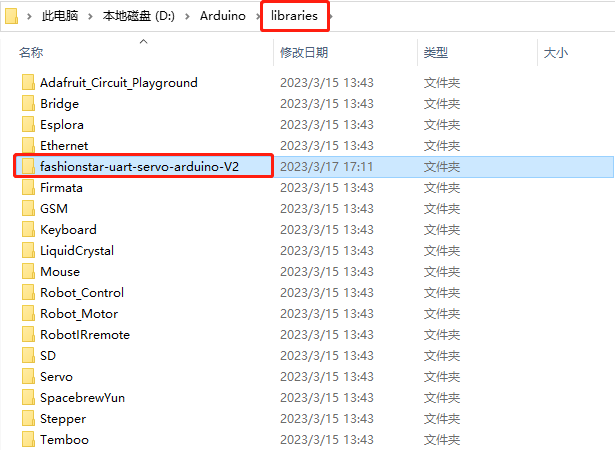
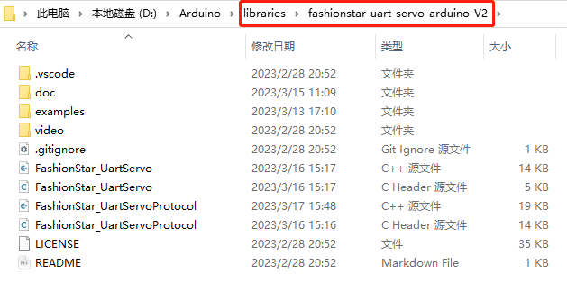

# 总线伺服舵机SDK使用手册(Arduino Uno)

## 1. 安装总线伺服舵机的Arduino库

将`fashionstar-uart-servo-arduino-V2`这个工程文件夹，整体拷贝到`Arduino ID`安装路径下的`libraries`这个文件夹





## 2. 烧录代码时注意事项

由于UNO只有一个硬串口，需要分时复用为烧录口和控制总线伺服舵机。在进行烧录操作时，需要把UC01转接板和UNO断开，烧录完成后再连接UC01和UNO。即：

- 烧录时：断开UC01--UNO，连接PC-UNO
- 使用时：连接UC01--UNO，断开PC-UNO

## 3. 软串口日志输出

**·** 安装`USB`转`TTL`模块的驱动程序

**·** 将`Arduino`跟`USB`转`TTL`模块通过杜邦线相连

| Arduino Uno             | USB转TTL模块               |
| ----------------------- | -------------------------- |
| pin6（软串口Rx 接收端） | Tx（USB转TTL模块的接收端） |
| pin7（软串口Tx 发送端） | Rx（USB转TTL模块的发送端） |
| GND                     | GND                        |

实物图如下所示：


**·** 将`USB`转`TTL`模块插入到电脑的`USB`口上

**·** 打开串口调试助手，选择`USB`转`TTL`模块的端口号，配置如下图所示：


点击`Open`，打开端口

**·** 打开`Arduino IDE > Examples > fashionstar-uart-servo-arduino-V2 > software_serial`，将例程烧录到`Arduino Uno`里面

**·** 查看运行效果，如下图所示


## 4. 舵机对象的创建与初始化


```
#include "FashionStar_UartServoProtocol.h" // 总线伺服舵机通信协议
#include "FashionStar_UartServo.h" // 总线伺服舵机SDK
```

> `FashionStar_UartServoProtocol`用来处理舵机的底层通信协议的逻辑（数据帧的收发，数据校验等）。
>
> `FashionStar_UartServo`是舵机的SDK，是在协议上层的更高一级的封装。

创建一个总线伺服舵机通信协议对象`FSUS_Protocol`，构造器里面需要填写`Arduino`与总线伺服舵机通信的波特率，默认为`115200`。


```
#define BAUDRATE 115200 // 波特率

FSUS_Protocol protocol(BAUDRATE); //协议
```

创建一个`FSUS_Servo`舵机对象，创建的时候需要传入舵机的`ID`，以及通信协议对象的指针`&protocol`，舵机的ID取值范围为`0-254`


```
#define SERVO_ID 0 //舵机ID号

FSUS_Servo uservo(SERVO_ID, &protocol); // 创建舵机
```

接下来需要在`setup()`函数里对通信协议对象以及舵机对象进行初始化


```
void setup(){
    ...
    protocol.init(); // 舵机通信协议初始化
    uservo.init(); // 总线伺服舵机初始化
    ...
}
```

## 5. 舵机通信检测

### 5.1. API-`ping`

调用舵机的`ping()`函数用于舵机的通信检测，判断舵机是否在线


```
bool isOnline = uservo.ping(); // 舵机通信检测
```

### 5.2. 例程源码

```
servo_ping.ino
```


```c
/*
 * 舵机通信检测
 * --------------------------
 * 作者: 深圳市华馨京科技有限公司
 * 网站：https://fashionrobo.com/
 * 更新时间: 2023/03/13
 **/
#include "FashionStar_UartServoProtocol.h" // 总线伺服舵机通信协议
#include "FashionStar_UartServo.h" // Fashion Star总线伺服舵机的依赖

// 总线伺服舵机配置
#define SERVO_ID 0 //舵机ID号
#define BAUDRATE 115200 // 波特率

// 调试串口的配置
#if defined(ARDUINO_AVR_UNO)
    #include <SoftwareSerial.h>
    #define SOFT_SERIAL_RX 6
    #define SOFT_SERIAL_TX 7
    SoftwareSerial softSerial(SOFT_SERIAL_RX, SOFT_SERIAL_TX); // 创建软串口
    #define DEBUG_SERIAL softSerial
    #define DEBUG_SERIAL_BAUDRATE 4800

#elif defined(ARDUINO_AVR_MEGA2560)
    #define DEBUG_SERIAL Serial
    #define DEBUG_SERIAL_BAUDRATE 115200

#elif defined(ARDUINO_ARCH_ESP32)
    #define DEBUG_SERIAL Serial
    #define DEBUG_SERIAL_BAUDRATE 115200

#elif defined(ARDUINO_ARCH_STM32)
    #include <HardwareSerial.h>
    //                      RX    TX
    HardwareSerial Serial1(PA10, PA9);
    //HardwareSerial Serial2(PA3, PA2); //这里串口2不需要定义
    HardwareSerial Serial3(PB11, PB10);
    #define DEBUG_SERIAL Serial1
    #define DEBUG_SERIAL_BAUDRATE (uint32_t)115200

#endif 

FSUS_Protocol protocol(BAUDRATE);       //协议
FSUS_Servo uservo(SERVO_ID, &protocol); // 创建舵机

void setup(){
    protocol.init(); // 舵机通信协议初始化
    uservo.init(); // 总线伺服舵机初始化
    // 打印例程信息
    DEBUG_SERIAL.begin(DEBUG_SERIAL_BAUDRATE);
    DEBUG_SERIAL.println("Start To Ping Servo\n");
}

void loop(){
    bool isOnline = uservo.ping(); // 舵机通信检测
    String message = "servo #"+String(uservo.servoId,DEC) + " is ";  // 日志输出
    if(isOnline){
        message += "online";
    }else{
        message += "offline";
    }
    // 调试串口初始化
    DEBUG_SERIAL.println(message);
    // 等待1s
    delay(1000);
}
```

日志输出


```
Start To Ping Servo


servo #0 is online.

servo #0 is online.

servo #0 is online.

servo #0 is online.
```

## 6. 舵机阻尼模式

### 6.1. API-`setDamping`

设置舵机为阻尼模式


```
void FSUS_Servo::setDamping(FSUS_POWER_T power)
```

**输入参数**

**·** `power`舵机的功率，单位为`mW`，功率值越大，旋转舵机的时候阻尼力也就越大

**使用示例**：


```
#define DAMPING_POWER 800 // 阻尼模式下的功率(单位mW) 500,800,1000

uservo.setDamping(DAMPING_POWER);
```

### 6.2. 例程源码

```
servo_damping.ino
```


```c
/*
 * 设置舵机为阻尼模式
 * 调整参数`DAMPING_POWER`感受不同的阻尼力
 * --------------------------
 * 作者: 深圳市华馨京科技有限公司
 * 网站：https://fashionrobo.com/
 * 更新时间: 2023/03/13
 **/
#include "FashionStar_UartServoProtocol.h"
#include "FashionStar_UartServo.h" // Fashion Star总线伺服舵机的依赖

// 总线伺服舵机配置参数
#define SERVO_ID 0 //舵机ID号
#define BAUDRATE 115200 // 波特率
#define DAMPING_POWER 800 // 阻尼模式下的功率(单位mW) 500,800,1000

// 调试串口的配置
#if defined(ARDUINO_AVR_UNO)
    #include <SoftwareSerial.h>
    #define SOFT_SERIAL_RX 6 
    #define SOFT_SERIAL_TX 7
    SoftwareSerial softSerial(SOFT_SERIAL_RX, SOFT_SERIAL_TX); // 创建软串口
    #define DEBUG_SERIAL softSerial
    #define DEBUG_SERIAL_BAUDRATE 4800

#elif defined(ARDUINO_AVR_MEGA2560)
    #define DEBUG_SERIAL Serial
    #define DEBUG_SERIAL_BAUDRATE 115200

#elif defined(ARDUINO_ARCH_ESP32)
    #define DEBUG_SERIAL Serial
    #define DEBUG_SERIAL_BAUDRATE 115200

#elif defined(ARDUINO_ARCH_STM32)
    #include <HardwareSerial.h>
    //                      RX    TX
    HardwareSerial Serial1(PA10, PA9);
    //HardwareSerial Serial2(PA3, PA2); //这里串口2不需要定义
    HardwareSerial Serial3(PB11, PB10);
    #define DEBUG_SERIAL Serial1
    #define DEBUG_SERIAL_BAUDRATE (uint32_t)115200

#endif 

FSUS_Protocol protocol(BAUDRATE); //协议
FSUS_Servo uservo(SERVO_ID, &protocol); // 创建舵机

void setup(){

    protocol.init(); // 通信协议初始化
    uservo.init(); // 舵机初始化
    // 打印日志
    DEBUG_SERIAL.begin(DEBUG_SERIAL_BAUDRATE);
    DEBUG_SERIAL.println("Set Servo Mode To Damping");
    // 设置电机的阻尼系数
    uservo.setDamping(DAMPING_POWER);
}

void loop(){
    // TODO;
}
```

日志输出


```
Set Servo Mode To Damping
```

## 7. 舵机角度查询

### 7.1. API-`queryAngle`

查询舵机当前的真实角度，向舵机发送角度查询指令，并将角度值赋值给舵机对象的`curAngle`属性


```
FSUS_SERVO_ANGLE_T FSUS_Servo::queryAngle()
```

**输入参数**

**·** <无>

**输出参数**

**·**`curAngle` 舵机当前的真实角度

**使用示例**：

示例1


```
float curAngle = uservo.queryAngle()
```

示例2


```
// 舵机角度查询 (更新角度)
uservo.queryAngle(); 
// 通过.curAngle访问当前的真实角度
uservo.curAngle
```

### 7.2. 例程源码

```
servo_query_angle.ino
```


```c
/*
 * 舵机角度回读实验
 * 用手掰动舵机, 角度回读并将角度读数通过SPI发送
 * --------------------------
 * 作者: 深圳市华馨京科技有限公司
 * 网站：https://fashionrobo.com/
 * 更新时间: 2023/03/13
 **/
#include "FashionStar_UartServoProtocol.h"
#include "FashionStar_UartServo.h" // Fashion Star总线伺服舵机的依赖

// 总线伺服舵机配置
#define SERVO_ID 0 //舵机ID号
#define DAMPING_POWER 800 // 阻尼模式下的功率(单位mW) 500,800,1000
#define BAUDRATE 115200 // 波特率

// 调试串口的配置
#if defined(ARDUINO_AVR_UNO)
    #include <SoftwareSerial.h>
    #define SOFT_SERIAL_RX 6 
    #define SOFT_SERIAL_TX 7
    SoftwareSerial softSerial(SOFT_SERIAL_RX, SOFT_SERIAL_TX); // 创建软串口
    #define DEBUG_SERIAL softSerial
    #define DEBUG_SERIAL_BAUDRATE 4800

#elif defined(ARDUINO_AVR_MEGA2560)
    #define DEBUG_SERIAL Serial
    #define DEBUG_SERIAL_BAUDRATE 115200

#elif defined(ARDUINO_ARCH_ESP32)
    #define DEBUG_SERIAL Serial
    #define DEBUG_SERIAL_BAUDRATE 115200

#elif defined(ARDUINO_ARCH_STM32)
    #include <HardwareSerial.h>
    //                      RX    TX
    HardwareSerial Serial1(PA10, PA9);
    //HardwareSerial Serial2(PA3, PA2); //这里串口2不需要定义
    HardwareSerial Serial3(PB11, PB10);
    #define DEBUG_SERIAL Serial1
    #define DEBUG_SERIAL_BAUDRATE (uint32_t)115200

#endif 


FSUS_Protocol protocol(BAUDRATE); //协议
FSUS_Servo uservo(SERVO_ID, &protocol); // 创建舵机


void setup(){
    protocol.init();                    // 通信协议初始化
    uservo.init();                      //舵机角度初始化
    uservo.setDamping(DAMPING_POWER);   // 舵机设置为阻尼模式
    // 打印例程信息
    DEBUG_SERIAL.begin(DEBUG_SERIAL_BAUDRATE);
    DEBUG_SERIAL.println("Query Servo Angle\n");    
}

void loop(){
    // 舵机角度查询 (更新角度)
    uservo.queryRawAngle(); 
    // 日志输出
    String message = "Status Code: " + String(uservo.protocol->responsePack.recv_status, DEC) + " servo #"+String(uservo.servoId, DEC) + " , Current Angle = "+String(uservo.curRawAngle, 1)+" deg";
    DEBUG_SERIAL.println(message);
    // 等待1s
    delay(1000);
}
```

**输出日志**


```
Query Servo Angle

Status Code: 0 servo #0 , Current Angle = -99.0

Status Code: 0 servo #0 , Current Angle = -99.0

Status Code: 0 servo #0 , Current Angle = -99.0
```

## 8. 舵机轮式模式

### 8.1. API-`wheelStop`

轮式模式，停止旋转

**函数原型**


```
void FSUS_Servo::wheelStop()
```

**输入参数**

**·** <无>

### 8.2. API-`wheelRun`

轮子持续旋转

**函数原型**


```
void FSUS_Servo::wheelRun(uint8_t is_cw)
```

**输入参数**

**·** `is_cw` ：轮子的旋转方向

 `0`：逆时针

 `1`：顺时针

### 8.3. API-`wheelRunNTime`

轮子旋转特定的时间

**函数原型**


```
void FSUS_Servo::wheelRunNTime(uint8_t is_cw, uint16_t time_ms)
```

**输入参数**

**·** `is_cw` ：轮子的旋转方向

 `0`：逆时针

 `1`：顺时针

**·** `time_ms` ：持续旋转的时间，单位为`ms`

### 8.4. API-`wheelRunNCircle`

轮子旋转特定的圈数

**函数原型**


```
void FSUS_Servo::wheelRunNCircle(uint8_t is_cw, uint16_t circle_num)
```

**输入参数**

**·** `is_cw` ：轮子的旋转方向

 `0` : 逆时针

 `1`: 顺时针

**·** `circle_num` ：轮子旋转的圈数

### 8.5. 例程源码

```
servo_wheel_mode.ino
```


```c
/*
 * 测试舵机轮式模式
 * 提示: 拓展板上电之后, 记得按下Arduino的RESET按键
 * --------------------------
 * 作者: 深圳市华馨京科技有限公司
 * 网站：https://fashionrobo.com/
 * 更新时间: 2023/03/13
 */
#include "FashionStar_UartServoProtocol.h"
#include "FashionStar_UartServo.h" // Fashion Star总线伺服舵机的依赖

// 配置参数
#define BAUDRATE 115200 // 波特率
#define SERVO_ID 0 //舵机ID号

FSUS_Protocol protocol(BAUDRATE); //协议
FSUS_Servo uservo(SERVO_ID, &protocol); // 创建舵机

/* 轮子持续旋转指令与停止指令测试 */
void testWheelRunAndStop(){
    uservo.wheelRun(FSUS_CCW); // 轮子持续旋转, 方向为逆时针
    delay(2000);            // 等待2s
    uservo.wheelStop();
    delay(2000);            // 等待2s
    uservo.wheelRun(FSUS_CW); // 轮子持续旋转
    delay(2000);            // 等待2s
    uservo.wheelStop();
    delay(2000);            // 等待2s
}

/* 测试轮子旋转特定的时间 */
void testWheelRunNTime(){
    uservo.wheelRunNTime(FSUS_CW, 5000); // 轮子持续旋转5s(顺时针)
    delay(5000);                         
    uservo.wheelRunNTime(FSUS_CCW, 5000); // 轮子持续旋转5s(逆时针)
    delay(5000);
}

/* 测试轮子旋转特定的圈数 */
void testWheelRunNCircle(){
    uint16_t nCircle = 2; // 旋转圈数
    uint16_t delayMsEstimate = (uint16_t)(360.0 * nCircle / uservo.speed * 1000); // 估计旋转的时间
    uservo.wheelRunNCircle(FSUS_CW, 2); // 轮子持续旋转2圈(顺时针)
    delay(delayMsEstimate);             // 等到轮子旋转到特定的位置 

    uservo.wheelRunNCircle(FSUS_CCW, 2);// 轮子持续旋转2圈(逆时针)
    delay(delayMsEstimate);             // 等到轮子旋转到特定的位置}
}

void setup(){
    protocol.init();        // 通信协议初始化
    uservo.init();          //舵机角度初始化
    uservo.setSpeed(100);    // 设置转速为20°/s

    // 测试持续旋转与停止
    // testRunAndStop();

    // 测试旋转特定的时间
    // testWheelRunNTime();

    // 测试旋转特定的圈数
    testWheelRunNCircle();
}

void loop(){
}
```

## 9. 设置舵机角度

### 9.1. API-`setAngle`

设定舵机的角度

**函数原型**


```
/* 设置舵机的原始角度 */
void FSUS_Servo::setRawAngle(FSUS_SERVO_ANGLE_T rawAngle, FSUS_INTERVAL_T interval, FSUS_POWER_T power)
```


```
/* 设置舵机的原始角度 */
void FSUS_Servo::setRawAngle(FSUS_SERVO_ANGLE_T rawAngle, FSUS_INTERVAL_T interval)
```


```
/* 设置舵机的原始角度 */
void FSUS_Servo::setRawAngle(FSUS_SERVO_ANGLE_T rawAngle)
```

**输入参数**

**·** `rawAngle` ：舵机的目标角度，单位°

**·** `interval` ：舵机旋转的周期，单位`ms`

**·** `power` ：最大功率，单位`mW`

### 9.2. API-`setRawAngleByInterval`

**函数原型**


```
// 设置舵机的原始角度(指定周期)
void FSUS_Servo::setRawAngleByInterval(FSUS_SERVO_ANGLE_T rawAngle, FSUS_INTERVAL_T interval, FSUS_INTERVAL_T t_acc, FSUS_INTERVAL_T t_dec, FSUS_POWER_T power)
```

**输入参数**

**·** `rawAngle` ：舵机的目标角度，单位°

**·** `interval` ：舵机旋转的周期，单位`ms`

**·** `t_acc` ：加速时间

**·** `t_dec` ：减速时间

**·** `power` ：最大功率，单位`mW`

### 9.3. API-`setRawAngleByVelocity`

**函数原型**


```
// 设定舵机的原始角度(指定转速)
void FSUS_Servo::setRawAngleByVelocity(FSUS_SERVO_ANGLE_T rawAngle, FSUS_SERVO_SPEED_T velocity, FSUS_INTERVAL_T t_acc, FSUS_INTERVAL_T t_dec, FSUS_POWER_T power)
```

**输入参数**

**·** `rawAngle` ：舵机的目标角度，单位°

**·** `velocity` ：舵机旋转的转速，单位°/s

**·** `t_acc` ：加速时间

**·** `t_dec` ：减速时间

**·** `power` ：最大功率，单位`mW`

### 9.4. API-`isStop`

判断舵机是否在旋转，是否是静止。

改函数在执行的时候，会先查询舵机当前的角度，返回对比跟目标角度`targetAngle`之间的差值是否小于控制死区。

**函数原型**


```
bool FSUS_Servo::isStop()
```

**输入参数**

**·** <无>

**返回参数**

**·** `is_stop`:

 `true` ：舵机已经到达目标角度, 停下来了

 `false` ：舵机还没有到达目标角度,正在旋转

### 9.5. API-`setRange`

设置舵机的角度范围

**函数原型**


```
void FSUS_Servo::setAngleRange(FSUS_SERVO_ANGLE_T minAngle, FSUS_SERVO_ANGLE_T maxAngle)
```

**输入参数**

**·** `minAngle`: 舵机角度下限

**·** `maxAngle`: 舵机角度上限

**输出参数**

**·** <无>

### 9.6. 例程源码

```
servo_set_angle
```


```c
/* 
 * 设置舵机的角度(单圈模式)
 * 提示: 拓展板上电之后, 记得按下Arduino的RESET按键
 * --------------------------
 * 作者: 深圳市华馨京科技有限公司
 * 网站：https://fashionrobo.com/
 * 更新时间: 2023/03/13
 */

#include "FashionStar_UartServoProtocol.h"
#include "FashionStar_UartServo.h" // Fashion Star总线伺服舵机的依赖

// 总线伺服舵机配置参数
#define SERVO_ID 0 //舵机ID号
#define BAUDRATE 115200 // 波特率

// 调试串口的配置
#if defined(ARDUINO_AVR_UNO)
    #include <SoftwareSerial.h>
    #define SOFT_SERIAL_RX 6 
    #define SOFT_SERIAL_TX 7
    SoftwareSerial softSerial(SOFT_SERIAL_RX, SOFT_SERIAL_TX); // 创建软串口
    #define DEBUG_SERIAL softSerial
    #define DEBUG_SERIAL_BAUDRATE 4800

#elif defined(ARDUINO_AVR_MEGA2560)
    #define DEBUG_SERIAL Serial
    #define DEBUG_SERIAL_BAUDRATE 115200

#elif defined(ARDUINO_ARCH_ESP32)
    #define DEBUG_SERIAL Serial
    #define DEBUG_SERIAL_BAUDRATE 115200

#elif defined(ARDUINO_ARCH_STM32)
    #include <HardwareSerial.h>
    //                      RX    TX
    HardwareSerial Serial1(PA10, PA9);
    //HardwareSerial Serial2(PA3, PA2); //这里串口2不需要定义
    HardwareSerial Serial3(PB11, PB10);
    #define DEBUG_SERIAL Serial1
    #define DEBUG_SERIAL_BAUDRATE (uint32_t)115200

#endif 

FSUS_Protocol protocol(BAUDRATE); //协议
FSUS_Servo uservo(SERVO_ID, &protocol); // 创建舵机

uint16_t interval;  // 运行周期 单位ms 
uint16_t t_acc;     // 加速时间 单位ms
uint16_t t_dec;     // 减速时间 单位ms
float velocity;         // 目标转速 单位°/s

/* 等待并报告当前的角度*/
void waitAndReport(){
    uservo.wait();          // 等待舵机旋转到目标角度
    DEBUG_SERIAL.println("Real Angle = " + String(uservo.curRawAngle, 1) + " Target Angle = "+String(uservo.targetRawAngle, 1));
    delay(2000); // 暂停2s

}

void setup(){
    protocol.init(); // 通信协议初始化
    uservo.init(); //舵机角度初始化
    // 打印例程信息
    DEBUG_SERIAL.begin(DEBUG_SERIAL_BAUDRATE); // 初始化软串口的波特率
    DEBUG_SERIAL.println("Set Servo Angle");
}

void loop(){
    DEBUG_SERIAL.println("Set Angle = 90°");
    uservo.setRawAngle(90.0);  // 设置舵机的角度
    waitAndReport();
    delay(2000);

    DEBUG_SERIAL.println("Set Angle = -90°");
    uservo.setRawAngle(-90);
    waitAndReport();
    delay(2000);

    DEBUG_SERIAL.println("Set Angle = 90° - Set Interval = 500ms");
    interval = 1000;
    t_acc = 100;
    t_dec = 100;
    uservo.setRawAngleByInterval(90, interval, t_acc, t_dec, 0);
    waitAndReport();
    delay(2000);

    DEBUG_SERIAL.println("Set Angle = -90° - Set Velocity = 200°/s");
    velocity = 200.0;
    t_acc = 100;
    t_dec = 100;
    uservo.setRawAngleByVelocity(-90, velocity, t_acc, t_dec, 0);
    waitAndReport();
    delay(2000);
}
```

日志输出


```
Set Angle = 90°
Real Angle = 89.7 Target Angle = 90.0
Set Angle = -90°
Real Angle = -89.6 Target Angle = -90.0
Set Angle = 90° - Set Interval = 500ms
Real Angle = 89.7 Target Angle = 90.0
Set Angle = -90° - Set Velocity = 200°/s
Real Angle = -89.6 Target Angle = -90.0
```

## 10. 舵机阻塞式等待

### 10.1. API-`wait`

等待舵机旋转到目标角度，阻塞式

**函数原型**


```
void FSUS_Servo::wait()
```

**输入参数**

**·** <无>

**输出参数**

**·** <无>

### 10.2. 例程源码

```
servo_wait.ino
```


```c
/* 
 * 测试wait()函数,轮询角度直到舵机旋转到目标位置
 * 提示: 拓展板上电之后, 记得按下Arduino的RESET按键
 * --------------------------
 * 作者: 深圳市华馨京科技有限公司
 * 网站：https://fashionrobo.com/
 * 更新时间: 2023/03/13
 */
#include "FashionStar_UartServoProtocol.h"
#include "FashionStar_UartServo.h" // Fashion Star总线伺服舵机的依赖

// 总线伺服舵机配置参数
#define SERVO_ID 0 //舵机ID号
#define BAUDRATE 115200 // 波特率

// 调试串口的配置
#if defined(ARDUINO_AVR_UNO)
    #include <SoftwareSerial.h>
    #define SOFT_SERIAL_RX 6 
    #define SOFT_SERIAL_TX 7
    SoftwareSerial softSerial(SOFT_SERIAL_RX, SOFT_SERIAL_TX); // 创建软串口
    #define DEBUG_SERIAL softSerial
    #define DEBUG_SERIAL_BAUDRATE 4800

#elif defined(ARDUINO_AVR_MEGA2560)
    #define DEBUG_SERIAL Serial
    #define DEBUG_SERIAL_BAUDRATE 115200

#elif defined(ARDUINO_ARCH_ESP32)
    #define DEBUG_SERIAL Serial
    #define DEBUG_SERIAL_BAUDRATE 115200

#elif defined(ARDUINO_ARCH_STM32)
    #include <HardwareSerial.h>
    //                      RX    TX
    HardwareSerial Serial1(PA10, PA9);
    //HardwareSerial Serial2(PA3, PA2); //这里串口2不需要定义
    HardwareSerial Serial3(PB11, PB10);
    #define DEBUG_SERIAL Serial1
    #define DEBUG_SERIAL_BAUDRATE (uint32_t)115200

#endif 

FSUS_Protocol protocol(BAUDRATE); //协议
FSUS_Servo uservo(SERVO_ID, &protocol); // 创建舵机

void setup(){

    protocol.init(); // 通信协议初始化
    uservo.init(); //舵机初始化
    // 打印例程信息
    DEBUG_SERIAL.begin(DEBUG_SERIAL_BAUDRATE);
    DEBUG_SERIAL.println("Test Wait");
}

void loop(){
    DEBUG_SERIAL.println("Set Angle = 90.0");
    uservo.setAngle(90.0); // 设置舵机的角度
    uservo.wait();
    DEBUG_SERIAL.println("Real Angle = "+String(uservo.curRawAngle, 2));

    DEBUG_SERIAL.println("Set Angle = -90.0");
    uservo.setAngle(-90);
    uservo.wait();
    DEBUG_SERIAL.println("Real Angle = "+String(uservo.curRawAngle, 2));
}
```

日志输出


```
Set Angle = -90.0
Real Angle = -89.00
Set Angle = 90.0
Real Angle = 89.80
Set Angle = -90.0
Real Angle = -89.00
Set Angle = 90.0
Real Angle = 89.80
Set Angle = -90.0
Real Angle = -89.00
Set Angle = 90.0
Real Angle = 89.80
Set Angle = -90.0
Real Angle = -89.00
```

## 11. 设置舵机角度-多圈模式

### 11.1. API-`setRawAngleMTurn`

**函数原型**


```
// 设定舵机的原始角度(多圈)
void FSUS_Servo::setRawAngleMTurn(FSUS_SERVO_ANGLE_T rawAngle, FSUS_INTERVAL_T_MTURN interval, FSUS_POWER_T power)
```


```
// 设定舵机的原始角度(多圈)
void FSUS_Servo::setRawAngleMTurn(FSUS_SERVO_ANGLE_T rawAngle, FSUS_INTERVAL_T_MTURN interval)
```


```
// 设定舵机的原始角度(多圈)
void FSUS_Servo::setRawAngleMTurn(FSUS_SERVO_ANGLE_T rawAngle)
```

**输入参数**

**·** `rawAngle` ：舵机的目标角度，单位°

**·** `interval` ：舵机旋转的周期，单位`ms`

**·** `power` ：最大功率，单位`mW`

**输出参数**

**·** <无>

### 11.2. API-`setRawAngleByInterval`

**函数原型**


```
// 设定舵机的原始角度(多圈+指定周期)
void FSUS_Servo::setRawAngleMTurnByInterval(FSUS_SERVO_ANGLE_T rawAngle, FSUS_INTERVAL_T_MTURN interval, FSUS_INTERVAL_T t_acc, FSUS_INTERVAL_T t_dec, FSUS_POWER_T power)
```

**输入参数**

**·** `rawAngle` ：舵机的目标角度，单位°

**·** `interval` ：舵机旋转的周期，单位`ms`

**·** `t_acc` ：加速时间，单位`ms`

**·** `t_dec` ：减速时间，单位`ms`

**·** `power` ：最大功率，单位`mW`

**输出参数**

**·** <无>

### 11.3. API-`setRawAngleMTurnByVelocity`

**函数原型**


```
// 设定舵机的原始角度(多圈+指定转速)
void FSUS_Servo::setRawAngleMTurnByVelocity(FSUS_SERVO_ANGLE_T rawAngle, FSUS_SERVO_SPEED_T velocity, FSUS_INTERVAL_T t_acc, FSUS_INTERVAL_T t_dec, FSUS_POWER_T power)
```

**输入参数**

**·** `rawAngle` ：舵机的目标角度，单位°

**·** `velocity` ：舵机旋转的速度，单位°/s

**·** `t_acc` ：加速时间，单位`ms`

**·** `t_dec` ：减速时间，单位`ms`

**·** `power` ：最大功率，单位`mW`

**输出参数**

**·** <无>

### 11.4. 例程源码

```
servo_set_angle_mturn.ino
```


```c
/* 
 * 设置舵机的角度(多圈模式)
 * 提示: 拓展板上电之后, 记得按下Arduino的RESET按键
 * --------------------------
 * 作者: 深圳市华馨京科技有限公司
 * 网站：https://fashionrobo.com/
 * 更新时间: 2023/03/13
 */

#include "FashionStar_UartServoProtocol.h"
#include "FashionStar_UartServo.h" // Fashion Star总线伺服舵机的依赖


// 总线伺服舵机配置参数
#define SERVO_ID 0 //舵机ID号
#define BAUDRATE 115200 // 波特率

// 调试串口的配置
#if defined(ARDUINO_AVR_UNO)
    #include <SoftwareSerial.h>
    #define SOFT_SERIAL_RX 6 
    #define SOFT_SERIAL_TX 7
    SoftwareSerial softSerial(SOFT_SERIAL_RX, SOFT_SERIAL_TX); // 创建软串口
    #define DEBUG_SERIAL softSerial
    #define DEBUG_SERIAL_BAUDRATE 4800

#elif defined(ARDUINO_AVR_MEGA2560)
    #define DEBUG_SERIAL Serial
    #define DEBUG_SERIAL_BAUDRATE 115200

#elif defined(ARDUINO_ARCH_ESP32)
    #define DEBUG_SERIAL Serial
    #define DEBUG_SERIAL_BAUDRATE 115200

#elif defined(ARDUINO_ARCH_STM32)
    #include <HardwareSerial.h>
    //                      RX    TX
    HardwareSerial Serial1(PA10, PA9);
    //HardwareSerial Serial2(PA3, PA2); //这里串口2不需要定义
    HardwareSerial Serial3(PB11, PB10);
    #define DEBUG_SERIAL Serial1
    #define DEBUG_SERIAL_BAUDRATE (uint32_t)115200

#endif 

FSUS_Protocol protocol(BAUDRATE); //协议
FSUS_Servo uservo(SERVO_ID, &protocol); // 创建舵机

uint32_t interval;  // 运行周期 单位ms 
uint16_t t_acc;     // 加速时间 单位ms
uint16_t t_dec;     // 减速时间 单位ms
float velocity;         // 目标转速 单位°/s

/* 等待并报告当前的角度*/
void waitAndReport(){
    uservo.wait();          // 等待舵机旋转到目标角度
    DEBUG_SERIAL.println("Real Angle = " + String(uservo.curRawAngle, 1) + " Target Angle = "+String(uservo.targetRawAngle, 1));
    delay(2000); // 暂停2s
}

void setup(){
    protocol.init(); // 通信协议初始化
    uservo.init(); //舵机角度初始化
    // 打印例程信息
    DEBUG_SERIAL.begin(DEBUG_SERIAL_BAUDRATE); // 初始化软串口的波特率
    DEBUG_SERIAL.println("Set Servo Angle");
}

void loop(){
    DEBUG_SERIAL.println("Set Angle = 900°");
    uservo.setRawAngleMTurn(900.0);  // 设置舵机的角度
    waitAndReport();

    DEBUG_SERIAL.println("Set Angle = -900.0°");
    uservo.setRawAngleMTurn(-900.0);
    waitAndReport();

    DEBUG_SERIAL.println("Set Angle = 900° - Set Interval = 10s");
    interval = 10000;
    t_acc = 100;
    t_dec = 100;
    uservo.setRawAngleMTurnByInterval(900, interval, t_acc, t_dec, 0);
    waitAndReport();

    DEBUG_SERIAL.println("Set Angle = -900° - Set Velocity = 200°/s");
    velocity = 200.0;
    t_acc = 100;
    t_dec = 100;
    uservo.setRawAngleMTurnByVelocity(-900, velocity, t_acc, t_dec, 0);
    waitAndReport();
}
```

日志输出


```
Set Angle = 900°
Set Servo Angle
Set Angle = 900°
Real Angle = 899.0 Target Angle = 900.0
Set Angle = -900.0°
Real Angle = -899.0 Target Angle = -900.0
Set Angle = 900° - Set Interval = 10s
Real Angle = 899.0 Target Angle = 900.0
Set Angle = -900° - Set Velocity = 200°/s
Real Angle = -899.0 Target Angle = -900.0
```

## 12. 舵机扭力开关

### 12.1. API-`setTorque`

**函数原型**


```
void FSUS_Servo::setTorque(bool enable)
```

**输入参数**

**·** `enable` ：扭力是否开启

 `ture` ：开启扭力

 `false` ：关闭扭力

**使用示例**


```
uservo.setTorque(true); // 开启扭力
```

### 12.2. 例程源码

```
servo_torque.ino
```


```c
/*
 * 测试舵机扭力开关
 * 提示: 拓展板上电之后, 记得按下Arduino的RESET按键
 * --------------------------
 * 作者: 深圳市华馨京科技有限公司
 * 网站：https://fashionrobo.com/
 * 更新时间: 2023/03/13
 */
#include "FashionStar_UartServoProtocol.h"
#include "FashionStar_UartServo.h" // Fashion Star总线伺服舵机的依赖

// 配置参数
#define BAUDRATE 115200 // 波特率
#define SERVO_ID 0 //舵机ID号

FSUS_Protocol protocol; //协议
FSUS_Servo uservo(SERVO_ID, &protocol); // 创建舵机
void setup(){
    protocol.init(); // 通信协议初始化
    uservo.init(); //舵机初始

    uservo.setTorque(true); // 开启扭力
    // uservo.setTorque(false); // 开启扭力
}

void loop(){

}
```

## 13. 舵机标定

### 13.1. API-`calibration`

在`FSUS_Servo`类里面，有两个跟标定相关的参数：


```
class FSUS_Servo{
public:
    ...
    float kAngleReal2Raw; // 舵机标定数据-舵机角度与位置之间的比例系数
    float bAngleReal2Raw; // 舵机标定数据-舵机角度与位置转换过程中的偏移量
    ...
}
```

舵机真实角度跟原始角度的映射关系如下：

$$ angleRaw = kAngleReal2Raw \cdot angleReal + bAngleReal2Raw $$

**函数原型**


```
void FSUS_Servo::calibration(FSUS_SERVO_ANGLE_T rawA, FSUS_SERVO_ANGLE_T realA, FSUS_SERVO_ANGLE_T rawB, FSUS_SERVO_ANGLE_T realB)
```

**输入参数**

**·** `rawA` ：在位置A时刻舵机原始的角度

**·** `realA` ：在位置A时刻舵机真实的角度

**·** `rawB` ：在位置B时刻舵机原始的角度

**·** `realB` ：在位置B时刻舵机真实的角度

**使用示例**


```c
// 设置舵机的标定点
// 样本1
#define SERVO_REAL_ANGLE_A 90 // 舵机真实角度
#define SERVO_RAW_ANGLE_A -86.2 // 舵机原始角度
// 样本2
#define SERVO_REAL_ANGLE_B -90 // 舵机真实角度
#define SERVO_RAW_ANGLE_B 91.9 // 舵机原始角度


// 输入舵机标定数据
uservo.calibration(
    SERVO_RAW_ANGLE_A,SERVO_REAL_ANGLE_A,\
    SERVO_RAW_ANGLE_B,SERVO_REAL_ANGLE_B);
```

**函数原型**


```
void FSUS_Servo::calibration(float kAngleReal2Raw, float bAngleReal2Raw);
```

**输入参数**

**·** `kAngleReal2Raw` ：舵机标定数据-舵机角度与位置之间的比例系数

**·** `bAngleReal2Raw` ：舵机标定数据-舵机角度与位置转换过程中的偏移量

### 13.2. API-`angleReal2Raw`

舵机真实角度转换为舵机原始角度

**函数原型**


```
// 真实角度转化为原始角度
FSUS_SERVO_ANGLE_T FSUS_Servo::angleReal2Raw(FSUS_SERVO_ANGLE_T realAngle);
```

**输入参数**

**·** `realAngle` ：舵机真实角度

**返回参数**

**·** `rawAngle` ：舵机原始角度

### 13.3. API-`angleRaw2Real`

舵机原始角度转化为真实角度

**函数原型**


```
// 原始角度转换为真实角度
FSUS_SERVO_ANGLE_T FSUS_Servo::angleRaw2Real(FSUS_SERVO_ANGLE_T rawAngle);
```

**输入参数**

**·** `rawAngle` ：舵机原始角度

**·** `realAngle` ：舵机真实角度

### 13.4. 例程源码

```
servo_calibration
```


```c
/*
 * 测试舵机标定
 * 提示: 拓展板上电之后, 记得按下Arduino的RESET按键
 * --------------------------
 * 作者: 深圳市华馨京科技有限公司
 * 网站：https://fashionrobo.com/
 * 更新时间: 2023/03/13
 */

#include "FashionStar_UartServoProtocol.h"
#include "FashionStar_UartServo.h" // Fashion Star总线伺服舵机的依赖


// 总线伺服舵机配置参数
#define SERVO_ID 0 //舵机ID号
#define BAUDRATE 115200 // 波特率

// 设置舵机的标定点
// 样本1
#define SERVO_REAL_ANGLE_A 90 // 舵机真实角度
#define SERVO_RAW_ANGLE_A -86.2 // 舵机原始角度
// 样本2
#define SERVO_REAL_ANGLE_B -90 // 舵机真实角度
#define SERVO_RAW_ANGLE_B 91.9 // 舵机原始角度

// 调试串口的配置
#if defined(ARDUINO_AVR_UNO)
    #include <SoftwareSerial.h>
    #define SOFT_SERIAL_RX 6 
    #define SOFT_SERIAL_TX 7
    SoftwareSerial softSerial(SOFT_SERIAL_RX, SOFT_SERIAL_TX); // 创建软串口
    #define DEBUG_SERIAL softSerial
    #define DEBUG_SERIAL_BAUDRATE 4800

#elif defined(ARDUINO_AVR_MEGA2560)
    #define DEBUG_SERIAL Serial
    #define DEBUG_SERIAL_BAUDRATE 115200

#elif defined(ARDUINO_ARCH_ESP32)
    #define DEBUG_SERIAL Serial
    #define DEBUG_SERIAL_BAUDRATE 115200

#elif defined(ARDUINO_ARCH_STM32)
    #include <HardwareSerial.h>
    //                      RX    TX
    HardwareSerial Serial1(PA10, PA9);
    //HardwareSerial Serial2(PA3, PA2); //这里串口2不需要定义
    HardwareSerial Serial3(PB11, PB10);
    #define DEBUG_SERIAL Serial1
    #define DEBUG_SERIAL_BAUDRATE (uint32_t)115200
#endif 

FSUS_Protocol protocol(BAUDRATE); //协议
FSUS_Servo uservo(SERVO_ID, &protocol); // 创建舵机

void setup(){
    protocol.init(); // 通信协议初始化
    uservo.init(); //舵机角度初始化
    // 调试串口初始化
    DEBUG_SERIAL.begin(DEBUG_SERIAL_BAUDRATE); // 初始化软串口的波特率
    DEBUG_SERIAL.println("Set Servo Angle");
    // 输入舵机标定数据
    uservo.calibration(
        SERVO_RAW_ANGLE_A,SERVO_REAL_ANGLE_A,\
        SERVO_RAW_ANGLE_B,SERVO_REAL_ANGLE_B);

    // 打印舵机标定数据
    DEBUG_SERIAL.println("kAngleReal2Raw = "+String(uservo.kAngleReal2Raw,2) + \
        "; bAngleReal2Raw = " + String(uservo.bAngleReal2Raw, 2));
}

void loop(){
    DEBUG_SERIAL.println("Set Angle = 90°");
    uservo.setAngle(90.0); // 设置舵机的角度
    uservo.wait();
    delay(2000);

    DEBUG_SERIAL.println("Set Angle = -90°");
    uservo.setAngle(-90);
    uservo.wait();
    delay(2000);
}
```

日志输出


```
Set Servo Angle

kAngleReal2Raw = -0.99; bAngleReal2Raw = 2.85

Set Angle = 90

Set Angle = -90
```

## 14. 舵机转速设置

### 14.1. API-`setSpeed`

**函数原型**


```
void FSUS_Servo::setSpeed(FSUS_SERVO_SPEED_T speed)
```

**输入参数**

**·** `speed` ：舵机的平均转速，单位°/s

**返回参数**

**·** <无>

## 15. 舵机数据读取

### 15.1. API

**函数原型**


```c++
uint16_t FSUS_Servo::queryVoltage()// 查询舵机的电压(单位mV)

uint16_t FSUS_Servo::queryCurrent()// 查询舵机的电流(单位mA)

uint16_t FSUS_Servo::queryPower()// 查询舵机的功率(单位mW)

uint16_t FSUS_Servo::queryTemperature()// 查询舵机的温度(单位 ADC)

uint8_t FSUS_Servo::queryStatus()// 查询舵机状态
```

**输入参数**

**·** <无>

**返回参数**

舵机的数据


### 15.2. 示例源码

```
servo_data_read.ino
```


```c
/*
 * 舵机数据读取实验
 * --------------------------
 * 作者: 深圳市华馨京科技有限公司
 * 网站：https://fashionrobo.com/
 * 更新时间: 2024/08/14
 **/
#include "FashionStar_UartServoProtocol.h" // 总线伺服舵机通信协议
#include "FashionStar_UartServo.h"         // Fashion Star总线伺服舵机的依赖

// 配置
#define SERVO_ID 0      // 舵机ID号
#define BAUDRATE 115200 // 波特率

// 调试串口的配置
#if defined(ARDUINO_AVR_UNO)
#include <SoftwareSerial.h>
#define SOFT_SERIAL_RX 6
#define SOFT_SERIAL_TX 7
SoftwareSerial softSerial(SOFT_SERIAL_RX, SOFT_SERIAL_TX); // 创建软串口
#define DEBUG_SERIAL softSerial
#define DEBUG_SERIAL_BAUDRATE 4800

#elif defined(ARDUINO_AVR_MEGA2560)
#define DEBUG_SERIAL Serial
#define DEBUG_SERIAL_BAUDRATE 115200

#elif defined(ARDUINO_ARCH_ESP32)
#define DEBUG_SERIAL Serial
#define DEBUG_SERIAL_BAUDRATE 115200

#elif defined(ARDUINO_ARCH_STM32)
#include <HardwareSerial.h>
//                      RX    TX
HardwareSerial Serial1(PA10, PA9);
// HardwareSerial Serial2(PA3, PA2); //这里串口2不需要定义
HardwareSerial Serial3(PB11, PB10);
#define DEBUG_SERIAL Serial1
#define DEBUG_SERIAL_BAUDRATE (uint32_t)115200

#endif

FSUS_Protocol protocol(BAUDRATE);       // 协议
FSUS_Servo uservo(SERVO_ID, &protocol); // 创建舵机

// 读取数据
uint16_t voltage;     // 电压 mV
uint16_t current;     // 电流 mA
uint16_t power;       // 功率 mW
uint16_t temperature; // 温度 ADC
uint8_t status;       // 状态

void setup()
{

    protocol.init(); // 舵机通信协议初始化
    uservo.init();   // 总线伺服舵机初始化
    // 打印例程信息
    DEBUG_SERIAL.begin(DEBUG_SERIAL_BAUDRATE);
    DEBUG_SERIAL.println("Start To Test Servo Data Read \n"); // 打印日志

    // uservo.setAngle(-25.0,  1000, 200); // 设置舵机角度(限制功率)
}

void loop()
{
    // 读取电压数据
    voltage = uservo.queryVoltage();
    DEBUG_SERIAL.println("voltage: " + String((float)voltage, 1) + " mV");
    delay(100);
    // 读取电流数据
    current = uservo.queryCurrent();
    DEBUG_SERIAL.println("current: " + String((float)current, 1) + " mA");
    delay(100);
    // 读取功率数据
    power = uservo.queryPower();
    DEBUG_SERIAL.println("power: " + String((float)power, 1) + " mW");
    delay(100);
    // 读取温度数据，需要做ADC转℃
    temperature = uservo.queryTemperature();
    temperature = 1 / (log(temperature / (4096.0f - temperature)) / 3435.0f + 1 / (273.15 + 25)) - 273.15;
    DEBUG_SERIAL.println("temperature: " + String((float)temperature, 1) + " Celsius");

    // 读取工作状态数据
    /*
        BIT[0] - 执行指令置1，执行完成后清零。
        BIT[1] - 执行指令错误置1，在下次正确执行后清零。
        BIT[2] - 堵转错误置1，解除堵转后清零。
        BIT[3] - 电压过高置1，电压恢复正常后清零。
        BIT[4] - 电压过低置1，电压恢复正常后清零。
        BIT[5] - 电流错误置1，电流恢复正常后清零。
        BIT[6] - 功率错误置1，功率恢复正常后清零。
        BIT[7] - 温度错误置1，温度恢复正常后清零。
    */
    status = uservo.queryStatus();
    char binStr[9]; // 8位二进制字符串加上终止符
    for (int i = 7; i >= 0; i--) {
        binStr[7 - i] = (status & (1 << i)) ? '1' : '0';
    }
    binStr[8] = '\0'; // 字符串终止符
    DEBUG_SERIAL.print("WorkState: ");
    DEBUG_SERIAL.println(binStr);
    int bitValue = bitRead(status, 3);
    //判断电压错误标志是否触发
    if (bitValue)
    {
        DEBUG_SERIAL.println("voltage_high");
    }
    bitValue = bitRead(status, 4);
    if (bitValue)
    {
        DEBUG_SERIAL.println("voltage_low");
    }
    delay(100);

    delay(1000);
}

```

## 16.原点设置

</td></tr></table><table><tr><td bgcolor=#DDDDDD>

**注意事项**：

- 仅适用于无刷磁编码舵机
- 需要在失锁状态下使用本API

</td></tr></table>


### 16.1.  API-`SetOriginPoint`

**函数原型**

```c++
void FSUS_Servo::SetOriginPoint();
```

**输入参数**

-  <无>

**返回参数**

- <无>


### 16.2.示例源码

`servo_set_origin_point.ino`

```c++
/*
 * 设置舵机原点
 * --------------------------
 * 作者: 深圳市华馨京科技有限公司
 * 网站：https://fashionrobo.com/
 * 更新时间: 2024/08/14
 **/
#include "FashionStar_UartServoProtocol.h" // 总线伺服舵机通信协议
#include "FashionStar_UartServo.h"         // Fashion Star总线伺服舵机的依赖

// 总线伺服舵机配置
#define SERVO_ID 0      // 舵机ID号
#define BAUDRATE 115200 // 波特率

// 调试串口的配置
#if defined(ARDUINO_AVR_UNO)
#include <SoftwareSerial.h>
#define SOFT_SERIAL_RX 6
#define SOFT_SERIAL_TX 7
SoftwareSerial softSerial(SOFT_SERIAL_RX, SOFT_SERIAL_TX); // 创建软串口
#define DEBUG_SERIAL softSerial
#define DEBUG_SERIAL_BAUDRATE 4800

#elif defined(ARDUINO_AVR_MEGA2560)
#define DEBUG_SERIAL Serial
#define DEBUG_SERIAL_BAUDRATE 115200

#elif defined(ARDUINO_ARCH_ESP32)
#define DEBUG_SERIAL Serial
#define DEBUG_SERIAL_BAUDRATE 115200

#elif defined(ARDUINO_ARCH_STM32)
#include <HardwareSerial.h>
//                      RX    TX
HardwareSerial Serial1(PA10, PA9);
// HardwareSerial Serial2(PA3, PA2); //这里串口2不需要定义
HardwareSerial Serial3(PB11, PB10);
#define DEBUG_SERIAL Serial1
#define DEBUG_SERIAL_BAUDRATE (uint32_t)115200

#endif

FSUS_Protocol protocol(BAUDRATE);       // 协议
FSUS_Servo uservo(SERVO_ID, &protocol); // 创建舵机

void setup()
{
    protocol.init(); // 舵机通信协议初始化
    uservo.init();   // 总线伺服舵机初始化
    // 打印例程信息
    DEBUG_SERIAL.begin(DEBUG_SERIAL_BAUDRATE);

    uservo.setTorque(0);
    uservo.queryRawAngle();
    // 输出查询信息
    DEBUG_SERIAL.println("Before Set Origin Point: Servo Angle: " + String(uservo.curRawAngle, 1) + " deg");
    uservo.SetOriginPoint();
    delay(1000);
    uservo.queryRawAngle();
    DEBUG_SERIAL.println("After Set Origin Point: Servo Angle: " + String(uservo.curRawAngle, 1) + " deg");
}

void loop()
{
    uservo.queryRawAngle();
    String message = "Status Code: " + String(uservo.protocol->responsePack.recv_status, DEC) + " servo #" + String(uservo.servoId, DEC) + " , Current Angle = " + String(uservo.curRawAngle, 1) + " deg";
    DEBUG_SERIAL.println(message);
    delay(1000);
}
```

## 17.重设多圈角度

</td></tr></table><table><tr><td bgcolor=#DDDDDD>

**注意事项**：

- 仅适用于磁编码舵机
- 需要在失锁状态下使用本API

</td></tr></table>


### 17.1.  API-`ResetMultiTurnAngle`

**函数原型**

```c++
void FSUS_Servo::ResetMultiTurnAngle();
```

**输入参数**

-  <无>

**返回参数**

- <无>


### 17.2.示例源码

`servo_reset_multiturn_angle.ino`

```c++
/* 
 * 舵机重设多圈角度
 * 提示: 拓展板上电之后, 记得按下Arduino的RESET按键
 * --------------------------
 * 作者: 深圳市华馨京科技有限公司
 * 网站：https://fashionrobo.com/
 * 更新时间: 2024/12/17
 */

#include "FashionStar_UartServoProtocol.h"
#include "FashionStar_UartServo.h" // Fashion Star总线伺服舵机的依赖


// 串口总线舵机配置参数
#define SERVO_ID 0 //舵机ID号
#define BAUDRATE 115200 // 波特率

// 调试串口的配置
#if defined(ARDUINO_AVR_UNO)
    #include <SoftwareSerial.h>
    #define SOFT_SERIAL_RX 6 
    #define SOFT_SERIAL_TX 7
    SoftwareSerial softSerial(SOFT_SERIAL_RX, SOFT_SERIAL_TX); // 创建软串口
    #define DEBUG_SERIAL softSerial
    #define DEBUG_SERIAL_BAUDRATE 115200
    

    #elif defined(ARDUINO_AVR_MEGA2560)
    #define DEBUG_SERIAL Serial
    #define DEBUG_SERIAL_BAUDRATE 115200
    
#elif defined(ARDUINO_ARCH_ESP32)
    #define DEBUG_SERIAL Serial
    #define DEBUG_SERIAL_BAUDRATE 115200
    
#elif defined(ARDUINO_ARCH_STM32)
    #include <HardwareSerial.h>
    //                      RX    TX
    HardwareSerial Serial1(PA10, PA9);
    //HardwareSerial Serial2(PA3, PA2); //这里串口2不需要定义
    HardwareSerial Serial3(PB11, PB10);
    #define DEBUG_SERIAL Serial1
    #define DEBUG_SERIAL_BAUDRATE (uint32_t)115200
    
#endif 

FSUS_Protocol protocol(BAUDRATE); //协议
FSUS_Servo uservo(SERVO_ID, &protocol); // 创建舵机

uint32_t interval;  // 运行周期 单位ms 
uint16_t t_acc;     // 加速时间 单位ms
uint16_t t_dec;     // 减速时间 单位ms
float velocity;         // 目标转速 单位°/s

/* 等待并报告当前的角度*/
void waitAndReport(){          // 等待舵机旋转到目标角度
    DEBUG_SERIAL.println("Real Angle = " + String(uservo.curRawAngle, 1) + " Target Angle = "+String(uservo.targetRawAngle, 1));
    delay(5000); // 暂停2s
}

void setup(){
    protocol.init(); // 通信协议初始化
    uservo.init(); //舵机角度初始化
    // 打印例程信息
   DEBUG_SERIAL.begin(DEBUG_SERIAL_BAUDRATE); // 初始化软串口的波特率
   DEBUG_SERIAL.println("Set Servo Angle");
}

void loop(){

   uservo.setRawAngleMTurn(1000.0);  // 设置舵机的角度
   delay(7000);
   uservo.queryRawAngleMTurn();      //读取角度
    // 日志输出
    String message = "Status Code: " + String(uservo.protocol->responsePack.recv_status, DEC) + " servo #"+String(uservo.servoId, DEC) + " , Current Angle = "+String(uservo.curRawAngle, 1)+" deg";
    DEBUG_SERIAL.println(message);
    // 等待1s
    delay(1000);
    uservo.StopOnControlUnloading(); //停止舵机（重置多圈需要在舵机停止状态）
    delay(10); 
    uservo.ResetMultiTurnAngle();   //重置多圈
    delay(10);
    uservo.queryRawAngleMTurn();    //读取角度
    message = "Status Code: " + String(uservo.protocol->responsePack.recv_status, DEC) + " servo #"+String(uservo.servoId, DEC) + " , Current Angle = "+String(uservo.curRawAngle, 1)+" deg";
    DEBUG_SERIAL.println(message);
    // 等待1s
    delay(1000);

    uservo.setRawAngleMTurn(-1000.0);  // 设置舵机的角度
    delay(7000);
    uservo.queryRawAngleMTurn(); 
    // 日志输出
    message = "Status Code: " + String(uservo.protocol->responsePack.recv_status, DEC) + " servo #"+String(uservo.servoId, DEC) + " , Current Angle = "+String(uservo.curRawAngle, 1)+" deg";
    DEBUG_SERIAL.println(message);
    // 等待1s
    delay(1000);
    uservo.StopOnControlUnloading();
    delay(10); 
    uservo.ResetMultiTurnAngle();
    delay(10);
    uservo.queryRawAngleMTurn(); 
    message = "Status Code: " + String(uservo.protocol->responsePack.recv_status, DEC) + " servo #"+String(uservo.servoId, DEC) + " , Current Angle = "+String(uservo.curRawAngle, 1)+" deg";
    DEBUG_SERIAL.println(message);
    // 等待1s
    delay(1000);

}
```

## 18.异步命令

</td></tr></table><table><tr><td bgcolor=#DDDDDD>

**注意事项**：

- **仅适用于无刷磁编码舵机V316及之后的版本**

</td></tr></table>


### 18.1.  API

**函数原型**

```c++
void FSUS_Servo::BeginAsync();	//开始异步指令

void FSUS_Servo::EndAsync(uint8_t cancel);  // 结束异步指令
```

**输入参数**

**·** `cancel` ：0 执行；1 取消

**返回参数**

- <无>


### 18.2.示例源码

`servo_async.ino`

```c++
/* 
 * 舵机异步命令
 * 提示: 拓展板上电之后, 记得按下Arduino的RESET按键
 * --------------------------
 * 作者: 深圳市华馨京科技有限公司
 * 网站：https://fashionrobo.com/
 * 更新时间: 2024/12/17
 */

#include "FashionStar_UartServoProtocol.h"
#include "FashionStar_UartServo.h" // Fashion Star总线伺服舵机的依赖


// 串口总线舵机配置参数
#define SERVO_ID 3 //舵机ID号
#define BAUDRATE 115200 // 波特率

// 调试串口的配置
#if defined(ARDUINO_AVR_UNO)
    #include <SoftwareSerial.h>
    #define SOFT_SERIAL_RX 6 
    #define SOFT_SERIAL_TX 7
    SoftwareSerial softSerial(SOFT_SERIAL_RX, SOFT_SERIAL_TX); // 创建软串口
    #define DEBUG_SERIAL softSerial
    #define DEBUG_SERIAL_BAUDRATE 115200
    

    #elif defined(ARDUINO_AVR_MEGA2560)
    #define DEBUG_SERIAL Serial
    #define DEBUG_SERIAL_BAUDRATE 115200
    
#elif defined(ARDUINO_ARCH_ESP32)
    #define DEBUG_SERIAL Serial
    #define DEBUG_SERIAL_BAUDRATE 115200
    
#elif defined(ARDUINO_ARCH_STM32)
    #include <HardwareSerial.h>
    //                      RX    TX
    HardwareSerial Serial1(PA10, PA9);
    //HardwareSerial Serial2(PA3, PA2); //这里串口2不需要定义
    HardwareSerial Serial3(PB11, PB10);
    #define DEBUG_SERIAL Serial1
    #define DEBUG_SERIAL_BAUDRATE (uint32_t)115200
    
#endif 

FSUS_Protocol protocol(BAUDRATE); //协议
FSUS_Servo uservo(SERVO_ID, &protocol); // 创建舵机

/* 等待并报告当前的角度*/
void waitAndReport(){
    uservo.wait();          // 等待舵机旋转到目标角度
    DEBUG_SERIAL.println("Real Angle = " + String(uservo.curRawAngle, 1) + " Target Angle = "+String(uservo.targetRawAngle, 1));
    delay(2000); // 暂停2s
}

void setup(){
    protocol.init(); // 通信协议初始化
    uservo.init(); //舵机角度初始化
    // 打印例程信息
   DEBUG_SERIAL.begin(DEBUG_SERIAL_BAUDRATE); // 初始化软串口的波特率
   DEBUG_SERIAL.println("Set Servo Angle");
}

void loop(){

    float angle; 
    uservo.setRawAngle(0.0);    // 设置舵机的角度      
    uservo.BeginAsync();        //开始异步指令
    delay(1000);
    uservo.setRawAngle(90.0);   // 存入设置舵机角度
    /*支持存入命令：
     设置舵机原始角度
     设置舵机的原始角度(指定周期)
     设定舵机的原始角度(指定转速)
     设定舵机的原始角度(多圈)
     设定舵机的原始角度(多圈+指定周期)
     设定舵机的原始角度(多圈+指定转速)
    */
    delay(1000);
    uservo.EndAsync(0);         //结束异步，执行存入的指令
    delay(1000);

    uservo.BeginAsync();        //开始异步指令
    delay(1000);
    uservo.setRawAngle(180.0);   // 存入设置舵机角度
    delay(1000);
    uservo.EndAsync(1);         //结束异步，执行存入的指令
    delay(1000);

}

```

## 19.数据监控

</td></tr></table><table><tr><td bgcolor=#DDDDDD>

**注意事项**：

- **仅适用于无刷磁编码舵机V316及之后的版本**

</td></tr></table>


### 19.1.  API

**函数原型**

```c++
ServoMonitorData FSUS_Servo::ServoMonitor();
```

**输入参数**

- <无>

**返回参数**

舵机的数据


### 19.2.示例源码

`servo_monitor.ino`

```c++
/* 
 * 舵机数据监控
 * 提示: 拓展板上电之后, 记得按下Arduino的RESET按键
 * --------------------------
 * 作者: 深圳市华馨京科技有限公司
 * 网站：https://fashionrobo.com/
 * 更新时间: 2024/12/17
 */

#include "FashionStar_UartServoProtocol.h"
#include "FashionStar_UartServo.h" // Fashion Star总线伺服舵机的依赖


// 串口总线舵机配置参数
#define SERVO_ID 0 //舵机ID号
#define BAUDRATE 115200 // 波特率

// 调试串口的配置
#if defined(ARDUINO_AVR_UNO)
    #include <SoftwareSerial.h>
    #define SOFT_SERIAL_RX 6 
    #define SOFT_SERIAL_TX 7
    SoftwareSerial softSerial(SOFT_SERIAL_RX, SOFT_SERIAL_TX); // 创建软串口
    #define DEBUG_SERIAL softSerial
    #define DEBUG_SERIAL_BAUDRATE 115200
    

    #elif defined(ARDUINO_AVR_MEGA2560)
    #define DEBUG_SERIAL Serial
    #define DEBUG_SERIAL_BAUDRATE 115200
    
#elif defined(ARDUINO_ARCH_ESP32)
    #define DEBUG_SERIAL Serial
    #define DEBUG_SERIAL_BAUDRATE 115200
    
#elif defined(ARDUINO_ARCH_STM32)
    #include <HardwareSerial.h>
    //                      RX    TX
    HardwareSerial Serial1(PA10, PA9);
    //HardwareSerial Serial2(PA3, PA2); //这里串口2不需要定义
    HardwareSerial Serial3(PB11, PB10);
    #define DEBUG_SERIAL Serial1
    #define DEBUG_SERIAL_BAUDRATE (uint32_t)115200
    
#endif 

FSUS_Protocol protocol(BAUDRATE); //协议
FSUS_Servo uservo(SERVO_ID, &protocol); // 创建舵机


uint16_t Voltage;
uint16_t Current;
uint16_t Power;
uint16_t Temperature;
uint8_t Status;
float Angle;
uint8_t Turns;

/* 等待并报告当前的角度*/
void waitAndReport(){
    uservo.wait();          // 等待舵机旋转到目标角度
    DEBUG_SERIAL.println("Real Angle = " + String(uservo.curRawAngle, 1) + " Target Angle = "+String(uservo.targetRawAngle, 1));
    delay(2000); // 暂停2s
}

void setup(){
    protocol.init(); // 通信协议初始化
    uservo.init(); //舵机角度初始化
    // 打印例程信息
   DEBUG_SERIAL.begin(DEBUG_SERIAL_BAUDRATE); // 初始化软串口的波特率
   DEBUG_SERIAL.println("Set Servo Angle");
}

void loop(){

ServoMonitorData data = uservo.ServoMonitor();

    // 打印舵机监控数据
    if (data.isValid) {
        DEBUG_SERIAL.println("Servo Monitor Data (Valid):");
        DEBUG_SERIAL.print("Servo ID: ");
        DEBUG_SERIAL.println(data.servoId);
        DEBUG_SERIAL.print("Voltage: ");
        DEBUG_SERIAL.println(data.voltage);
        DEBUG_SERIAL.print("Current: ");
        DEBUG_SERIAL.println(data.current);
        DEBUG_SERIAL.print("Power: ");
        DEBUG_SERIAL.println(data.power);
        DEBUG_SERIAL.print("Temperature: ");
        DEBUG_SERIAL.println(data.temperature);
        DEBUG_SERIAL.print("Status: ");
        DEBUG_SERIAL.println(data.status);
        DEBUG_SERIAL.print("Angle: ");
        DEBUG_SERIAL.println(data.angle);
        DEBUG_SERIAL.print("Turns: ");
        DEBUG_SERIAL.println(data.turns);
        delay(2000);
    } else {
        DEBUG_SERIAL.println("Failed to receive valid servo data.");
        delay(2000);
    }
}
```

日志输出


```
Servo Monitor Data (Valid):
Servo ID: 0
Voltage: 12051.00
Current: 30.00
Power: 361.00
Temperature: 2015.00
Status: 0
Angle: 4999.90
Turns: 13.00
```

## 20.控制模式停止指令

</td></tr></table><table><tr><td bgcolor=#DDDDDD>

**注意事项**：

- **仅适用于无刷磁编码舵机V316及之后的版本**

</td></tr></table>


### 20.1.  API

**函数原型**

```c++
void StopOnControlMode(uint8_t method, uint16_t power);// 控制模式停止指令
    
void StopOnControlUnloading();// 控制模式停止指令-卸力（失锁）
   
void StopOnControlKeep(uint16_t power); // 控制模式停止指令-锁力
    
void StopOnControlDammping(uint16_t power);// 控制模式停止指令-阻尼
```

**输入参数**

**·** `method` ：停止指令执行方式

​					0x10-停止后卸力(失锁)

​					0x11-停止后保持锁力

​					0x12-停止后进入阻尼状态

**·** `power` ：扭矩开关后功率

​					单位：mW，如果为 0 或大于功率保护值，则按功率保护值操作。

**返回参数**

- <无>


### 20.2.示例源码

`servo_stop.ino`

```c++
/* 
 * 设置舵机的角度（多圈）-停止
 * 提示: 拓展板上电之后, 记得按下Arduino的RESET按键
 * --------------------------
 * 作者: 深圳市华馨京科技有限公司
 * 网站：https://fashionrobo.com/
 * 更新时间: 2024/12/17
 */

#include "FashionStar_UartServoProtocol.h"
#include "FashionStar_UartServo.h" // Fashion Star总线伺服舵机的依赖


// 串口总线舵机配置参数
#define SERVO_ID 1 //舵机ID号
#define BAUDRATE 115200 // 波特率

// 调试串口的配置
#if defined(ARDUINO_AVR_UNO)
    #include <SoftwareSerial.h>
    #define SOFT_SERIAL_RX 6 
    #define SOFT_SERIAL_TX 7
    SoftwareSerial softSerial(SOFT_SERIAL_RX, SOFT_SERIAL_TX); // 创建软串口
    #define DEBUG_SERIAL softSerial
    #define DEBUG_SERIAL_BAUDRATE 115200
    
#elif defined(ARDUINO_AVR_MEGA2560)
    #define DEBUG_SERIAL Serial
    #define DEBUG_SERIAL_BAUDRATE 115200
    
#elif defined(ARDUINO_ARCH_ESP32)
    #define DEBUG_SERIAL Serial
    #define DEBUG_SERIAL_BAUDRATE 115200
    
#elif defined(ARDUINO_ARCH_STM32)
    #include <HardwareSerial.h>
    //                      RX    TX
    HardwareSerial Serial1(PA10, PA9);
    //HardwareSerial Serial2(PA3, PA2); //这里串口2不需要定义
    HardwareSerial Serial3(PB11, PB10);
    #define DEBUG_SERIAL Serial1
    #define DEBUG_SERIAL_BAUDRATE (uint32_t)115200
    
#endif 

FSUS_Protocol protocol(BAUDRATE); //协议
FSUS_Servo uservo(SERVO_ID, &protocol); // 创建舵机

uint32_t interval;  // 运行周期 单位ms 
uint16_t t_acc;     // 加速时间 单位ms
uint16_t t_dec;     // 减速时间 单位ms
float velocity;         // 目标转速 单位°/s

/* 等待并报告当前的角度*/
void waitAndReport(){
    uservo.wait();          // 等待舵机旋转到目标角度
    DEBUG_SERIAL.println("Real Angle = " + String(uservo.curRawAngle, 1) + " Target Angle = "+String(uservo.targetRawAngle, 1));
    delay(2000); // 暂停2s
}

void setup(){
    protocol.init(); // 通信协议初始化
    uservo.init(); //舵机角度初始化
    // 打印例程信息
    DEBUG_SERIAL.begin(DEBUG_SERIAL_BAUDRATE); // 初始化软串口的波特率
    DEBUG_SERIAL.println("Set Servo Angle");
}

void loop(){

    DEBUG_SERIAL.println("Set Angle = 10000° ,StopOnControlUnloading\r\n");
    interval = 500;
    t_acc = 100;
    t_dec = 100;
    uservo.setRawAngleMTurnByInterval(10000, interval, t_acc, t_dec, 0);
    delay(2000); // 暂停2s
    uservo.StopOnControlUnloading();//停止失锁，可掰动
    delay(5000);

    DEBUG_SERIAL.println("Set Angle = -10000° ,StopOnControlKeep\r\n");
    interval = 500;
    t_acc = 100;
    t_dec = 100;
    uservo.setRawAngleMTurnByInterval(-10000, interval, t_acc, t_dec, 0);
    delay(2000); // 暂停2s
    uservo.StopOnControlKeep(100);//停止锁止，无法掰动
    delay(5000);

    DEBUG_SERIAL.println("Set Angle = 10000° ,StopOnControlKeep\r\n");
    interval = 500;
    t_acc = 100;
    t_dec = 100;
    uservo.setRawAngleMTurnByInterval(10000, interval, t_acc, t_dec, 0);
    delay(2000); // 暂停2s
    uservo.StopOnControlDammping(500);//停止阻尼，可掰动（有阻尼感）
    delay(5000);

    DEBUG_SERIAL.println("Set Angle = -10000° ,StopOnControlKeep\r\n");
    interval = 500;
    t_acc = 100;
    t_dec = 100;
    uservo.setRawAngleMTurnByInterval(-10000, interval, t_acc, t_dec, 0);
    delay(6000); // 暂停2s

}
```

## 21.同步控制/同步数据监控

</td></tr></table><table><tr><td bgcolor=#DDDDDD>

**注意事项**：

- **仅适用于无刷磁编码舵机V316及之后的版本**
- Arduino UNO板子的RAM只有2k，目前只支持12个舵机同步

</td></tr></table>


### 21.1.  API

**函数原型**

```c++
void FSUS_Servo::SyncCommand(uint8_t servocount, uint8_t syncmode, FSUS_sync_servo servoSync[]);	//同步控制
    
void FSUS_Servo::SyncMonitorCommand(uint8_t servocount, FSUS_sync_servo servoSync[],ServoMonitorData* data);	// 同步数据监控
```

**输入参数**

- <无>

**返回参数**

舵机的数据


### 21.2.示例源码

`servo_sync_command.ino`

```c++
/* 
 * 同步控制/同步监控
 * 提示: 拓展板上电之后, 记得按下Arduino的RESET按键
 * --------------------------
 * 作者: 深圳市华馨京科技有限公司
 * 网站：https://fashionrobo.com/
 * 更新时间: 2024/12/30
 */

#include "FashionStar_UartServoProtocol.h"
#include "FashionStar_UartServo.h" // Fashion Star总线伺服舵机的依赖

// 串口总线舵机配置参数
#define SERVO_ID 0 //舵机ID号
#define BAUDRATE 115200 // 波特率

// 调试串口的配置
#if defined(ARDUINO_AVR_UNO)
    #include <SoftwareSerial.h>
    #define SOFT_SERIAL_RX 6 
    #define SOFT_SERIAL_TX 7
    SoftwareSerial softSerial(SOFT_SERIAL_RX, SOFT_SERIAL_TX); // 创建软串口
    #define DEBUG_SERIAL softSerial
    #define DEBUG_SERIAL_BAUDRATE 115200
    
#elif defined(ARDUINO_AVR_MEGA2560)
    #define DEBUG_SERIAL Serial
    #define DEBUG_SERIAL_BAUDRATE 115200
    
#elif defined(ARDUINO_ARCH_ESP32)
    #define DEBUG_SERIAL Serial
    #define DEBUG_SERIAL_BAUDRATE 115200
    
#elif defined(ARDUINO_ARCH_STM32)
    #include <HardwareSerial.h>
    //                      RX    TX
    HardwareSerial Serial1(PA10, PA9);
    //HardwareSerial Serial2(PA3, PA2); //这里串口2不需要定义
    HardwareSerial Serial3(PB11, PB10);
    #define DEBUG_SERIAL Serial1
    #define DEBUG_SERIAL_BAUDRATE (uint32_t)115200
    
#endif 

FSUS_Protocol protocol(BAUDRATE); //协议
FSUS_Servo uservo(SERVO_ID, &protocol); // 创建舵机

FSUS_sync_servo servoSyncArray[18]; // 

void setup(){
    protocol.init(); // 通信协议初始化
    uservo.init(); //舵机角度初始化
    // 打印例程信息
    DEBUG_SERIAL.begin(DEBUG_SERIAL_BAUDRATE); // 初始化软串口的波特率
}
int mode;
int count;
ServoMonitorData servodata[1];
void loop(){
    mode = 1;
    /*  mode 1:单圈角度控制
        mode 2:单圈角度模式-指定时间
        mode 3:单圈角度模式-指定速度
        mode 4:多圈角度模式
        mode 5:多圈角度模式-指定时间
        mode 5:多圈角度模式-指定速度
        注意：Arduino UNO板子的RAM只有2k，目前只支持12个舵机同步
    */
    count = 4;
 for (int i = 0; i < count; i++) {
    servoSyncArray[i].servoId = i;
    servoSyncArray[i].angle = 90;
    servoSyncArray[i].interval = 1000;
    servoSyncArray[i].interval_multiturn = 1000;
    servoSyncArray[i].velocity = 360;
    servoSyncArray[i].t_acc = 100;
    servoSyncArray[i].t_dec = 100;
    servoSyncArray[i].power = 0;
}
    uservo.SyncCommand(count,mode, servoSyncArray);
    delay(2000);

    uservo.SyncMonitorCommand(count, servoSyncArray,servodata);
    delay(2000);
        for (int i = 0; i < count; i++) {
        DEBUG_SERIAL.println("id:");  // 打印每个 syncmonitorData
        DEBUG_SERIAL.println(servodata[i].servoId);

        DEBUG_SERIAL.println("voltage:");  // 打印每个 syncmonitorData
        DEBUG_SERIAL.println(servodata[i].voltage);

        DEBUG_SERIAL.println("current:");  // 打印每个 syncmonitorData
        DEBUG_SERIAL.println(servodata[i].current);

        DEBUG_SERIAL.println("power:");  // 打印每个 syncmonitorData
        DEBUG_SERIAL.println(servodata[i].power);

        DEBUG_SERIAL.println("temperature:");  // 打印每个 syncmonitorData
        DEBUG_SERIAL.println(servodata[i].temperature);

        DEBUG_SERIAL.println("status:");  // 打印每个 syncmonitorData
        DEBUG_SERIAL.println(servodata[i].status);

        DEBUG_SERIAL.println("angle:");  // 打印每个 syncmonitorData
        DEBUG_SERIAL.println(servodata[i].angle);

        DEBUG_SERIAL.println("turns:");  // 打印每个 syncmonitorData
        DEBUG_SERIAL.println(servodata[i].turns);
        delay(1000);
    }
    delay(2000);

    mode = 1;
    count = 4;
 for (int i = 0; i < count; i++) {
    servoSyncArray[i].servoId = i;
    servoSyncArray[i].angle = 0;
    servoSyncArray[i].interval = 1000;
    servoSyncArray[i].interval_multiturn = 1000;
    servoSyncArray[i].velocity = 360;
    servoSyncArray[i].t_acc = 100;
    servoSyncArray[i].t_dec = 100;
    servoSyncArray[i].power = 0;
}
    uservo.SyncCommand(count,mode, servoSyncArray);
    delay(2000);
    uservo.SyncMonitorCommand(count,servoSyncArray,servodata);
    delay(2000);
        for (int i = 0; i < count; i++) {
        DEBUG_SERIAL.println("id:");  // 打印每个 syncmonitorData
        DEBUG_SERIAL.println(servodata[i].servoId);

        DEBUG_SERIAL.println("voltage:");  // 打印每个 syncmonitorData
        DEBUG_SERIAL.println(servodata[i].voltage);

        DEBUG_SERIAL.println("current:");  // 打印每个 syncmonitorData
        DEBUG_SERIAL.println(servodata[i].current);

        DEBUG_SERIAL.println("power:");  // 打印每个 syncmonitorData
        DEBUG_SERIAL.println(servodata[i].power);

        DEBUG_SERIAL.println("temperature:");  // 打印每个 syncmonitorData
        DEBUG_SERIAL.println(servodata[i].temperature);

        DEBUG_SERIAL.println("status:");  // 打印每个 syncmonitorData
        DEBUG_SERIAL.println(servodata[i].status);

        DEBUG_SERIAL.println("angle:");  // 打印每个 syncmonitorData
        DEBUG_SERIAL.println(servodata[i].angle);

        DEBUG_SERIAL.println("turns:");  // 打印每个 syncmonitorData
        DEBUG_SERIAL.println(servodata[i].turns);
        delay(1000);
    }
    delay(2000);

}
```

日志输出


```
id:
0
voltage:
11427.00
current:
30.00
power:
342.00
temperature:
2035.00
status:
0
angle:
0.10
turns:
0.00

id:
1
voltage:
11654.00
current:
30.00
power:
349.00
temperature:
2053.00
status:
0
angle:
0.10
turns:
0.00

id:
2
voltage:
11553.00
current:
30.00
power:
346.00
temperature:
2108.00
status:
0
angle:
0.10
turns:
0.00

id:
3
voltage:
11543.00
current:
30.00
power:
346.00
temperature:
2041.00
status:
0
angle:
0.10
turns:
0.00
```

