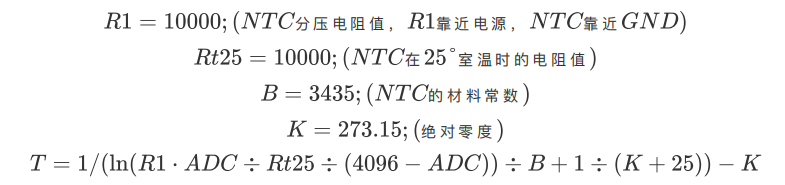

# 总线伺服舵机SDK使用手册（Python）
请注意，本python手册暂未更新完成，如有疑问可联系我们。


## 1.概述

本SDK内容有

- 基于[总线伺服舵机通信协议](https://wiki.fashionrobo.com/uartbasic/uart-protocol/)的Python的API函数，适用于所有总线伺服舵机型号。

### 1.1.上位机软件

上位机软件可以调试总线伺服舵机，测试总线伺服舵机的功能。

- 上位机软件：[FashionStar UART总线伺服舵机上位机软件](https://fashionrobo.com/downloadcenter)

- 使用说明：[总线伺服舵机上位机软件使用说明](https://wiki.fashionrobo.com/uartbasic/uart-servo-software/)

### 1.2.SDK

本文例程、API下载。

- Python_SDK下载链接：[SDK for Python](https://fashionrobo.com/downloadcenter/)


### 1.3.图例

HP8-U45-M总线伺服舵机


总线伺服舵机转接板UC-01


## 2.接线说明

1. 安装USB转TTL模块的驱动程序。
2. 将TTL/USB调试转换板UC-01与控制器、总线伺服舵机以及电源连接。


## 3.创建总线伺服舵机管理器

总线伺服舵机的文件路径`fashionstar-uart-servo-python/src/uservo.py`， 使用的时候可以将`uservo.py` 拷贝至你当前工程文件夹里面。 

或者使用的时候，将`uservo.py`所在的文件夹添加到系统路径里面， 相对路径/绝对路径都可以。

```python
# 添加uservo.py的系统路径
import sys
sys.path.append("../../src")
```

然后使用的过程中一般需要导入如下这两个依赖

```python
# PySerial 负责串口总线通信
import serial
# UartServoManager 总线伺服舵机管理器
from uservo import UartServoManager
```

接下来要创建串口对象，指定相关的参数

```python
# 参数配置
# 角度定义
SERVO_PORT_NAME =  'COM7' # 舵机串口号
SERVO_BAUDRATE = 115200 # 舵机的波特率
SERVO_ID = 0  # 舵机的ID号

# 初始化串口
uart = serial.Serial(port=SERVO_PORT_NAME, baudrate=SERVO_BAUDRATE,\
					 parity=serial.PARITY_NONE, stopbits=1,\
					 bytesize=8,timeout=0)
```

创建舵机管理器，将串口对象传入到构造器`UartServoManager`里面.

```python
# 初始化舵机管理器
uservo = UartServoManager(uart)
```


## 4.舵机通信检测


### 4.1.API-`ping` 

调用舵机的`ping()` 函数用于舵机的通信检测, 判断舵机是否在线。

**函数原型**

```python
def ping(self, servo_id:int):
```

**输入参数**

* `servo_id` : 舵机ID

**输出参数**

* `is_online` : 舵机是否在线


### 4.2.例程源码

`example/ping.py`

```python
'''
伺服总线舵机
> Python SDK舵机通讯检测 Example <
--------------------------------------------------
 * 作者: 深圳市华馨京科技有限公司
 * 网站：https://fashionrobo.com/
 * 更新时间: 2023/03/13
--------------------------------------------------
'''
# 添加uservo.py的系统路径
import sys
sys.path.append("../../src")
# 导入依赖
import time
import serial
from uservo import UartServoManager

# 参数配置
# 角度定义
SERVO_PORT_NAME =  'COM7' # 舵机串口号
SERVO_BAUDRATE = 115200 # 舵机的波特率
SERVO_ID = 0  # 舵机的ID号

# 初始化串口
uart = serial.Serial(port=SERVO_PORT_NAME, baudrate=SERVO_BAUDRATE,\
					 parity=serial.PARITY_NONE, stopbits=1,\
					 bytesize=8,timeout=0)
# 初始化舵机管理器
uservo = UartServoManager(uart)

# 舵机通讯检测
is_online = uservo.ping(SERVO_ID)
print("舵机ID={} 是否在线: {}".format(SERVO_ID, is_online))

```


## 5.舵机阻尼模式


### 5.1.API-`set_damping` 

设置舵机为阻尼模式。

**函数原型**

```python
def set_damping(self, servo_id, power=0):
```

**输入参数**

* `servo_id`: 舵机ID
* `power`: 舵机功率，单位mW

**输出参数**

* 无


### 5.2.例程源码

```python
'''
伺服总线舵机
> Python SDK 舵机阻尼模式 <
--------------------------------------------------
 * 作者: 深圳市华馨京科技有限公司
 * 网站：https://fashionrobo.com/
 * 更新时间: 2023/03/13
--------------------------------------------------
'''
# 添加uservo.py的系统路径
import sys
sys.path.append("../../src")
# 导入依赖
import time
import serial
from uservo import UartServoManager

# 参数配置
# 角度定义
SERVO_PORT_NAME =  'COM7' # 舵机串口号
SERVO_BAUDRATE = 115200 # 舵机的波特率
SERVO_ID = 0  # 舵机的ID号

# 初始化串口
uart = serial.Serial(port=SERVO_PORT_NAME, baudrate=SERVO_BAUDRATE,\
					 parity=serial.PARITY_NONE, stopbits=1,\
					 bytesize=8,timeout=0)
# 初始化舵机管理器
uservo = UartServoManager(uart)

power = 500 # 阻尼模式下的功率, 单位mW
uservo.set_damping(SERVO_ID, power)
```


## 6.舵机角度查询


### 6.1.API-`query_servo_angle` 

**函数原型**

```python
def query_servo_angle(self, servo_id):
```

**输入参数**

* `servo_id`: 舵机ID

**输出参数**

* `angle` : 舵机角度(单圈/多圈）

**注意事项**

注意这里返回的角度是多圈模式的角度还是单圈模式的角度，取决于上次控制舵机的角度的指令是单圈模式还是/多圈模式， 默认为单圈。 

如果想人为的设定查询多圈/单圈，可以在查询之前设定`uservo.servos[servo_id].is_mturn` 这个布尔值。 

* `is_mturn=True` : 返回多圈角度
* `is_mturn=False`: 返回单圈角度


### 6.2.例程源码

设置舵机为阻尼模式，转动舵机 1s打印一下当前的角度。

`example/query_servo_angle.py`

```python
'''
伺服总线舵机
> Python SDK舵机角度查询 Example <
--------------------------------------------------
 * 作者: 深圳市华馨京科技有限公司
 * 网站：https://fashionrobo.com/
 * 更新时间: 2023/03/13
--------------------------------------------------
'''
# 添加uservo.py的系统路径
import sys
sys.path.append("../../src")
# 导入依赖
import time
import serial
from uservo import UartServoManager

# 参数配置
# 角度定义
SERVO_PORT_NAME =  'COM7' # 舵机串口号
SERVO_BAUDRATE = 115200 # 舵机的波特率
SERVO_ID = 0  # 舵机的ID号

# 初始化串口
uart = serial.Serial(port=SERVO_PORT_NAME, baudrate=SERVO_BAUDRATE,\
					 parity=serial.PARITY_NONE, stopbits=1,\
					 bytesize=8,timeout=0)
# 初始化舵机管理器
uservo = UartServoManager(uart)

# 设置舵机为阻尼模式
uservo.set_damping(SERVO_ID, 200)

# 舵机角度查询
while True:
    angle = uservo.query_servo_angle(SERVO_ID)
    print("当前舵机角度: {:4.1f} °".format(angle), end='\r')
    time.sleep(1)
```


## 7.设置舵机角度

### 7.1.API-`set_servo_angle` 

设置舵机角度，这个API包含了6种舵机角度控制模式，通过传入不同的参数调用不同的指令。


**函数原型**

```python
def set_servo_angle(self, servo_id:int, angle:float, is_mturn:bool=False, interval:float=None, velocity:float=None, t_acc:int=20, t_dec:int=20,  power:int=0, mean_dps:float=100.0):
```

**输入参数**

* `servo_id` : 舵机的ID号

* `angle`: 目标角度 （单圈控制范围[-180°，180°]，多圈控制范围[-368,640.0° , 368,640.0°]）
* `is_mturn`: 是否是多圈模式
* `interval `:  中间间隔，单位ms
* `velocity `: 舵机的目标转速，单位dps
* `t_acc`: 加速时间，启动时加速段的时间。单位ms
* `t_dec`:  减速时间，运动到接近目标的减速段时间。单位ms
* `power`: 功率限制，单位mW
* `mean_dps`: 平均转速，单位dps，用于估计interval

**输出参数**

* 无


### 7.2.API-`wait`  

等待所有的舵机到达目标角度。

**函数原型**

```python
def wait(self, timeout=None):
```

**输入参数**

* `timeout`: 阻塞式等待的超时判断阈值，单位ms

**输出参数**

* 无

### 7.3.例程源码

```python
'''
伺服总线舵机
> 设置舵机角度 <
--------------------------------------------------
 * 作者: 深圳市华馨京科技有限公司
 * 网站：https://fashionrobo.com/
 * 更新时间: 2023/03/13
--------------------------------------------------
'''
# 添加uservo.py的系统路径
import sys
sys.path.append("../../src")
# 导入依赖
import time
import struct
import serial
from uservo import UartServoManager

# 参数配置
# 角度定义
SERVO_PORT_NAME =  'COM6' # 舵机串口号
SERVO_BAUDRATE = 115200 # 舵机的波特率
SERVO_ID = 0  # 舵机的ID号

# 初始化串口
uart = serial.Serial(port=SERVO_PORT_NAME, baudrate=SERVO_BAUDRATE,\
					 parity=serial.PARITY_NONE, stopbits=1,\
					 bytesize=8,timeout=0)
# 初始化舵机管理器
uservo = UartServoManager(uart, is_debug=True)

print("[单圈模式]设置舵机角度为90.0°")
uservo.set_servo_angle(SERVO_ID, 90.0, interval=0) # 设置舵机角度 极速模式
uservo.wait() # 等待舵机静止
print("-> {}".format(uservo.query_servo_angle(SERVO_ID)))

print("[单圈模式]设置舵机角度为-80.0°, 周期1000ms")
uservo.set_servo_angle(SERVO_ID, -80.0, interval=1000) # 设置舵机角度(指定周期 单位ms)
uservo.wait() # 等待舵机静止
print("-> {}".format(uservo.query_servo_angle(SERVO_ID)))

print("[单圈模式]设置舵机角度为70.0°, 设置转速为200 °/s, 加速时间100ms, 减速时间100ms")
uservo.set_servo_angle(SERVO_ID, 70.0, velocity=200.0, t_acc=100, t_dec=100) # 设置舵机角度(指定转速 单位°/s)
uservo.wait() # 等待舵机静止
print("-> {}".format(uservo.query_servo_angle(SERVO_ID)))


print("[单圈模式]设置舵机角度为-90.0°, 添加功率限制")
uservo.set_servo_angle(SERVO_ID, -90.0, power=400) # 设置舵机角度(指定功率 单位mW)
uservo.wait() # 等待舵机静止

#########################################################################################

print("[多圈模式]设置舵机角度为900.0°, 周期1000ms")
uservo.set_servo_angle(SERVO_ID, 900.0, interval=1000, is_mturn=True) # 设置舵机角度(指定周期 单位ms)
uservo.wait() # 等待舵机静止
print("-> {}".format(uservo.query_servo_angle(SERVO_ID)))

print("[多圈模式]设置舵机角度为-900.0°, 设置转速为200 °/s")
uservo.set_servo_angle(SERVO_ID, -900.0, velocity=200.0, t_acc=100, t_dec=100, is_mturn=True) # 设置舵机角度(指定转速 单位°/s) dps: degree per second
uservo.wait() # 等待舵机静止
print("-> {}".format(uservo.query_servo_angle(SERVO_ID)))

print("[多圈模式]设置舵机角度为-850.0°, 添加功率限制")
uservo.set_servo_angle(SERVO_ID, -850.0, power=400, is_mturn=True) # 设置舵机角度(指定功率 单位mW)
uservo.wait() # 等待舵机静止
print("-> {}".format(uservo.query_servo_angle(SERVO_ID)))

```

## 8.清除多圈圈数

该API用于清除多圈圈数，须在失锁状态下使用。


**函数原型**

```python
def reset_multi_turn_angle(self, servo_id:int):
```

**输入参数**

* `servo_id`: 舵机的ID

**输出参数**

* 无


##  9.轮转模式(316版本以及后续版本已弃用)


### 9.1.API-`wheel_stop`

轮转模式停止转动。

**函数原型**

```python
def wheel_stop(self, servo_id):
```

**输入参数**

* `servo_id`: 舵机ID

**输出参数**

* 无


### 9.2.API-`set_wheel_norm` 

设置轮转普通模式，转速单位: °/s

**函数原型**

```python
def set_wheel_norm(self, servo_id, is_cw=True, mean_dps=None)
```

**输入参数**

* `servo_id`: 舵机ID
* `is_cw`: 是否是顺时针：`True`: 顺时针，`False`: 逆时针
* `mean_dps`: 平均转速

**输出参数**

* 无


### 9.3.API-`set_wheel_turn` 

轮转模式，让舵机旋转特定的圈数。

**函数原型**

```python
def set_wheel_turn(self, servo_id, turn=1, is_cw=True, mean_dps=None, is_wait=True):
```

**输入参数**

* `servo_id` : 舵机ID
* `turn`: 目标要旋转的圈数
* `is_cw`: 旋转方向，是否为顺时针
  * `True`: 顺时针
  * `False`: 逆时针
* `mean_dps`: 平均转速
* `is_wait`: 是否是阻塞式等待

**输出参数**

* 无


### 9.4.API-`set_wheel_time`

轮转模式，旋转特定的时间。

**函数原型**

```python
def set_wheel_time(self, servo_id, interval=1000, is_cw=True, mean_dps=None, is_wait=True):
```

**输入参数**

* `servo_id` : 舵机ID
* `interval`: 目标要旋转的时间, 单位ms
* `is_cw`: 旋转方向，是否为顺时针
  * `True`: 顺时针
  * `False`: 逆时针
* `mean_dps`: 平均转速, 单位dps
* `is_wait`: 是否是阻塞式等待

**输出参数**

* 无


### 9.5.例程源码

`src/wheel.py`

```python
'''
伺服总线舵机
> Python SDK 舵机轮转模式测试 <
--------------------------------------------------
 * 作者: 深圳市华馨京科技有限公司
 * 网站：https://fashionrobo.com/
 * 更新时间: 2023/03/13
--------------------------------------------------
'''
# 添加uservo.py的系统路径
import sys
sys.path.append("../../src")
# 导入依赖
import time
import serial
from uservo import UartServoManager

# 参数配置
# 角度定义
SERVO_PORT_NAME =  'COM7' # 舵机串口号
SERVO_BAUDRATE = 115200 # 舵机的波特率
SERVO_ID = 0  # 舵机的ID号

# 初始化串口
uart = serial.Serial(port=SERVO_PORT_NAME, baudrate=SERVO_BAUDRATE,\
					 parity=serial.PARITY_NONE, stopbits=1,\
					 bytesize=8,timeout=0)
# 初始化舵机管理器
uservo = UartServoManager(uart)

print("测试常规模式")

# 设置舵机为轮转普通模式
# 旋转方向(is_cw) : 顺时针
# 角速度(mean_dps) : 单位°/s
uservo.set_wheel_norm(SERVO_ID, is_cw=True, mean_dps=200.0)

# 延时5s然后关闭
time.sleep(5.0)

# 停止
uservo.wheel_stop(SERVO_ID)

time.sleep(1)

# 定圈模式
print("测试定圈模式")
uservo.set_wheel_turn(SERVO_ID, turn=5, is_cw=False, mean_dps=200.0)

# 定时模式
print("测试定时模式")
uservo.set_wheel_time(SERVO_ID, interval=5000, is_cw=True, mean_dps=200.0)

```


## 10.用户自定义参数修改

</td></tr></table><table><tr><td bgcolor=#DDDDDD>

**注意事项：**

- 如有修改用户自定义参数的需要，可以在上位机进行，更加方便，直观。

</td></tr></table>

### 10.1.API-`reset_user_data`

重置用户数据表, 恢复默认值。

**函数原型**

```python
def reset_user_data(self, servo_id):
```

**输入参数**

* `servo_id`: 舵机ID

**输出参数**

* 无


### 10.2.API-`read_data` 

读取数据。

**函数原型**

```python
def read_data(self, servo_id, address):
```

**输入参数**

* `servo_id`: 舵机ID
* `address`: 内存表

**输出参数**

* `content`: 数值的二进制数据流


### 10.3.API-`write_data`

写入数据。

**函数原型**

```python
def write_data(self, servo_id, address, content):
```

**输入参数**

* `servo_id`: 舵机ID
* `address`: 内存表
* `content`: 数值的二进制数据流

**输出参数**

* 无


### 10.4.例程源码-重置用户数据表

`example/reset_user_data.py`

```python
'''
伺服总线舵机
> 内存表数据重置 <

注意事项: 重置内存表这个指令比较特殊, 舵机ID也会被重置为0
因此测试该指令的时候, 最好只接一颗舵机。
--------------------------------------------------
 * 作者: 深圳市华馨京科技有限公司
 * 网站：https://fashionrobo.com/
 * 更新时间: 2023/03/13
--------------------------------------------------
'''
# 添加uservo.py的系统路径
import sys
sys.path.append("../../src")
# 导入依赖
import time
import struct
import serial
from uservo import UartServoManager

# 参数配置
# 角度定义
SERVO_PORT_NAME =  'COM7' # 舵机串口号
SERVO_BAUDRATE = 115200 # 舵机的波特率
SERVO_ID = 0  # 舵机的ID号

# 数据表定义
ADDRESS_SOFTSTART = 49 # 上电缓启动地址位
SOFTSTART_OPEN = 1 # 上电缓启动-开启
SOFTSTART_CLOSE = 0 # 上电缓启动-关闭

# 初始化串口
uart = serial.Serial(port=SERVO_PORT_NAME, baudrate=SERVO_BAUDRATE,\
					 parity=serial.PARITY_NONE, stopbits=1,\
					 bytesize=8,timeout=0)
# 初始化舵机管理器
uservo = UartServoManager(uart, is_debug=True)
# 重置用户数据
uservo.reset_user_data(SERVO_ID)


# 舵机扫描
print("开始进行舵机扫描")
uservo.scan_servo()
servo_list = list(uservo.servos.keys())
print("舵机扫描结束, 舵机列表: {}".format(servo_list))

if SERVO_ID not in servo_list:
    print("指定的SERVO_ID无效, 请修改舵机ID列表")
    exit(-1)

print("重置舵机内存表: 舵机ID = {}".format(SERVO_ID))
uservo.reset_user_data(SERVO_ID)

print("重新进行舵机扫描")
uservo.scan_servo()
servo_list = list(uservo.servos.keys())
print("舵机扫描结束, 舵机列表: {}".format(servo_list))

```


### 10.5.例程源码-读取内存表

`example/read_data.py`

```python
'''
伺服总线舵机
> 内存表数据读取 <
--------------------------------------------------
 * 作者: 深圳市华馨京科技有限公司
 * 网站：https://fashionrobo.com/
 * 更新时间: 2023/03/13
--------------------------------------------------
'''
# 添加uservo.py的系统路径
import sys
sys.path.append("../../src")
# 导入依赖
import time
import struct
import serial
from uservo import UartServoManager

# 参数配置
# 角度定义
SERVO_PORT_NAME =  'COM7' # 舵机串口号
SERVO_BAUDRATE = 115200 # 舵机的波特率
SERVO_ID = 0  # 舵机的ID号
# 数据表定义
ADDRESS_VOLTAGE = 1 # 总线电压值的地址

# 初始化串口
uart = serial.Serial(port=SERVO_PORT_NAME, baudrate=SERVO_BAUDRATE,\
					 parity=serial.PARITY_NONE, stopbits=1,\
					 bytesize=8,timeout=0)
# 初始化舵机管理器
uservo = UartServoManager(uart)

# 内存表读取
# 注: 因为每个数据位数据格式各不相同
# 因此读取得到的是字节流
voltage_bytes = uservo.read_data(SERVO_ID, ADDRESS_VOLTAGE)
# 数据解析
# 电压的数据格式为uint16_t,单位: mV
# 关于struct的用法，请参阅官方手册: https://docs.python.org/3/library/struct.html
voltage = struct.unpack('<H', voltage_bytes)

print("总线电压 {} mV".format(voltage))
```


### 10.6.例程源码-写入内存表

`example/write_data.py`

```python
'''
伺服总线舵机
> 内存表数据写入 <
--------------------------------------------------
 * 作者: 深圳市华馨京科技有限公司
 * 网站：https://fashionrobo.com/
 * 更新时间: 2023/03/13
--------------------------------------------------
'''
# 添加uservo.py的系统路径
import sys
sys.path.append("../../src")
# 导入依赖
import time
import struct
import serial
from uservo import UartServoManager

# 参数配置
# 角度定义
SERVO_PORT_NAME =  'COM7' # 舵机串口号
SERVO_BAUDRATE = 115200 # 舵机的波特率
SERVO_ID = 0  # 舵机的ID号

# 数据表定义
ADDRESS_SOFTSTART = 49 # 上电缓启动地址位
SOFTSTART_OPEN = 1 # 上电缓启动-开启
SOFTSTART_CLOSE = 0 # 上电缓启动-关闭

# 初始化串口
uart = serial.Serial(port=SERVO_PORT_NAME, baudrate=SERVO_BAUDRATE,\
					 parity=serial.PARITY_NONE, stopbits=1,\
					 bytesize=8,timeout=0)
# 初始化舵机管理器
uservo = UartServoManager(uart)

# 内存表写入
# 注: 在写入之前，需要查阅手册确保该数据位可写
# 缓启动数据类型 uint8_t, 首先构造数据位
softstart_bytes = struct.pack('<B', SOFTSTART_OPEN)
# 将数据写入内存表
ret = uservo.write_data(SERVO_ID, ADDRESS_SOFTSTART, softstart_bytes)
# 打印日志
print("缓启动数据写入是否成功: {}".format(ret))
```


## 11.系统状态查询


### 11.1.API-`query_voltage`

查询当前的电压

**函数原型**

```python
def query_voltage(self, servo_id)
```

**输入参数**

* `servo_id`: 舵机ID

**输出参数**

* `voltage`: 电压，单位V


### 11.2.API-`query_current`

查询当前的电流

**函数原型**

```python
def query_current(self, servo_id):
```

**输入参数**

* `servo_id`: 舵机ID

**输出参数**

* `power`: 舵机电流，单位A


### 11.3.API-`query_power`

查询当前的功率

**函数原型**

```python
def query_power(self, servo_id)
```

**输入参数**

* `servo_id`: 舵机ID

**输出参数**

* `power`: 舵机功率，单位W


### 11.4.API-`query_temperature`

查询舵机当前的温度

**函数原型**

```python
def query_temperature(self, servo_id)
```

**输入参数**

* `servo_id`: 舵机ID

**输出参数**

* `temperature`: 温度，ADC值

### 11.5.API-`query_status`

查询舵机当前的工作状态

```python
#  舵机工作状态标志位
#  BIT[0] - 执行指令置1，执行完成后清零。
#  BIT[1] - 执行指令错误置1，在下次正确执行后清零。
#  BIT[2] - 堵转错误置1，解除堵转后清零。
#  BIT[3] - 电压过高置1，电压恢复正常后清零。
#  BIT[4] - 电压过低置1，电压恢复正常后清零。
#  BIT[5] - 电流错误置1，电流恢复正常后清零。
#  BIT[6] - 功率错误置1，功率恢复正常后清零。
#  BIT[7] - 温度错误置1，温度恢复正常后清零。
```

**函数原型**

```python
def query_status(self, servo_id)
```

**输入参数**

* `servo_id`: 舵机ID

**输出参数**

* `status`: 8位工作状态标志位

### 11.6.例程源码

`example/servo_status.py`

```python
'''
伺服总线舵机
> 读取舵机的状态信息 <
--------------------------------------------------
 * 作者: 深圳市华馨京科技有限公司
 * 网站：https://fashionrobo.com/
 * 更新时间: 2023/03/13
--------------------------------------------------
'''
# 添加uservo.py的系统路径
import sys
import os
sys.path.append("../../src")
# sys.path.append(os.getcwd()+"\\src")

# 导入依赖
import time
import serial
from uservo import UartServoManager

# 参数配置
# 角度定义
SERVO_PORT_NAME =  'COM3' # 舵机串口号
SERVO_BAUDRATE = 115200 # 舵机的波特率
SERVO_ID = 0  # 舵机的ID号

# 初始化串口
uart = serial.Serial(port=SERVO_PORT_NAME, baudrate=SERVO_BAUDRATE,\
					 parity=serial.PARITY_NONE, stopbits=1,\
					 bytesize=8,timeout=0)
# 初始化舵机管理器
uservo = UartServoManager(uart)

def log_servo_status():
    '''打印舵机状态'''
    # 读取温度
    voltage = uservo.query_voltage(SERVO_ID)
    # 读取电流
    current = uservo.query_current(SERVO_ID)
    # 读取功率
    power = uservo.query_power(SERVO_ID)
    # 读取温度
    temp = uservo.query_temperature(SERVO_ID)
    #  舵机工作状态标志位
	#  BIT[0] - 执行指令置1，执行完成后清零。
	#  BIT[1] - 执行指令错误置1，在下次正确执行后清零。
	#  BIT[2] - 堵转错误置1，解除堵转后清零。
	#  BIT[3] - 电压过高置1，电压恢复正常后清零。
	#  BIT[4] - 电压过低置1，电压恢复正常后清零。
	#  BIT[5] - 电流错误置1，电流恢复正常后清零。
	#  BIT[6] - 功率错误置1，功率恢复正常后清零。
	#  BIT[7] - 温度错误置1，温度恢复正常后清零。
    status = uservo.query_status(SERVO_ID)
    print("Voltage: {:4.1f}V; Current: {:4.1f}A; Power: {:4.1f}W; T: {:2.0f}; Status: {:08b}".format(voltage, current, power, temp,status), end='\r')

while True:
    uservo.set_servo_angle(SERVO_ID, 90)
    while not uservo.is_stop():
        log_servo_status()
        time.sleep(0.1)
    
    time.sleep(1)

    uservo.set_servo_angle(SERVO_ID, -90)
    while not uservo.is_stop():
        log_servo_status()
        time.sleep(0.1)

    time.sleep(1)
```

## 12.舵机失锁

</td></tr></table><table><tr><td bgcolor=#DDDDDD>

**注意事项：**

- 失锁状态下，舵机仍会响应指令。

</td></tr></table>

### 12.1.API-`disable_torque`

**函数原型**

```python
def disable_torque(self, servo_id:int):
```

**输入参数**

* `servo_id`: 舵机ID

**输出参数**

* 无

## 13.原点设置

</td></tr></table><table><tr><td bgcolor=#DDDDDD>

**注意事项**：

- 仅适用于无刷磁编码舵机
- 需要在失锁状态下使用本API

</td></tr></table>

### 13.1.API-`set_origin_point`

**函数原型**

```C
uservo.set_origin_point(self, servo_id:int):
```

**输入参数**

* `servo_id`: 舵机ID

**输出参数**

* 无

### 13.2.例程源码

`example/set_origin_point.py`

```python
'''
总线伺服舵机
> Python SDK设置舵机原点 Example <
--------------------------------------------------
 * 作者: 深圳市华馨京科技有限公司
 * 网站：https://fashionrobo.com/
 * 更新时间: 2024/08/20
--------------------------------------------------
'''
# 添加uservo.py的系统路径
import os
import sys
sys.path.append(os.getcwd()+"\\src")
# sys.path.append("../../src")
# 导入依赖
import time
import serial
from uservo import UartServoManager

# 参数配置
# 角度定义
SERVO_PORT_NAME =  'COM3' # 舵机串口号
SERVO_BAUDRATE = 115200 # 舵机的波特率
SERVO_ID = 0  # 舵机的ID号

# 初始化串口
uart = serial.Serial(port=SERVO_PORT_NAME, baudrate=SERVO_BAUDRATE,\
					 parity=serial.PARITY_NONE, stopbits=1,\
					 bytesize=8,timeout=0)
# 初始化舵机管理器
uservo = UartServoManager(uart)

angle = uservo.query_servo_angle(SERVO_ID)

print("当前舵机角度: {:4.1f} °".format(angle), end='\n')

uservo.disable_torque(SERVO_ID)

uservo.set_origin_point(SERVO_ID)

time.sleep(1)

angle = uservo.query_servo_angle(SERVO_ID)

print("设置新的原点后舵机角度: {:4.1f} °".format(angle), end='\n')


```

## 14.同步命令

> 注：**仅适用于无刷磁编码舵机V316及之后的版本**

**支持的命令编号**

| 数据包编号 | 数据包命名                           | 功能                         |
| :--------- | :----------------------------------- | :--------------------------- |
| 8          | MoveOnAngleMode(Rotate)              | 角度模式                     |
| 11         | MoveOnAngleModeExByInterval          | 角度模式(基于加减速时间)     |
| 12         | MoveOnAngleModeExByVelocity          | 角度模式(基于目标速度)       |
| 13         | MoveOnMultiTurnAngleMode(Rotate)     | 多圈角度控制                 |
| 14         | MoveOnMultiTurnAngleModeExByInterval | 多圈角度控制(基于加减速时间) |
| 15         | MoveOnMultiTurnAngleModeExByVelocity | 多圈角度控制(基于目标速度)   |
| 22         | ServoMonitor                         | 舵机数据监控                 |

### 14.1.API-`send_sync_angle`

**函数原型**

```python
def send_sync_angle(self, command_id, servo_num, command_data_list):
```

**输入参数**

- `command_id`: 命令编号
- `servo_num`: 舵机个数
- `command_data_list`: 命令数据列表

**输出参数**

- 无

### 14.2.API-`send_sync_anglebyinterval`

**函数原型**

```python
def send_sync_anglebyinterval(self, command_id, servo_num, command_data_list):
```

**输入参数**

- `command_id`: 命令编号
- `servo_num`: 舵机个数
- `command_data_list`: 命令数据列表

**输出参数**

- 无

### 14.3.API-`send_sync_anglebyvelocity`

**函数原型**

```python
def send_sync_anglebyvelocity(self, command_id, servo_num, command_data_list):
```

**输入参数**

- `command_id`: 命令编号
- `servo_num`: 舵机个数
- `command_data_list`: 命令数据列表

**输出参数**

- 无

### 14.4.API-`send_sync_multiturnangle`

**函数原型**

```python
def send_sync_multiturnangle(self, command_id, servo_num, command_data_list):
```

**输入参数**

- `command_id`: 命令编号
- `servo_num`: 舵机个数
- `command_data_list`: 命令数据列表

**输出参数**

- 无

### 14.5.API-`send_sync_multiturnanglebyinterval`

**函数原型**

```python
def send_sync_multiturnanglebyinterval(self, command_id, servo_num, command_data_list):
```

**输入参数**

- `command_id`: 命令编号
- `servo_num`: 舵机个数
- `command_data_list`: 命令数据列表

**输出参数**

- 无

- 

### 14.6.API-`send_sync_multiturnanglebyvelocity`

**函数原型**

```c
uservo.set_origin_point(self, servo_id:int):
```

**输入参数**

- `command_id`: 命令编号
- `servo_num`: 舵机个数
- `command_data_list`: 命令数据列表

**输出参数**

- 无

### 14.7.API-`send_sync_servo_monitor`

**函数原型**

```python
def send_sync_servo_monitor(self, servo_ids):
```

**输入参数**

- `command_id`: 命令编号
- `servo_num`: 舵机个数
- `command_data_list`: 命令数据列表

**输出参数**

- ID
- 电压
- 电流
- 功率
- 温度
- 状态
- 角度
- 圈数

### 14.8.例程源码

`example/sync_mode`

```python
'''
总线伺服舵机
> Python SDK同步指令 Example <
--------------------------------------------------
 * 作者: 深圳市华馨京科技有限公司
 * 网站：https://fashionrobo.com/
 * 更新时间: 2024/12/23
--------------------------------------------------
'''
# 添加uservo.py的系统路径
import sys
sys.path.append("../../src")


import time
import serial
import struct
# 导入串口舵机管理器
from uservo import UartServoManager
# 设置日志输出模式为INFO
USERVO_PORT_NAME = 'COM3'
uart = serial.Serial(port=USERVO_PORT_NAME, baudrate=115200,\
                     parity=serial.PARITY_NONE, stopbits=1,\
                     bytesize=8,timeout=0)
srv_num = 6# 舵机个数
uservo = UartServoManager(uart, is_debug=True)


command_data_list1 = [
    struct.pack('<BhHH', 1, -400, 500, 10000),  # 同步命令角度模式控制
    struct.pack('<BhHH', 2, -400 ,500, 10000),  #id2+度数-40 +时间 +功率
]
uservo.send_sync_angle(8, 2, command_data_list1)
time.sleep(2.02)

command_data_list2 = [
    struct.pack('<BhHHHH', 1, 400, 500, 100, 100, 10000) , # 同步命令角度模式控制(基於加减速時間)
    struct.pack('<BhHHHH', 2, 400, 500, 100, 100, 10000) , #id2+度数40+总时间+启动加速时间+运动减速时间+功率
]
uservo.send_sync_anglebyinterval(11, 2, command_data_list2)
time.sleep(2.02)


command_data_list4 = [
    struct.pack('<BhHHHH', 1, 600, 500, 100, 100, 10000), # 同步命令角度模式控制 (基於速率的運動控制 )
    struct.pack('<BhHHHH', 2, 600, 500, 100, 100, 10000), # id2+度数60+时间+功率
]
uservo.send_sync_anglebyvelocity(12, 2, command_data_list4)
time.sleep(2.02)


command_data_list3 = [
    struct.pack('<BlLH', 1, 800, 1500, 10000)  ,# 同步命令多圈角度模式控制
    struct.pack('<BlLH', 2, 800 ,1500, 10000)  ,# id2+度数80 +时间 +功率
]
uservo.send_sync_multiturnangle(13, 2, command_data_list3)
time.sleep(2.02)


command_data_list5 = [
    struct.pack('<BlLHHH', 1, 10010, 1000, 100,100,10000)  ,# 多圈角度模式控制 (基於加減速時段的運動控制 )
    struct.pack('<BlLHHH', 2, 10010 ,1000,100,100, 10000)  ,# id2+度数1001+总时间+启动加速时间+运动减速时间+功率
]
uservo.send_sync_multiturnanglebyinterval(14, 2, command_data_list5)
time.sleep(2.02)


command_data_list6 = [
    struct.pack('<BlHHHH', 1, 12010, 3000,100 ,100,10000)  ,# 多圈角度模式控制(基於速率的運動控制)
    struct.pack('<BlHHHH', 2, 12010 ,3000, 100, 100, 10000)  ,# id2+度数1201+目标速度300dps+启动加速时间+运动减速时间+功率
]
uservo.send_sync_multiturnanglebyvelocity(15, 2, command_data_list6)
```

`example/sync_monitor`

```python
'''
总线伺服舵机
> Python SDK同步命令-同步监控 Example <
--------------------------------------------------
 * 作者: 深圳市华馨京科技有限公司
 * 网站：https://fashionrobo.com/
 * 更新时间: 2024/12/23
--------------------------------------------------
'''
# 添加uservo.py的系统路径
import sys
sys.path.append("../../src")
# 导入依赖
import time
import serial
from uservo import UartServoManager

# 参数配置
# 角度定义
SERVO_PORT_NAME =  'COM4' # 舵机串口号
SERVO_BAUDRATE = 115200 # 舵机的波特率
SERVO_ID = 0  # 舵机的ID号

# 初始化串口
uart = serial.Serial(port=SERVO_PORT_NAME, baudrate=SERVO_BAUDRATE,\
					 parity=serial.PARITY_NONE, stopbits=1,\
					 bytesize=8,timeout=0)
# 初始化舵机管理器
uservo = UartServoManager(uart)

power = 500 # 阻尼模式下的功率, 单位mW
uservo.set_damping(SERVO_ID, power)


servo_ids = [5,6,2,76,17]  # 想要同步读取的舵机ID列表
servo_monitor_data = uservo.send_sync_servo_monitor(servo_ids)
for servo_id, info in servo_monitor_data.items():
    if info:
        print("舵机ID: {}, 电压: {:.2f} V, 电流: {:.2f} A, 功率: {:.2f} W, 温度: {:.2f} °C, 状态: {}, 角度: {:.2f} °, 圈数: {:.0f}"
              .format(servo_id, info.voltage / 1000, info.current / 1000, info.power / 1000, info.temp, info.status, info.angle, info.turn))
```


## 15.异步命令

> 注：**仅适用于无刷磁编码舵机V316及之后的版本**

### API-`begin_async`

开始异步指令，对下一个接收到的指令进行缓存，仅支持角度指令。

**函数原型**

```python
def begin_async(self):
```

**输入参数**

- 无

**输出参数**

- 无


### API-`end_async`

结束异步指令，立即执行缓存指令。若参数 cancel 不为0，則清除缓存缓存。

**函数原型**

```python
def end_async(self,cancel=0):
```

**输入参数**

- `cancel`：是否取消

**输出参数**

- 无

### 例程源码

`example/async_mode`

```python
'''
总线伺服舵机
> Python SDK异步指令 Example <
--------------------------------------------------
 * 作者: 深圳市华馨京科技有限公司
 * 网站：https://fashionrobo.com/
 * 更新时间: 2024/12/23
--------------------------------------------------
'''
# 添加uservo.py的系统路径
import sys
sys.path.append("../../src")
# 导入依赖
import time
import struct
import serial
from uservo import UartServoManager

# 参数配置
# 角度定义
SERVO_PORT_NAME =  'COM6'		# 舵机串口号 请根据实际串口进行修改
SERVO_BAUDRATE = 115200			# 舵机的波特率 请根据实际波特率进行修改

SERVO_ID = 0       #舵机ID
# 初始化串口
uart = serial.Serial(port=SERVO_PORT_NAME, baudrate=SERVO_BAUDRATE,\
					 parity=serial.PARITY_NONE, stopbits=1,\
					 bytesize=8,timeout=0)
# 初始化舵机管理器
uservo = UartServoManager(uart, is_debug=True)
uservo.begin_async()   #  开始异步命令
time.sleep(0.02)
SERVO_ID  = 0
uservo.set_servo_angle( 0, angle = 20.0, interval=0, power=10000) 
time.sleep(2.02)
uservo.end_async(0)    #  结束异步命令    0:執行； 1:取消
```


## 16.数据监控

> 注：**仅适用于无刷磁编码舵机V316及之后的版本**

### API-`query_servo_monitor`

获取舵机数据。

**函数原型**

```python
def query_servo_monitor(self,servo_id=0):
```

**输入参数**

- `servo_id`：舵机ID

**输出参数**

- `voltage`：舵机电压
- `current`：舵机电流
- `voltage`：舵机功率
- `temp`：舵机温度
- `status`：舵机状态
- `angle`：舵机角度(单圈/多圈）
- `turn`：圈数

### 例程源码

`example/servo_monitor`

```python
'''
总线伺服舵机
> Python SDK监控指令 Example <
--------------------------------------------------
 * 作者: 深圳市华馨京科技有限公司
 * 网站：https://fashionrobo.com/
 * 更新时间: 2024/12/23
--------------------------------------------------
'''
# 添加uservo.py的系统路径
import sys
sys.path.append("../../src")
# 导入依赖
import time
import struct
import serial
from uservo import UartServoManager

# 参数配置
SERVO_PORT_NAME =  'COM5'		# 舵机串口号 请根据实际串口进行修改
SERVO_BAUDRATE = 115200			# 舵机的波特率 请根据实际波特率进行修改
servo_id = 0                    # 监控的舵机id号

# 初始化串口
uart = serial.Serial(port=SERVO_PORT_NAME, baudrate=SERVO_BAUDRATE,\
					 parity=serial.PARITY_NONE, stopbits=1,\
					 bytesize=8,timeout=0)
# 初始化舵机管理器
uservo = UartServoManager(uart, is_debug=True)
servo_info = uservo.query_servo_monitor(servo_id=0)
print("舵机 电压: {:.2f} V".format( servo_info["voltage"]/1000))         #单个参数

print("舵机 角度: {:.2f} °".format( servo_info["angle"] )) 
print("舵机电压: {:.2f}V, 电流: {:.2f}A, 功率: {:.2f}W, 温度: {:.2f}°C, 状态: {}, 角度: {:.2f}°, 圈数: {:.0f}"
          .format( servo_info["voltage"] / 1000, servo_info["current"] / 1000, servo_info["power"] / 1000, servo_info["temp"], servo_info["status"], servo_info["angle"], servo_info["turn"])) #多个参数
```


## 17.控制模式停止指令

> 注：**仅适用于无刷磁编码舵机V316及之后的版本**

### API-`stop_on_control_mode`

使舵机停止后保持不同状态模式。

**函数原型**

```python
def stop_on_control_mode(self,servo_id, method, power):
```

**输入参数**

- `servo_id`：舵机ID
- `method`：停止后的模式：0x10 卸力  ；0x11保持锁力；0x12进入阻尼状态
- `power`：保持的功率

**输出参数**

- 无

### 例程源码

`example/stop_on_control_mode`

```python
'''
总线伺服舵机
> MicroPython SDK停止指令 Example <
--------------------------------------------------
 * 作者: 深圳市华馨京科技有限公司
 * 网站：https://fashionrobo.com/
 * 更新时间: 2024/12/23
--------------------------------------------------
'''
import ustruct
from machine import UART
from uservo import UartServoManager
import time


# 舵机ID编号: [0, 1, 2, ..., srv_num-1]
# 扫描舵机个数
servo_num = 4
# 舵机ID
servo_id = 0
# 舵机是否有多圈模式的功能
#servo_has_mturn_func = False
# 创建串口对象 使用串口2作为控制对象
# 波特率: 115200
# RX: gpio 16
# TX: gpio 17
uart = UART(2, baudrate=115200)
# 创建舵机管理器
uservo = UartServoManager(uart, srv_num=servo_num)
uservo.stop_on_control_mode(servo_id, method=0x10, power=500)
uservo.stop_on_control_mode(servo_id, method=0x11, power=500)
uservo.stop_on_control_mode(servo_id, method=0x12, power=500)
```


## 附表1 - 温度ADC值转换表

***注：ADC转换为摄氏度值公式***



| 温度(℃) | ADC  | 温度(℃) | ADC  | 温度(℃) | ADC  |
| ------- | ---- | ------- | ---- | ------- | ---- |
| 50      | 1191 | 60      | 941  | 70      | 741  |
| 51      | 1164 | 61      | 918  | 71      | 723  |
| 52      | 1137 | 62      | 897  | 72      | 706  |
| 53      | 1110 | 63      | 876  | 73      | 689  |
| 54      | 1085 | 64      | 855  | 74      | 673  |
| 55      | 1059 | 65      | 835  | 75      | 657  |
| 56      | 1034 | 66      | 815  | 76      | 642  |
| 57      | 1010 | 67      | 796  | 77      | 627  |
| 58      | 986  | 68      | 777  | 78      | 612  |
| 59      | 963  | 69      | 759  | 79      | 598  |

* 以上为50-79℃ 温度/ADC参照表
